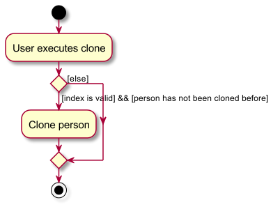

* Table of Contents
{:toc}

--------------------------------------------------------------------------------------------------------------------

## **Acknowledgements**

* {list here sources of all reused/adapted ideas, code, documentation, and third-party libraries -- include links to the original source as well}

--------------------------------------------------------------------------------------------------------------------

## **Setting up, getting started**

Refer to the guide [_Setting up and getting started_](SettingUp.md).

--------------------------------------------------------------------------------------------------------------------

## **Design**

:bulb: **Tip:** The `.puml` files used to create diagrams in this document `docs/diagrams` folder. Refer to the [_PlantUML Tutorial_ at se-edu/guides](https://se-education.org/guides/tutorials/plantUml.html) to learn how to create and edit diagrams.

### Architecture

The ***Architecture Diagram*** given above explains the high-level design of the App.

Given below is a quick overview of main components and how they interact with each other.

**Main components of the architecture**

**`Main`** (consisting of classes [`Main`](https://github.com/se-edu/addressbook-level3/tree/master/src/main/java/seedu/address/Main.java) and [`MainApp`](https://github.com/se-edu/addressbook-level3/tree/master/src/main/java/seedu/address/MainApp.java)) is in charge of the app launch and shut down.
* At app launch, it initializes the other components in the correct sequence, and connects them up with each other.
* At shut down, it shuts down the other components and invokes cleanup methods where necessary.

The bulk of the app's work is done by the following four components:

* [**`UI`**](#ui-component): The UI of the App.
* [**`Logic`**](#logic-component): The command executor.
* [**`Model`**](#model-component): Holds the data of the App in memory.
* [**`Storage`**](#storage-component): Reads data from, and writes data to, the hard disk.

[**`Commons`**](#common-classes) represents a collection of classes used by multiple other components.

**How the architecture components interact with each other**

The *Sequence Diagram* below shows how the components interact with each other for the scenario where the user issues the command `delete 1`.

Each of the four main components (also shown in the diagram above),

* defines its *API* in an `interface` with the same name as the Component.
* implements its functionality using a concrete `{Component Name}Manager` class (which follows the corresponding API `interface` mentioned in the previous point.

For example, the `Logic` component defines its API in the `Logic.java` interface and implements its functionality using the `LogicManager.java` class which follows the `Logic` interface. Other components interact with a given component through its interface rather than the concrete class (reason: to prevent outside component's being coupled to the implementation of a component), as illustrated in the (partial) class diagram below.

The sections below give more details of each component.

### UI component

The **API** of this component is specified in [`Ui.java`](https://github.com/se-edu/addressbook-level3/tree/master/src/main/java/seedu/address/ui/Ui.java)

The UI consists of a `MainWindow` that is made up of parts e.g.`CommandBox`, `ResultDisplay`, `PersonListPanel`, `StatusBarFooter` etc. All these, including the `MainWindow`, inherit from the abstract `UiPart` class which captures the commonalities between classes that represent parts of the visible GUI.

The `UI` component uses the JavaFx UI framework. The layout of these UI parts are defined in matching `.fxml` files that are in the `src/main/resources/view` folder. For example, the layout of the [`MainWindow`](https://github.com/se-edu/addressbook-level3/tree/master/src/main/java/seedu/address/ui/MainWindow.java) is specified in [`MainWindow.fxml`](https://github.com/se-edu/addressbook-level3/tree/master/src/main/resources/view/MainWindow.fxml)

The `UI` component,

* executes user commands using the `Logic` component.
* listens for changes to `Model` data so that the UI can be updated with the modified data.
* keeps a reference to the `Logic` component, because the `UI` relies on the `Logic` to execute commands.
* depends on some classes in the `Model` component, as it displays `Person` object residing in the `Model`.

### Logic component

**API** : [`Logic.java`](https://github.com/se-edu/addressbook-level3/tree/master/src/main/java/seedu/address/logic/Logic.java)

Here's a (partial) class diagram of the `Logic` component:

The sequence diagram below illustrates the interactions within the `Logic` component, taking `execute("delete 1")` API call as an example.

:information_source: **Note:** The lifeline for `DeleteCommandParser` should end at the destroy marker (X) but due to a limitation of PlantUML, the lifeline reaches the end of diagram.

How the `Logic` component works:

1. When `Logic` is called upon to execute a command, it is passed to an `AddressBookParser` object which in turn creates a parser that matches the command (e.g., `DeleteCommandParser`) and uses it to parse the command.
1. This results in a `Command` object (more precisely, an object of one of its subclasses e.g., `DeleteCommand`) which is executed by the `LogicManager`.
1. The command can communicate with the `Model` when it is executed (e.g. to delete a person).
1. The result of the command execution is encapsulated as a `CommandResult` object which is returned back from `Logic`.

Here are the other classes in `Logic` (omitted from the class diagram above) that are used for parsing a user command:

How the parsing works:
* When called upon to parse a user command, the `AddressBookParser` class creates an `XYZCommandParser` (`XYZ` is a placeholder for the specific command name e.g., `AddCommandParser`) which uses the other classes shown above to parse the user command and create a `XYZCommand` object (e.g., `AddCommand`) which the `AddressBookParser` returns back as a `Command` object.
* All `XYZCommandParser` classes (e.g., `AddCommandParser`, `DeleteCommandParser`, ...) inherit from the `Parser` interface so that they can be treated similarly where possible e.g, during testing.

### Model component
**API** : [`Model.java`](https://github.com/se-edu/addressbook-level3/tree/master/src/main/java/seedu/address/model/Model.java)

The `Model` component,

* stores the address book data i.e., all `Person` objects (which are contained in a `UniquePersonList` object).
* stores the currently 'selected' `Person` objects (e.g., results of a search query) as a separate _filtered_ list which is exposed to outsiders as an unmodifiable `ObservableList<Person>` that can be 'observed' e.g. the UI can be bound to this list so that the UI automatically updates when the data in the list change.
* stores a `UserPref` object that represents the user’s preferences. This is exposed to the outside as a `ReadOnlyUserPref` objects.
* does not depend on any of the other three components (as the `Model` represents data entities of the domain, they should make sense on their own without depending on other components)

:information_source: **Note:** An alternative (arguably, a more OOP) model is given below. It has a `Tag` list in the `AddressBook`, which `Person` references. This allows `AddressBook` to only require one `Tag` object per unique tag, instead of each `Person` needing their own `Tag` objects. 

### Storage component

**API** : [`Storage.java`](https://github.com/se-edu/addressbook-level3/tree/master/src/main/java/seedu/address/storage/Storage.java)

The `Storage` component,
* can save both address book data and user preference data in JSON format, and read them back into corresponding objects.
* inherits from both `AddressBookStorage` and `UserPrefStorage`, which means it can be treated as either one (if only the functionality of only one is needed).
* depends on some classes in the `Model` component (because the `Storage` component's job is to save/retrieve objects that belong to the `Model`)

### Common classes

Classes used by multiple components are in the `seedu.addressbook.commons` package.

--------------------------------------------------------------------------------------------------------------------

## **Implementation**

This section describes some noteworthy details on how certain features are implemented.

### \[Proposed\] Undo/redo feature

#### Proposed Implementation

The proposed undo/redo mechanism is facilitated by `VersionedAddressBook`. It extends `AddressBook` with an undo/redo history, stored internally as an `addressBookStateList` and `currentStatePointer`. Additionally, it implements the following operations:

* `VersionedAddressBook#commit()` — Saves the current address book state in its history.
* `VersionedAddressBook#undo()` — Restores the previous address book state from its history.
* `VersionedAddressBook#redo()` — Restores a previously undone address book state from its history.

These operations are exposed in the `Model` interface as `Model#commitAddressBook()`, `Model#undoAddressBook()` and `Model#redoAddressBook()` respectively.

Given below is an example usage scenario and how the undo/redo mechanism behaves at each step.

Step 1. The user launches the application for the first time. The `VersionedAddressBook` will be initialized with the initial address book state, and the `currentStatePointer` pointing to that single address book state.

Step 2. The user executes `delete 5` command to delete the 5th person in the address book. The `delete` command calls `Model#commitAddressBook()`, causing the modified state of the address book after the `delete 5` command executes to be saved in the `addressBookStateList`, and the `currentStatePointer` is shifted to the newly inserted address book state.

Step 3. The user executes `add n/David …​` to add a new person. The `add` command also calls `Model#commitAddressBook()`, causing another modified address book state to be saved into the `addressBookStateList`.

:information_source: **Note:** If a command fails its execution, it will not call `Model#commitAddressBook()`, so the address book state will not be saved into the `addressBookStateList`.

Step 4. The user now decides that adding the person was a mistake, and decides to undo that action by executing the `undo` command. The `undo` command will call `Model#undoAddressBook()`, which will shift the `currentStatePointer` once to the left, pointing it to the previous address book state, and restores the address book to that state.

:information_source: **Note:** If the `currentStatePointer` is at index 0, pointing to the initial AddressBook state, then there are no previous AddressBook states to restore. The `undo` command uses `Model#canUndoAddressBook()` to check if this is the case. If so, it will return an error to the user rather
than attempting to perform the undo.

The following sequence diagram shows how the undo operation works:

:information_source: **Note:** The lifeline for `UndoCommand` should end at the destroy marker (X) but due to a limitation of PlantUML, the lifeline reaches the end of diagram.

The `redo` command does the opposite — it calls `Model#redoAddressBook()`, which shifts the `currentStatePointer` once to the right, pointing to the previously undone state, and restores the address book to that state.

:information_source: **Note:** If the `currentStatePointer` is at index `addressBookStateList.size() - 1`, pointing to the latest address book state, then there are no undone AddressBook states to restore. The `redo` command uses `Model#canRedoAddressBook()` to check if this is the case. If so, it will return an error to the user rather than attempting to perform the redo.

Step 5. The user then decides to execute the command `list`. Commands that do not modify the address book, such as `list`, will usually not call `Model#commitAddressBook()`, `Model#undoAddressBook()` or `Model#redoAddressBook()`. Thus, the `addressBookStateList` remains unchanged.

Step 6. The user executes `clear`, which calls `Model#commitAddressBook()`. Since the `currentStatePointer` is not pointing at the end of the `addressBookStateList`, all address book states after the `currentStatePointer` will be purged. Reason: It no longer makes sense to redo the `add n/David …​` command. This is the behavior that most modern desktop applications follow.

The following activity diagram summarizes what happens when a user executes a new command:

#### Design considerations:

**Aspect: How undo & redo executes:**

* **Alternative 1 (current choice):** Saves the entire address book.
  * Pros: Easy to implement.
  * Cons: May have performance issues in terms of memory usage.

* **Alternative 2:** Individual command knows how to undo/redo by
  itself.
  * Pros: Will use less memory (e.g. for `delete`, just save the person being deleted).
  * Cons: We must ensure that the implementation of each individual command are correct.

_{more aspects and alternatives to be added}_

### Clone feature

#### Implementation

The clone feature creates a copy of a person in the addressbook while only adding a number at the end of the name and maintaining all other variables. 

Given below is an example usage scenario and how the clone mechanism behaves at each step.

Step 1. The user executes "list" to see what Persons are available in the address book

Step 2. The user executes "clone 1" to clone the person at index 1 of the addressbook, John

The following activity diagram summarizes what happens when a user executes a new command:

#### Design considerations:

**Aspect: How clone executes:**

* **Alternative 1 (current choice):** Copies the person at the index provided and returns a person with a number next to their name
  * Pros: Fast, prevents excessive copying of a person while ensuring that there are no struct duplicates
  * Cons: Can be restrictive and time consuming, as you have to keep copying the clone if you wish to make a clone of a person

* **Alternative 2:** Copies the person exactly as is while allowing for duplicates
  * Pros: Fast, allows for as many copies of a person as the user desires
  * Cons: Will be difficult to keep track of contacts, defeating the purpose of FAPro as a comprehensive yet focused contact organiserr

_{more aspects and alternatives to be added}_

### Undo feature

#### Implementation

The `undo` feature undoes the most recent undoable command. The only undoable commands available are: `add`, `clone`, `edit`,
`delete`, & `clear`. Commands that do not modify the address book, such as `list`, `find`, `sort` etc. are not 
undoable commands.

The undo mechanism is facilitated by the use of `ArrayLists` in `ModelManager` to store deleted persons, edited persons, 
as well as the previous undoable commands. As such `ArrayLists` are instantiated every time the user starts the 
program, undo does not store the commands from previous sessions and cannot undo changes made in previous sessions.

The undo mechanism also changes the implementation of all the undoable commands. For all undoable commands, when they 
are invoked, `ModelManager` will be called to store each command in an `ArrayList` named `previousUndoableCommands`. 
Furthermore, for the `delete` and `clear` commands, each deleted person will be stored in an `ArrayList` named 
`deletedPersons`. For the `edit` command, a `pair` of the original `person` and the edited `person` will be stored in an 
`ArrayList` named `editedPersons`. 

Additionally, it implements a single `execute` command which determines which type of undo operation to do based on the 
most recent previous undoable command. The other undo operations are:
* `UndoCommand#executeUndoDelete(Model)`
* `UndoCommand#executeUndoClear(Model)`
* `UndoCommand#executeUndoAdd(Model)`
* `UndoCommand#executeUndoEdit(Model)`

These operations make use of other operations exposed in the `Model` interface, which are:
* `Model#storeDeletedPerson(Person)`
* `Model#getDeletedPerson()`
* `Model#removeDeletedPerson()`
* `Model#getDeletedPersonsSize()`
* `Model#getPreviousUndoableCommandsSize()`
* `Model#getNumberOfPreviousDeleteCommands()`
* `Model#undoDelete()`
* `Model#storePreviousUndoableCommand(String)`
* `Model#getPreviousUndoableCommand()`
* `Model#removePreviousUndoableCommand()`
* `Model#getAddressBookSize()`
* `Model#storeEditedPersonsPair(Person, Person)`
* `Model#getEditedPersonsPair()`
* `Model#removeEditedPersonsPair()`

Given below is an example usage scenario and how the undo mechanism behaves at each step.

Step 1. The user launches the application for the first time. The `ArrayList`s `previousUndoableCommands`, 
`deletedPersons`, and `editedPersons` are initialized as a blank `ArrayList`.

Step 2. The user executes `delete 5` command to delete the 5th person in the address book. The `delete` command calls 
`Model#storePreviousUndoableCommand(String)`, adding the command as a String into `previousUndoableCommands`, and also 
calls `Model#storeDeletedPerson(Person)`, adding the Person into `deletedPersons`.

:information_source: **Note:** If an undoable command fails its execution, it will not call 
`Model#storePreviousUndoableCommand(String)` so nothing is stored in `previousUndoableCommands`, and `ModelManager` 
is unchanged.

Step 3. The user now decides that deleting the person was a mistake, and decides to undo that action by executing 
the `undo` command. The `undo` command will call `model#getPreviousUndoableCommand`, which gets the most recent 
undoable command executed by the user. In this case, it is the `delete` command. Hence, `UndoCommand#executeUndoAdd
(model)` is called, which adds back the deleted `Person` to the address book. 

In the process, `Model#removePreviousUndoableCommand` is called, removing the delete command (as a String) from the  
`ArrayList` `previousUndoableCommands`.

The following sequence diagram shows how the `undo` operation and (mainly) `executeUndoAdd` operation works.

Step 4. The user now decides to execute the command `list`. As this command is not an undoable command, 
`Model#storePreviousUndoableCommand(String)` and other storing operations are not called, so `ModelManager` remains 
unchanged.

### \[Proposed\] Data archiving

_{Explain here how the data archiving feature will be implemented}_

### Find feature

#### Implementation

The `find` feature allows the user to search for contacts in their address book. It allows users to find contacts based on
name, address, and appointment date. The type of search is determined by the input prefix specified by the user:
1. `n/` for find by name
2. `a/` for find by address
3. `appt/` for find by appointment date

The actual `find` operation acts as a "facilitator" for `find_name`, `find_add` and `find_appt`, all three of which 
are abstracted out of the user's sight, i.e. they do not know that these operations exist, and they are not allowed to 
directly call these functions. The parser for the `find` command will identify the prefix specified by the user and 
pass on the operation to the relevant class for execution. As such, there is no meaningful methods implemented directly
in the `find` class. The parser for the `find` class parse the (valid) user input, and call on one of the three operations:
1. `FindNameCommandParser#parse(String)`
2. `FindAddCommandParser#parse(String)`
3. `FindApptCommandParser#parse(String)`

From there on, the operation will be handled by the separate classes.

Should the user input be invalid, an exception specific to the error type will be returned to the user.

Given below is an example usage scenario and how the find feature works for every possible prefix.

_Name_

Step 1. The financial adviser wants to find the details of "John" and "Alice" in his address book.

Step 2. The financial adviser enters `find n/John Alice` into the command box and presses enter.

Step 3. A list of all contacts who have `John` and `Alice` in their name is listed.

_Address_

Step 1. The financial adviser wants to find out all their clients living in Serangoon so that they can 
        line up client appointments efficiently.

Step 2. The financial adviser enters `find a/Serangoon` into the command box and presses enter.

Step 3. A list of all contacts who have `Serangoon` in their address is listed.

_Appointment Date_

Step 1. The financial adviser wants to check all the appointments he has that day (assuming the date is `2023-12-12`).

Step 2. The financial adviser enters `find appt/2023-12-12` into the command box and presses enter.

Step 3. A list of all contacts who have `2023-12-12` in their appointment date field is listed.

--------------------------------------------------------------------------------------------------------------------

## **Documentation, logging, testing, configuration, dev-ops**

* [Documentation guide](Documentation.md)
* [Testing guide](Testing.md)
* [Logging guide](Logging.md)
* [Configuration guide](Configuration.md)
* [DevOps guide](DevOps.md)

--------------------------------------------------------------------------------------------------------------------

## **Appendix: Requirements**

### Product scope

**Target user profile**:

* has a need to manage a significant number of contacts
* prefer desktop apps over other types
* can type fast
* prefers typing to mouse interactions
* is reasonably comfortable using CLI apps
* financial advisors
* has a need for sorting clients by schedule

**Value proposition**:
FApro seeks to improve the quality of life of financial advisors (FAs). It allows FAs to keep track of large numbers of contacts. It allows FAs to have a one-stop platform to manage their contacts and conduct financial analytics while providing a big-picture view of their clientele as a whole.

### User stories

Priorities: High (must have) - `* * *`, Medium (nice to have) - `* *`, Low (unlikely to have) - `*`

| Priority | As a …​                          | I want to …​                          | So that I can…​                                                        |
|----------|----------------------------------|---------------------------------------|------------------------------------------------------------------------|
| `* * *`  | user                             | add a new person                      | add entries that I need                                                |
| `* * *`  | user                             | delete a person                       | remove entries that I no longer need                                   |
| `* * *`  | user                             | find a person by name                 | locate details of persons without having to go through the entire list |
| `* * *`  | financial advisor                | find a person by address              | line-up all my client meetings efficiently                             |
| `* * *`  | financial advisor                | find all contacts by appointment date | see what appointments I have for that date                             |
| `* * *`  | financial advisor                | edit contact details of clients       | client details are up to date                                          |
| `* * *`  | financial advisor                | be able to view the help page         | quickly troubleshoot and learn how to operate the program              |
| `* *`    | lazy financial advisor           | be able to clone a person             | I can easily replicate contacts that are similar                       |
| `* *`    | financial advisor                | be able to sort clients contact list  | easier to find client contact that I am looking for                    |
| `* *`    | clumsy financial advisor         | be able to undo commands done previously such as delete, clear, edit, add    | undo my mistakes made with a simple command, rather than having to do multiple commands  | 

*{More to be added}*

### Use cases

(For all use cases below, the **System** is the `FAPro` and the **Actor** is the `Financial Advisor`, unless specified otherwise)

**Use case: Add a person**

**MSS**

1.  Financial Advisor requests to list persons
2.  FAPro shows a list of persons
3.  Financial Advisor requests to add a new person
4.  FAPro adds the person to the address book based on the specified parameter (name, address, phone number, email address, occupation, and tag)

    Use case ends.

**Extensions**

* 3a. The parameter is provided in an invalid format.

    * 3a1. FAPro shows an error message: "Invalid command format!"
  
        Use case resumes at step 2.

* 3b. The parameter is specified multiple times.

    * 3b1. FAPro shows an error message: "The parameter can only be specified once!"
  
        Use case resumes at step 2.

* 3c. The person's name is the same as the existing name in the address book.

    * 3c1. FAPro shows an error message: "This person already exists in the address book"

        Use case resumes at step 2.

    
**Use case: Delete a person**

**MSS**

1.  Financial Advisor requests to list persons
2.  FAPro shows a list of persons
3.  Financial Advisor requests to delete a specific person in the list
4.  FAPro deletes the person

    Use case ends.

**Extensions**

* 2a. The list is empty.

    Use case ends.

* 3a. The given index is invalid.

    * 3a1. FAPro shows an error message:  “Sorry, that value is not accepted! Please specify the index of the person you would like to delete! It should be non-negative and within the address book!”

        Use case resumes at step 2.

**Use case: Clone a person**

**MSS**

1.  Financial Advisor requests to list persons
2.  FAPro shows a list of persons
3.  Financial Advisor requests to clone a specific person in the list
4.  FAPro clones the person

    Use case ends.

**Extensions**

* 1a. The parameter is provided in an invalid format.

    * 1a1. FAPro shows an error message: "Invalid command format!", along with instructions on how to
      properly use the command.

* 3a. The given index is invalid.

    * 3a1. FAPro shows an error message:  “Sorry, that value is not accepted! Please specify the index of the person you would like to clone! It should be non-negative and within the address book!”

        Use case resumes at step 2.

* 3b. The given person has already been cloned.

    * 3b1. FAPro shows an error message:  “A clone of this person already exists. To clone again, please edit the previous clone first or alternatively, clone the previous clone."

        Use case resumes at step 2.

**Use case: Find a person**

**MSS**

1.  Financial Advisor requests to find person(s) using a specific input
2.  FAPro shows a list of person(s) who fits the search input

    Use case ends.

**Extensions**

* 1a. The parameter is provided in an invalid format.

    * 1a1. FAPro shows an error message: "Invalid command format!", along with instructions on how to
      properly use the command.

      Use case resumes at step 1.

* 2a. The list is empty because no contacts exist with the search input.

  Use case ends.

**Use case: Edit a person**

**MSS**

1.  Financial Advisor requests to list persons
2.  FAPro shows a list of persons
3.  Financial Advisor requests to edit specified parameter of a specific person in the list
4.  FAPro edits the specified parameter (name, address, phone number, email address, occupation, and tag) of a person

    Use case ends.

**Extensions**

* 2a. The list is empty.

    Use case ends.

* 3a. The given index is invalid.

    * 3a1. FAPro shows an error message: "Invalid command format!"

        Use case resumes at step 2.

* 3b. The parameter is provided in an invalid format.

    * 3b1. FAPro shows an error message: "Invalid command format!"

        Use case resumes at step 2.

* 3c. The parameter is specified multiple times.

    * 3c1. FAPro shows an error message: "The parameter can only be specified once."

        Use case resumes at step 2.

**Use case: Viewing help**

Preconditions:

* The user has opened FAPro.
* The user is on the main application interface.

**MSS**

1.  Financial Advisor requests viewing help.
2.  FAPro shows a help window.
3.  Financial Advisor views a list of all the main commands and a link to FAPro's 
    user guide.

    Use case ends.

**Use case: Sort contact list**

**MSS**

1.  Financial Advisor requests to list persons
2.  FAPro shows a list of persons 
3.  Financial Advisor requests to sort contacts by a parameter
4.  FAPro shows a sorted list

    Use case ends.

**Extensions**

* 2a. The list is empty.

  Use case ends.

* 3a. The parameter provided is invalid.

    * 3b1. FAPro shows an error message: "Invalid command format!"

      Use case resumes at step 2.

* 3b. The parameter is specified multiple times.

    * 3c1. FAPro shows an error message: "The parameter can only be specified once."

      Use case resumes at step 2.

### Non-Functional Requirements

1. Should work on any _mainstream OS_ as long as it has Java `11` or above installed.
2. Should be able to hold up to 1000 persons without a noticeable sluggishness in performance for typical usage.
3. A user with above average typing speed for regular English text (i.e. not code, not system admin commands) should be able to accomplish most of the tasks faster using commands than using the mouse.
4. The app should be responsive, with a maximum response time of 2 seconds for common user actions like searching for contacts or adding new ones.
5. The user interface should be intuitive enough for users who are not IT-savvy.
6. There should be user authentication and authorization mechanisms to ensure only authorized users can access and 
    modify data.
7. The app should not be required to handle the direct contacting of persons.
8. Should have regular backups of user data and a reliable mechanism for data recovery.
9. Should have easy-to-read and detailed User & Developer Guides.
10. Codebase should be structured using singular coding standard and style.
11. Testing should be implemented for easier maintenance.
12. The app should be designed to handle unexpected input and edge cases gracefully, without crashing the system.

*{More to be added}*

### Glossary

* **Mainstream OS**: Windows, Linux, Unix, OS-X
* **Private contact detail**: A contact detail that is not meant to be shared with others

--------------------------------------------------------------------------------------------------------------------

## **Appendix: Instructions for manual testing**

Given below are instructions to test the app manually.

:information_source: **Note:** These instructions only provide a starting point for testers to work on;
testers are expected to do more *exploratory* testing.

### Launch and shutdown

1. Initial launch

   1. Download the jar file and copy into an empty folder

   1. Double-click the jar file Expected: Shows the GUI with a set of sample contacts. The window size may not be optimum.

1. Saving window preferences

   1. Resize the window to an optimum size. Move the window to a different location. Close the window.

   1. Re-launch the app by double-clicking the jar file. 
       Expected: The most recent window size and location is retained.

1. _{ more test cases …​ }_

### Deleting a person

1. Deleting a person while all persons are being shown

   1. Prerequisites: List all persons using the `list` command. Multiple persons in the list.

   1. Test case: `delete 1` 
      Expected: First contact is deleted from the list. Details of the deleted contact shown in the status message. Timestamp in the status bar is updated.

   1. Test case: `delete 0` 
      Expected: No person is deleted. Error details shown in the status message. Status bar remains the same.

   1. Other incorrect delete commands to try: `delete`, `delete x`, `...` (where x is larger than the list size) 
      Expected: Similar to previous.

1. _{ more test cases …​ }_

### Cloning a person

1. Cloning a person whohas not been cloned while all persons are being shown

   1. Prerequisites: List all persons using the `list` command. Multiple persons in the list.

   1. Test case: `clone 1` 
      Expected: First contact is cloned from the list. Details of the cloned contact shown in the status message. Timestamp in the status bar is updated.

   1. Test case: `clone 0` 
      Expected: No person is cloned. Error details shown in the status message. Status bar remains the same.

   1. Other incorrect clone commands to try: `clone`, `clone x`, `...` (where x is larger than the list size) 
      Expected: Similar to previous.

2. Cloning a person who has already been cloned while all persons are being shown

   2. Prerequisites: List all persons using the `list` command. Multiple persons in the list.

   2. Test case: `clone 1` 
      Expected: First contact has already been cloned. Error message is returned.

3. Cloning a clone while all persons are being shown

   2. Prerequisites: List all persons using the `list` command. Multiple persons in the list.

   2. Test case: `clone 1` 
      Expected: The clone is cloned from the list and the number next to its name it incremented. Details of the cloned contact shown in the status message. Timestamp in the status bar is updated.

### Saving data

1. Dealing with missing/corrupted data files

   1. _{explain how to simulate a missing/corrupted file, and the expected behavior}_

1. _{ more test cases …​ }_
