Table of contents
--------------------------------------------------------------------------------------------------------------------
1. [Setting up](#setting-up-getting-started)
2. [Design](#design)
    * [Architecture](#architecture)
    * [UI component](#ui-component)
    * [Logic component](#logic-component)
    * [Model component](#model-component)
    * [Storage component](#storage-component)
    * [Common classes](#common-classes)
3. [Implementation](#implementation)
    * [Add feature](#add-feature)
    * [Edit feature](#edit-feature)
    * [Clone feature](#clone-feature)
    * [Delete feature](#delete-feature)
    * [Undo feature](#undo-feature)
    * [Redo feature](#redo-feature)
    * [Find feature](#find-feature)
    * [Sort feature](#sort-feature)
    * [Questionnaire feature](#questionnaire-feature)
    * [Risk Profile feature](#risk-profile-feature)
    * [Calendar feature](#calendar-feature)
    * [Help feature](#help-feature)
4. [Documentation, Logging, Testing, Configuration, Dev-ops](#documentation-logging-testing-configuration-dev-ops)
5. [Appendix A: Product Scope](#appendix-a-product-scope)
6. [Appendix B: User Stories](#appendix-b-user-stories)
7. [Appendix C: Use Cases](#appendix-c-use-cases)
8. [Appendix D: Non-Functional Requirements](#appendix-d-non-functional-requirements)
9. [Appendix E: Glossary](#appendix-e-glossary)
10. [Appendix F: Instructions for Manual Testing](#appendix-f-instructions-for-manual-testing)
11. [Appendix G: Future Implementations](#appendix-g-future-implementations)
13. [Appendix H: Planned Enhancements](#appendix-i-planned-enhancements)
14. [Appendix I: Acknowledgement](#appendix-j-acknowledgement)

--------------------------------------------------------------------------------------------------------------------

## **Setting up, getting started**

Refer to the guide [_Setting up and getting started_](SettingUp.md).

--------------------------------------------------------------------------------------------------------------------

## **Design**

:bulb: **Tip:** The `.puml` files used to create diagrams in this document `docs/diagrams` folder. Refer to the [_PlantUML Tutorial_ at se-edu/guides](https://se-education.org/guides/tutorials/plantUml.html) to learn how to create and edit diagrams.

### Architecture

The ***Architecture Diagram*** given above explains the high-level design of the App.

Given below is a quick overview of main components and how they interact with each other.

**Main components of the architecture**

**`Main`** (consisting of classes [`Main`](https://github.com/se-edu/addressbook-level3/tree/master/src/main/java/seedu/address/Main.java) and [`MainApp`](https://github.com/se-edu/addressbook-level3/tree/master/src/main/java/seedu/address/MainApp.java)) is in charge of the app launch and shut down.
* At app launch, it initializes the other components in the correct sequence, and connects them up with each other.
* At shut down, it shuts down the other components and invokes cleanup methods where necessary.

The bulk of the app's work is done by the following four components:

* [**`UI`**](#ui-component): The UI of the App.
* [**`Logic`**](#logic-component): The command executor.
* [**`Model`**](#model-component): Holds the data of the App in memory.
* [**`Storage`**](#storage-component): Reads data from, and writes data to, the hard disk.

[**`Commons`**](#common-classes) represents a collection of classes used by multiple other components.

**How the architecture components interact with each other**

The *Sequence Diagram* below shows how the components interact with each other for the scenario where the user issues the command `delete 1`.

Each of the four main components (also shown in the diagram above),

* defines its *API* in an `interface` with the same name as the Component.
* implements its functionality using a concrete `{Component Name}Manager` class (which follows the corresponding API 
  `interface` mentioned in the previous point).

For example, the `Logic` component defines its API in the `Logic.java` interface and implements its functionality using the `LogicManager.java` class which follows the `Logic` interface. Other components interact with a given component through its interface rather than the concrete class (reason: to prevent outside component's being coupled to the implementation of a component), as illustrated in the (partial) class diagram below.

The sections below give more details of each component.

### UI component

The **API** of this component is specified in [`Ui.java`](https://github.com/se-edu/addressbook-level3/tree/master/src/main/java/seedu/address/ui/Ui.java)

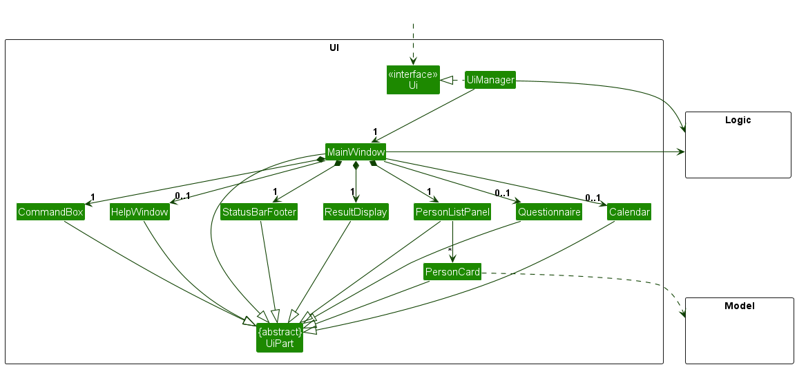

The UI consists of a `MainWindow` that is made up of parts e.g.`CommandBox`, `ResultDisplay`, `PersonListPanel`, `StatusBarFooter` etc. All these, including the `MainWindow`, inherit from the abstract `UiPart` class which captures the commonalities between classes that represent parts of the visible GUI.

The `UI` component uses the JavaFx UI framework. The layout of these UI parts are defined in matching `.fxml` files that are in the `src/main/resources/view` folder. For example, the layout of the [`MainWindow`](https://github.com/se-edu/addressbook-level3/tree/master/src/main/java/seedu/address/ui/MainWindow.java) is specified in [`MainWindow.fxml`](https://github.com/se-edu/addressbook-level3/tree/master/src/main/resources/view/MainWindow.fxml)

The `UI` component,

* executes user commands using the `Logic` component.
* listens for changes to `Model` data so that the UI can be updated with the modified data.
* keeps a reference to the `Logic` component, because the `UI` relies on the `Logic` to execute commands.
* depends on some classes in the `Model` component, as it displays `Person` object residing in the `Model`.

### Logic component

**API** : [`Logic.java`](https://github.com/se-edu/addressbook-level3/tree/master/src/main/java/seedu/address/logic/Logic.java)

Here's a (partial) class diagram of the `Logic` component:

The sequence diagram below illustrates the interactions within the `Logic` component, taking `execute("delete 1")` API call as an example.

:information_source: **Note:** The lifeline for `DeleteCommandParser` should end at the destroy marker (X) but due to a limitation of PlantUML, the lifeline reaches the end of diagram.

How the `Logic` component works:

1. When `Logic` is called upon to execute a command, it is passed to an `AddressBookParser` object which in turn creates a parser that matches the command (e.g., `DeleteCommandParser`) and uses it to parse the command.
2. This results in a `Command` object (more precisely, an object of one of its subclasses e.g., `DeleteCommand`) which is executed by the `LogicManager`.
3. The command can communicate with the `Model` when it is executed (e.g. to delete a person).
4. The result of the command execution is encapsulated as a `CommandResult` object which is returned back from `Logic`.

Here are the other classes in `Logic` (omitted from the class diagram above) that are used for parsing a user command:

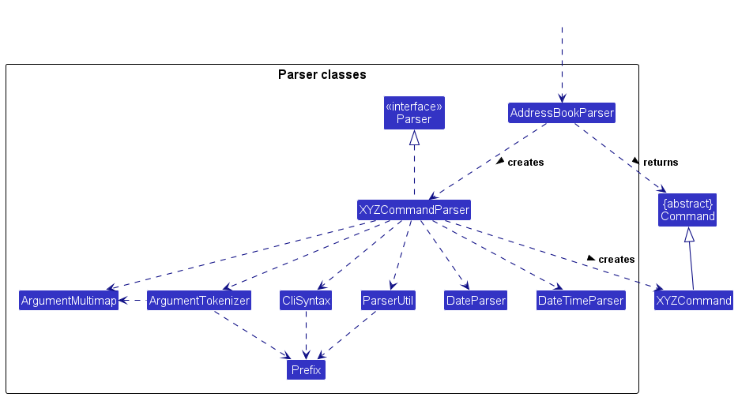

How the parsing works:
* When called upon to parse a user command, the `AddressBookParser` class creates an `XYZCommandParser` (`XYZ` is a placeholder for the specific command name e.g., `AddCommandParser`) which uses the other classes shown above to parse the user command and create a `XYZCommand` object (e.g., `AddCommand`) which the `AddressBookParser` returns back as a `Command` object.
* All `XYZCommandParser` classes (e.g., `AddCommandParser`, `DeleteCommandParser`, ...) inherit from the `Parser` interface so that they can be treated similarly where possible e.g, during testing.

### Model component
**API** : [`Model.java`](https://github.com/se-edu/addressbook-level3/tree/master/src/main/java/seedu/address/model/Model.java)

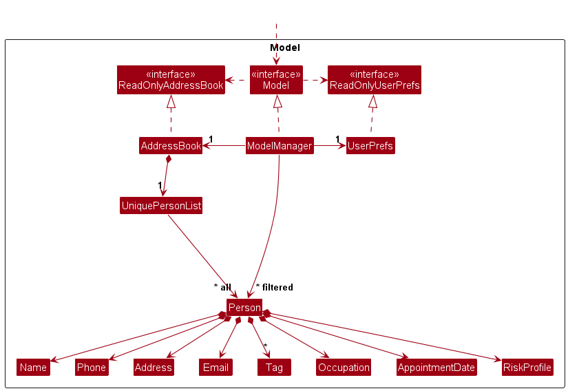

The `Model` component,

* stores the address book data i.e., all `Person` objects (which are contained in a `UniquePersonList` object).
* stores the currently 'selected' `Person` objects (e.g., results of a search query) as a separate _filtered_ list which is exposed to outsiders as an unmodifiable `ObservableList<Person>` that can be 'observed' e.g. the UI can be bound to this list so that the UI automatically updates when the data in the list change.
* stores a `UserPref` object that represents the user’s preferences. This is exposed to the outside as a `ReadOnlyUserPref` objects.
* does not depend on any of the other three components (as the `Model` represents data entities of the domain, they should make sense on their own without depending on other components)

:information_source: **Note:** An alternative (arguably, a more OOP) model is given below. It has a `Tag` list in the `AddressBook`, which `Person` references. This allows `AddressBook` to only require one `Tag` object per unique tag, instead of each `Person` needing their own `Tag` objects. 

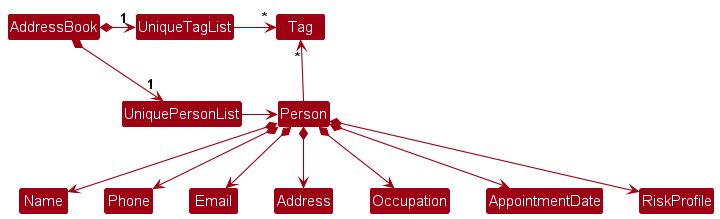

### Storage component

**API** : [`Storage.java`](https://github.com/se-edu/addressbook-level3/tree/master/src/main/java/seedu/address/storage/Storage.java)

The `Storage` component,
* can save both address book data and user preference data in JSON format, and read them back into corresponding objects.
* inherits from both `AddressBookStorage` and `UserPrefStorage`, which means it can be treated as either one (if only the functionality of only one is needed).
* depends on some classes in the `Model` component (because the `Storage` component's job is to save/retrieve objects that belong to the `Model`)

### Common classes

Classes used by multiple components are in the `seedu.addressbook.commons` package.

--------------------------------------------------------------------------------------------------------------------

## **Implementation**

This section describes some noteworthy details on how certain features are implemented.

### Add feature

#### Implementation

The `add` feature allows users to add a `Person` to their address book. The `add` command is implemented by the `AddCommand`
class.

Add implements the following operations:
* `AddCommand#execute`
* `AddCommand#equals`
* `AddCommand#toString`

These operations make use of other operations exposed in the `Model` interface, which are:
* `Model#hasPerson(Person)`
* `Model#addPerson(Person)`
* `Model#storePreviousUndoableCommand(String)`
* `Model#resetRedoableStateList()`
* `Model#resetUndoableStateList()`
* `Model#removeRedoCommands()`

Given below is an example usage scenario and how the add mechanism behaves at each step.

Step 1: The user launches the application. The application initializes various lists and data structures.

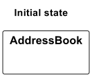

As seen in the object diagram, the address book is currently empty.

Step 2. The user executes `add n/Robert Johnson p/55512345 e/robertj@email.com o/Hairdresser a/789 Oak Street, Suite 10`
to add their client, Robert Johnson, to their address book.

The add command first calls `AddCommand#execute`, which calls `AddCommandParser#parse(String)`, to ensure that all the
mandatory prefixes are present, namely `Name`, `Phone`, `Email`, `Occupation` and `Address`.

`AddCommandParser#parse(String)` then verifies that among these mandatory fields, there are no duplicate prefixes

Once done, it then parses each prefix (both mandatory and optional) in their respective parser to ensure that they are
valid. For example, `Name` is parsed by `ParserUtil#parseName`, which checks if the name is valid (Only consists of
alphanumeric characters).

Once everything has been parsed and all prefixes are valid, `AddCommandParser#parse(String)` then returns a `Person`
with all these details to `AddCommand#execute`.

Step 3. `AddCommand#execute` then checks to ensure that the returned `Person` does not already exist in the address
book. If he does already exist in the address book, an exception is returned. On the other hand, if he does not, he is
then added to the address book by `Model#addPerson`.

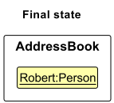

Upon successfully adding the person, the add success message is returned to the user, as depicted in the
User Guide.

#### Design considerations:

**Aspect: How add executes:**

* **Alternative** (current choice): Adds persons to the address book, checking for duplicates, and provides feedback
  messages.
    * Pros: Ensures controlled addition with validation and provides feedback to the user.
    * Cons: Can be meticulous.

* **Alternative 2:** Adds persons to the address book without checking for duplicates and allows for multiple additions 
  without feedback.
    * Pros: Fast and straightforward for multiple deletions.
    * Cons: Lacks feedback on whether the persons were added, which may be useful for confirmation and may result in
      duplicate entries.

### Edit feature

#### Implementation

The `edit` feature allows user to edit a person's data in the address book by providing the prefix and the changed value.

Edit implements the following operations:
* `EditCommand#execute`
* `EditCommand#createEditedPerson`

EditCommand also contains a static class `EditPersonDescriptor` that stores the details to edit the person with.

Given below is an example usage scenario and how the edit mechanism behaves at each step.

Step 1. The user launches the application for the first time.

Step 2. The user executes `list` to see what Persons are available in the address book. Initially, only John and
James are in the address book.

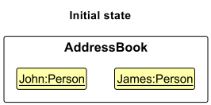

Step 3. The user executes `edit 1 n/ Greg` to edit the person's name at index 1 of the address book, John. 
* The `EditCommandParser#parse` will create a new `EditPersonDescriptor` to store the edited value of a person.
In this case, the new name of the person is stored in `EditPersonDescriptor`.
 
* `EditCommandParser#parse` will return a new `EditCommand` object with the parameter index, in this case 1, and the `EditPersonDescriptor` object.
* `EditCommand#execute` will then compare if the `EditPersonDescriptor` name already exist in the contact list. If it already exist, it will throw an exception. In this case, it does not.  
* `EditCommand#execute` will call `model#setPerson` to replace the current person with the newly edited person at the index number.

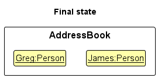

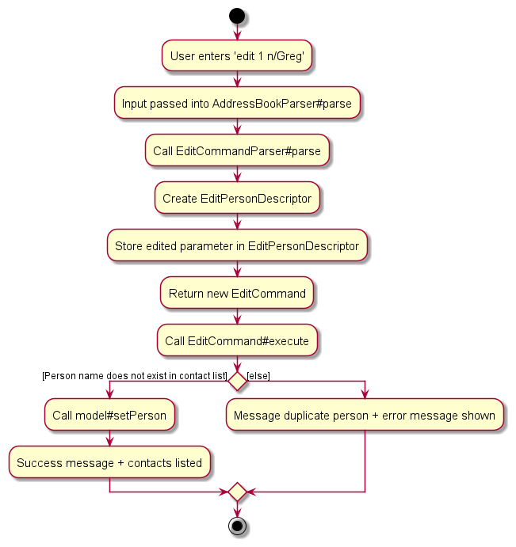

### Clone feature

#### Implementation

The `clone` feature creates a copy of a person in the address book while either adding a suffix at the end of the name 
of the cloned contact or, if the contact name has a pre-existing suffix, it increments that suffix by one.

The clone mechanism first checks to see if the index provided is valid. If a person exists at the index, it then checks
the suffix of the person in question.

Clone implements the following operations:
* `CloneCommand#execute`
* `CloneCommand#equals`
* `CloneCommand#toString`
* `CloneCommand#clonePerson`
* `CloneCommand#splitStringAtLastSpace`

These operations make use of other operations exposed in the `Model` interface, which are:
* `Model#getFilteredPersonList()`
* `Model#addPerson(Person)`
* `Model#storePreviousUndoableCommand(String)`
* `Model#resetRedoableStateList()`
* `Model#resetUndoableStateList()`
* `Model#removeRedoCommands()`

Given below is an example usage scenario and how the clone mechanism behaves at each step.

Step 1. The user launches the application for the first time. 

Step 2. The user executes `list` to see what Persons are available in the address book. Initially, only John and
James are in the address book.

Step 3. The user executes `clone 1` to clone the person at index 1 of the address book, John. The `clone` command first
calls `CloneCommand#execute`, which in turn checks to see if the index provided is valid in CloneCommandParser by
calling `ParserUtil#parseIndex`. If the index is valid, `Index#getZeroBased` is then called to ensure that it is
smaller than the size of the list. In this case, the index 1 provided is valid.

After all the checks on the index have been done, `CloneCommand#execute` then calls `CloneCommand#clonePerson`, which separates
the Person name (as a string) into two substrings using `CloneCommand#splitStringAtLastSpace`, the name and the possible
suffix, respectively.

After being separated into two substrings, `CloneCommand#clonePerson` then separates the person name into three cases:
Firstly, if the name has no spaces and no suffix. Secondly, if the name has spaces but the suffix does not consist of
only an integer. And lastly, if the name has spaces and the suffix consists of only an integer. As John has no spaces
and no suffix, this would be the first case highlighted.

Based on these three cases, either they have a suffix or they do not. If they do not have a suffix, such as in the first
two cases, then they have a suffix of one added to the back of the person name. If their name already possesses a suffix,
then this suffix is incremented. The newly cloned person with their new name is now returned to `CloneCommand#execute`.
As John has no suffix, a suffix of "1" is added to the back of his name and "John 1" is returned. 

Once returned, the command then attempts to add the cloned person into the list through `Model#addPerson`. However, if
it throws a duplicate exception (implying that a person with that name already exists in the contact book), then this
cloned person is cloned yet again via `CloneCommand#clonePerson` until the suffix of the cloned person returned is
unique. As the only other person in the list prior was James, John 1 is added to the list successfully on the first
attempt to add him.

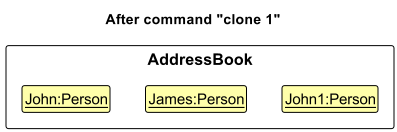

Should the person be added successfully to the address book, the clone success message will be returned to the user, as 
depicted in the User Guide.

#### Design considerations:

**Aspect: How clone executes:**

* **Alternative 1 (current choice):** Copies the person at the index provided and returns a person with a number 
    next to their name
  * Pros: Fast,  while ensuring that there are no strict duplicates
  * Cons: Can be restrictive as you might have contacts that are similar and have the same name

* **Alternative 2:** Copies the person exactly as is while allowing for duplicates
  * Pros: Fast, allows for as many copies of a person as the user desires
  * Cons: Will be difficult to keep track of contacts, defeating the purpose of FAPro as a comprehensive yet focused
    contact organiser

### Delete feature

#### Implementation

The `delete` feature allows users to remove one or more persons from the address book. Users can specify one or
more indexes to identify the persons to be deleted. The `delete` command is implemented by the `DeleteCommand`
class.

Delete implements the following operations:
* `DeleteCommand#execute`
* `DeleteCommand#equals`
* `DeleteCommand#toString`

These operations make use of other operations exposed in the `Model` interface, which are:
* `Model#getFilteredPersonList()`
* `Model#deletePerson(Person)`
* `Model#storePreviousUndoableCommand(String)`
* `Model#storeDeletedNumberList(int)`
* `Model#resetRedoableStateList()`
* `Model#resetUndoableStateList()`
* `Model#removeRedoCommands()`

Given below is an example usage scenario and how the delete mechanism behaves at each step.

Step 1: The user launches the application. The application initializes various lists and data structures,
including `deletedPersons`.

Step 2. The user executes `list` to view the persons available in the address book.

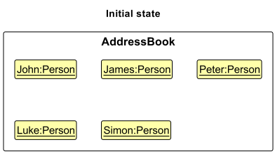

In this example, we will take John to be at index 1, James to be at index 2, Peter to be at index 3, Luke to be at index
4 and Simon to be at index 5.

Step 3. The user executes `delete 1 3 5` to delete the persons at indexes 1, 3, and 5 from the address book.
The delete command first calls `DeleteCommandParser`, to ensure that there are no duplicate indexes, to
perform regular index validation and to sort indexes ascendingly and return the indexes.

`DeleteCommand#execute`, which checks the validity of the provided indexes. It ensures that the indexes are
positive integers and within the range of the displayed list. 

After validating the indexes, the command iterates through the target indexes and deletes the corresponding
persons from the address book using `Model#deletePerson`. The deleted persons are stored in `deletedPersons`,
and the command records the execution for potential undo operations.

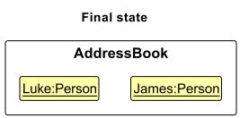

Upon successfully deleting the persons, the delete success message is returned to the user, as depicted in the
User Guide.

#### Design considerations:

**Aspect: How delete executes:**

* **Alternative 1 (current choice):**  Deletes persons at the specified indexes and provides a feedback message.
    * Pros: Ensures controlled deletion and provides feedback to the user.
    * Cons: Can be tedious.

* **Alternative 2:** Deletes persons at the specified indexes and allows for multiple deletions without feedback.
    * Pros: Fast and straightforward for multiple deletions.
    * Cons: Lacks feedback on deleted persons, which may be useful for confirmation.

### Undo feature

#### Implementation

The `undo` command undoes the most recent undoable command. The only undoable commands available are: `add`, `clone`, 
`edit`, `delete`, & `clear`. Commands that do not modify the address book, such as `list`, `find`, `sort` etc. are not 
undoable commands.

The undo mechanism is facilitated by the use of `ArrayLists` in `ModelManager` to store deleted, added and edited 
persons, as well as the previous undoable commands. The number of contacts deleted from a single delete command and 
from a clear command are stored as well. As these `ArrayLists` are instantiated every time the user starts 
the program, undo does not store the commands from previous sessions and cannot undo changes made in previous sessions.

The below diagram shows the instantiation of such empty `ArrayLists` in `ModelManager`

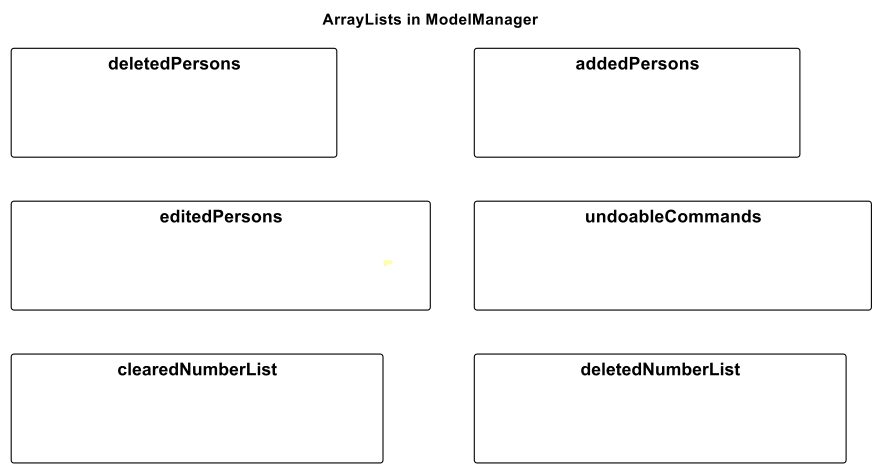

The undo mechanism also uses implementation of all the undoable commands. For all undoable commands, when they 
are invoked, `ModelManager` will be called to store each command in `previousUndoableCommands`. 
* Furthermore, for the `delete` and `clear` commands, each deleted person will be stored in `deletedPersons`.
  * For `delete`, the number of deleted persons from a singular `delete` 
  command will be stored in `deletedNumberList`. I.e. `delete 1 2 3` deletes 3 persons, so 3 is stored in 
  `deletedNumberList`, `delete 1` deletes 1 person, so 1 is stored.
  * For `clear`, the number of deleted persons will be stored in `clearedNumberList`. I.e. 
  `clear` will store 5 in `clearedNumberList` if there were 5 contacts in the address book.
* For the `edit` command, a `pair` of the original `person` and the edited `person` will be stored in an 
`ArrayList` named `editedPersons`. 

Additionally, it implements a single `execute` command which determines which type of undo operation to do based on the 
most recent previous undoable command. The other undo operations are:
* `UndoCommand#executeUndoDelete(Model)`
* `UndoCommand#executeUndoClear(Model)`
* `UndoCommand#executeUndoAdd(Model)`
* `UndoCommand#executeUndoEdit(Model)`

These operations make use of other operations exposed in the `Model` interface, which are:
* For undoable commands:
  * `Model#getPreviousUndoableCommandsSize()`
  * `Model#getPreviousUndoableCommand()`
  * `Model#removePreviousUndoableCommand()`
* For undoing `delete` and `clear` commands:
  * `Model#getDeletedPersons()`
  * `Model#getDeletedPerson()`
  * `Model#removeDeletedPerson()`
  * `Model#getLastDeletedNumber()`
  * `Model#getDeletedNumberList()`
  * `Model#undoDelete()`
  * `Model#getLastClearedNumber()`
  * `Model#removeLastClearedNumber()`
* For undoing `add` and `clone` commands:
  * `Model#getAddedPerson()`
  * `Model#undoAdd()`
* For undoing `edit` commands
  * `Model#getEditedPersonsPair()`
  * `Model#removeEditedPersonsPair()`
  * `Model#undoEdit()`

Given below is an example usage scenario and how the undo mechanism behaves at each step.

Step 1. The user launches the application for the first time. The `ArrayList`s `previousUndoableCommands`, 
`deletedPersons`, and `editedPersons` are initialized as a blank `ArrayList`.

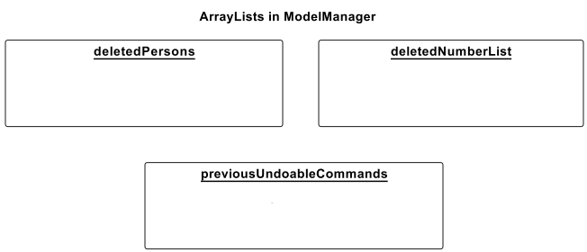

Step 2. The user executes `delete 1 2` command to delete the 1st and 2nd person (John and Greg) in the address book. 
The following steps are repeated twice, since 2 persons are deleted.
* The `delete` command calls `Model#storePreviousUndoableCommand(String)`, adding the command as a String into 
`previousUndoableCommands`, and also calls `Model#storeDeletedPerson(Person)`, adding the Person into 
`deletedPersons`.
* Hence, there are 2 elements in `deletedPersons` and `previousUndoableCommands`.

Then, the `delete` command also calls `Model#storeDeletedNumberList`, adding the number of persons deleted into 
`deletedNumberList`.

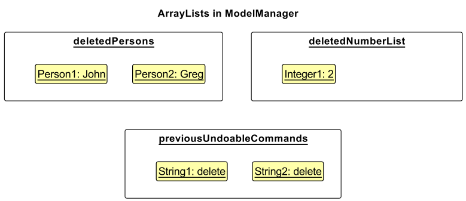

The following sequence diagram shows how the `delete` operation works (only important parts related to undo).

:information_source: **Note:** The lifeline for `UndoCommand` should 
end at the destroy marker (X) but due to a limitation of PlantUML, the lifeline reaches the end of diagram.

:information_source: **Note:** If an undoable command fails its execution, it will not call 
`Model#storePreviousUndoableCommand(String)` so nothing is stored in `previousUndoableCommands`, and `ModelManager` 
is unchanged.

Step 3. The user now decides that deleting the person was a mistake, and decides to undo that action by executing 
the `undo` command. The `undo` command will call `model#getPreviousUndoableCommand`, which gets the most recent 
undoable command executed by the user. In this case, it is the `delete` command. Hence, `UndoCommand#UndoDelete
(model)` is called, which adds back the deleted `Person`s to the address book. 

In the process, `Model#removePreviousUndoableCommand` and `Model#removeDeletedPerson()` is called twice, removing the 
delete commands from `previousUndoableCommands` and deleted persons from `deletedPersons`. 
`Model#removeLastDeletedNumber` is also called once, removing the deleted number from `deletedNumberList`.

The following sequence diagram shows how the `undo` operation works.

:information_source: **Note:** The lifeline for `UndoCommand` should
end at the destroy marker (X) but due to a limitation of PlantUML, the lifeline reaches the end of diagram.

Step 4. The user now decides to execute the command `list`. As this command is not an undoable command, 
`Model#storePreviousUndoableCommand(String)` and other storing operations are not called, so `ModelManager` remains 
unchanged.

#### Design considerations:

**Aspect: How undo executes:**

* **Alternative 1 (current choice):** Individual command knows how to undo by
  itself.
    * Pros: Will use less memory (e.g. for `delete`, just save the person being deleted).
    * Cons: We must ensure that the implementation of each individual command are correct.

* **Alternative 2 :** Save the entire address book.
    * Pros: Easy to implement.
    * Cons: May have performance issues in terms of memory usage.

### Redo feature

#### Implementation

The `redo` command redoes the most recent `undo` command. It is closely linked with the `undo` command. 

The `redo` mechanism is facilitated by the use of `ArrayLists` in `ModelManager` that stores the states that can be 
redone and undone, namely `redoableStateList` and `undoableStateList`. The `redo` mechanism is used in conjunction with 
the `undo` mechanism. For each `undo` command, 
`Model#addToRedoableStateList` is called, saving the state of the address book before the undo is committed. 

Additionally, it implements the following operations:
* `Model#getRedoableStateListSize()`
* `Model#restoreRedoableState()`
* `Model#addToUndoableStateList()`

For each `redo` command, `Model#addToUndoableStatelist` is called, saving the state of the address book before the 
redo is committed.

The following operations are implemented to `undo` a `redo` command:
* `Model#addToRedoableStateList()`
* `Model#restoreUndoableState()`
* `Model#removePreviousUndoableState()`

After any command that modifies the address book is executed (I.e. `add`, `clone`, `delete`, `clear`, `edit`), 
`redoableStateList` and `undoableStatelist` are re-initialised as blank `ArrayList`s, and any redo commands left in 
`previousUndoableCommands` are deleted. The following operations are implemented to facilitate this:
* `Model#resetRedoableStateList()`
* `Model#resetUndoableStateList()`
* `Model#removeRedoCommands()`

Given below is an example usage scenario and how the redo mechanism behaves at each step.

Step 0: The user launches the application and deletes the first 2 contacts, with names John and Greg. (Refer to the 
usage scenario of the undo mechanism for these steps) At the launch of the application, the `ArrayList`s `previousUndoableCommands`, 
`redoableStatelist` and `undoableStateList` are initialized as a blank `ArrayList`. Then, 2 delete commands are 
added into the `previousUndoableCommands` after the deletion of the first 2 contacts.

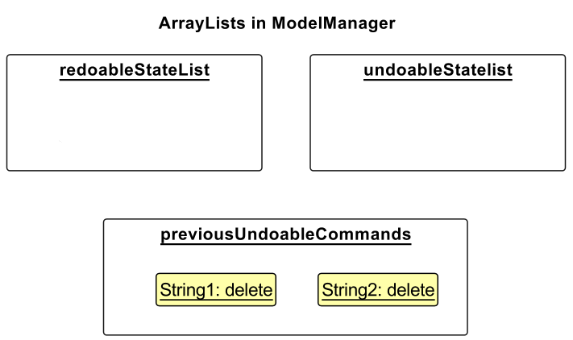

Now, John and Greg are deleted.

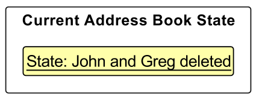

Step 1: The user now decides that deleting the person was a mistake, and decides to undo that action by executing
the `undo` command. The `undo` command will call `Model#addToRedoableStateList()`, adding the state of the address 
book before the `undo` is committed into the `redoableStateList`. Furthermore, `Model#removePreviousUndoableCommand()
` is called twice, removing the delete commands.

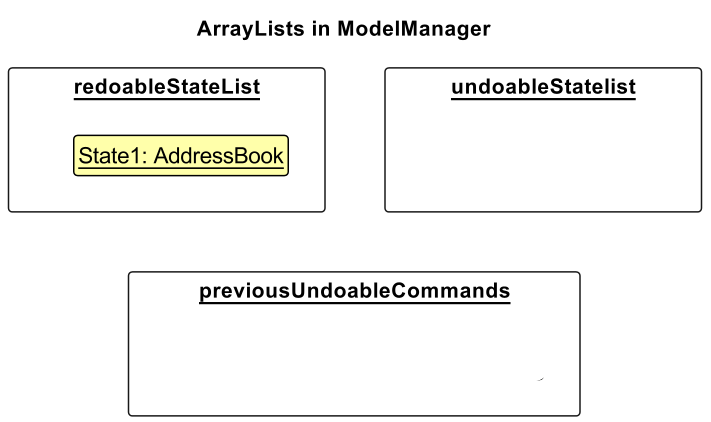

Now, John and Greg are back in the address book.

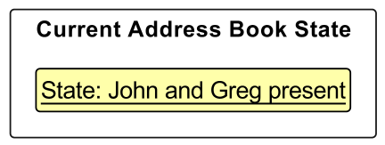

The following sequence diagram shows how the `undo` operation works when undoing the `delete` command.

:information_source: **Note:** The lifeline for `RedoCommand` should
end at the destroy marker (X) but due to a limitation of PlantUML, the lifeline reaches the end of diagram.

Step 2: The user now decides that undoing was a mistake, and decides to redo that action by executing the `redo` 
command. The `redo` command will call `Model#addToUndoableStateList()`, adding the state of the address book before 
the `redo` is committed into the `undoableStateList`. `Model#storePreviousUndoableCommand(String)` is also called, 
adding the command as a String into `previousUndoableCommands`, and finally `Model#restoreRedoableState` is called, 
restoring the current address book to the redone state (I.e. the address book after the deletion of the first 2 
contacts).

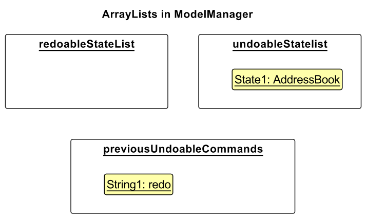

Now, John and Greg are deleted.

The following sequence diagram shows how the `redo` operation works.

:information_source: **Note:** The lifeline for `RedoCommand` should
end at the destroy marker (X) but due to a limitation of PlantUML, the lifeline reaches the end of diagram.

Step 3: The user now decides that redoing was a mistake, again! Hence, the user decides to undo that action once 
again, by executing the `undo` command. The `undo` command will call `UndoCommand#executeUndoRedo`, which calls 
`Model#addToRedoableStateList()`, adding the state of the address book before the `undo` is committed into the 
`redoableStateList`. `Model#removePreviousUndoableCommand()` is also called, removing the command from 
`previousUndoableCommands`, and finally `Model#restoreUndoableState` is called, restoring the current address book 
to the undone state (I.e. the address book before the deletion of the first 2 contacts).

Now, John and Greg are back in the address book.

The following sequence diagram shows how the `undo` operation works when undoing the `redo` command.

:information_source: **Note:** The lifeline for `UndoCommand` should
end at the destroy marker (X) but due to a limitation of PlantUML, the lifeline reaches the end of diagram.

:information_source: **Note:** From here on, it is possible to continuously redo and undo the same command indefinitely.

Step 4: The user now decides to execute the command `clone 1`. `Model#resetRedoableStateList()` and 
`Model#resetUndoableStateList()` are called, re-initialising `redoableStateList` and `undoableStateList` to blank 
`ArrayList`s. `Model#removeRedoCommands()` is also called, removing all redo commands from 
`previousUndoableCommands`. However, in this case, there are no redo commands to remove.

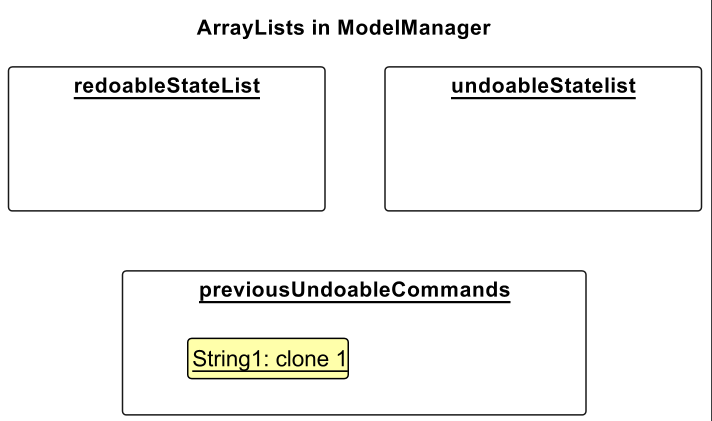

#### Design considerations:

**Aspect: How redo executes:**

* **Alternative 1 (current choice):** Save the entire address book only for redoing an undo command and undoing a redo 
  command.
    * Pros: Easy to implement and reduces performance issues by not storing states for all undo commands.
    * Cons: Every command that modifies the address book will have to re-initialise `redoableStateList` and 
      `undoableStatelist` and remove `redo` commands from `previousUndoableCommands`, adding performance cost.
  
* **Alternative 2:** Save the entire address book for all undo and redo commands.
    * Pros: Easy to implement
    * Cons: May have performance issues in terms of memory usage.

### Find feature

#### Implementation

The `find` feature allows the user to search for contacts in their address book. It allows users to find contacts based on
name, address, and appointment date. The type of search is determined by the input prefix specified by the user:
1. `n/` for find by name
2. `a/` for find by address
3. `appt/` for find by appointment date

The actual `find` operation acts as a "facilitator" for `find_name`, `find_add` and `find_appt`, all three of which 
are abstracted out of the user's sight, i.e. they do not know that these operations exist, and they are not allowed to 
directly call these functions. The parser for the `find` command will identify the prefix specified by the user and 
pass on the operation to the relevant class for execution. As such, there is no meaningful methods implemented directly
in the `find` class. The parser for the `find` class parse the (valid) user input, and call on one of the three operations:
1. `FindNameCommandParser#parse(String)`
2. `FindAddCommandParser#parse(String)`
3. `FindApptCommandParser#parse(String)`

From there on, the operation will be handled by the separate classes.

Should the user input be invalid, an exception specific to the error type will be returned to the user.

Given below is an example usage scenario and how the find feature works for every possible prefix.

_Name_

Step 1. The financial advisor wants to find the details of "John" and "Alice" in his address book.

Step 2. The financial advisor enters `find n/John Alice` into the command box and presses enter.

Step 3. The input `find n/John Alice` is passed into `FindCommandParser#parse`, and the string is parsed into two portions:
1. Prefix
2. Argument

Step 4. Since the prefix specified by the financial advisor is `n/`, the `FindCommandParser` knows that it should call
`find_name`, and thus, the argument is passed into `FindNameCommandParser#parse` for execution.

Step 5. `FindNameCommandParser#parse` parses the argument input, and separates `John` and `Alice`, and places both names into
a String array. Then, a new `FindNameCommand` is returned.

Step 6. Then, `FindNameCommand#execute` is called, which uses the keywords in the String array to filter the address book.

Step 7. A list of all contacts who have `John` and `Alice` in their name is listed.

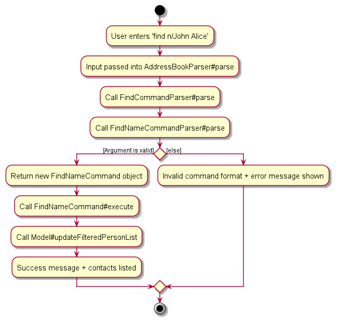

_Address_

Step 1. The financial advisor wants to find out all their clients living in Serangoon so that they can 
        line up client appointments efficiently.

Step 2. The financial advisor enters `find a/Serangoon` into the command box and presses enter.

Step 3. The input `find a/Serangoon` is passed into `FindCommandParser#parse`, and the string is parsed into two portions:
1. Prefix
2. Argument

Step 4. Since the prefix specified by the financial advisor is `a/`, the `FindCommandParser` knows that it should call
`find_add`, and thus, the argument is passed into `FindAddCommandParser#parse` for execution.

Step 5. `FindAddCommandParser#parse` parses the argument input, and separates extracts `Serangoon`, and places it into
a String array. Then, a new `FindAddCommand` is returned.

Step 6. Then, `FindAddCommand#execute` is called, which uses the keyword in the String array to filter the address book.

Step 7. A list of all contacts who have `Serangoon` in their address is listed.

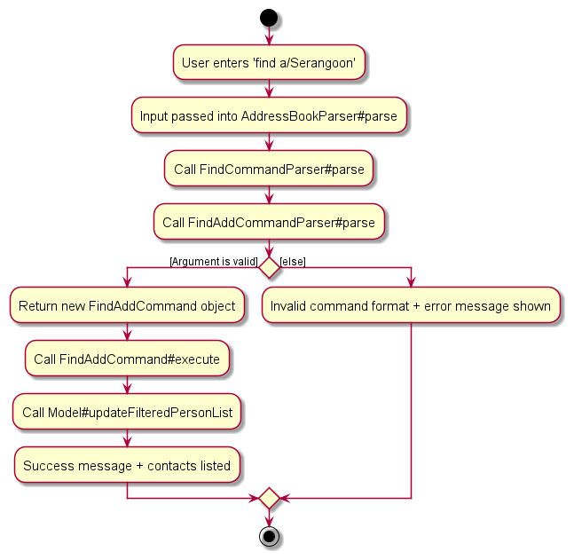

_Appointment Date_

Step 1. The financial advisor wants to check all the appointments he has that day (assuming the date is `2023-12-12`).

Step 2. The financial advisor enters `find appt/2023-12-12` into the command box and presses enter.

Step 3. The input `find appt/2023-12-12` is passed into `FindCommandParser#parse`, and the string is parsed into two portions:
1. Prefix
2. Argument

Step 4. Since the prefix specified by the financial advisor is `appt/`, the `FindCommandParser` knows that it should call
`find_appt`, and thus, the argument is passed into `FindApptCommandParser#parse` for execution.

Step 5. `FindApptCommandParser#parse` parses the argument input, and extracts `2023-12-12`, and places it into
a String array. Then, a new `FindApptCommand` is returned.

Step 6. Then, `FindApptCommand#execute` is called, which uses the keyword in the String array to filter the address book.

Step 7. A list of all contacts who have `2023-12-12` matching their appointment date is listed.

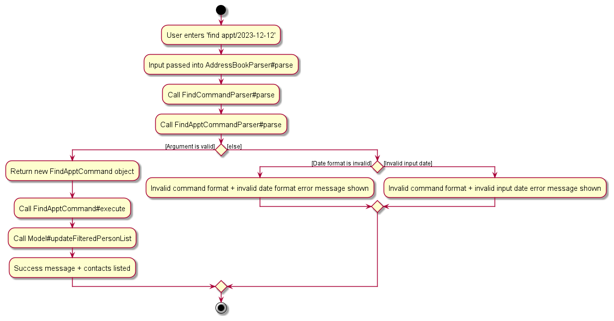

### Sort feature

#### Implementation
The `sort` feature allows the user to sort the clients' data in the data display in ascending order based on the input prefix specified by user:

1. n/ for sort by name
2. appt/ for sort by appointment date

The parser for the sort command will identify the prefix specified by the user and return a new sort command class with the parameter of comparator type stored in ComparatorUtil class. ComparatorUtil class currently have two static comparator:

1. APPTCOMPARATOR: comparator that sort the contacts by appointment date
2. NAMECOMPARATOR: comparator that sort the contacts by name

The sort feature implements the following operations:

* SortCommand#Execute
* SortCommand#Equals
* SortCommand#ToString

These operations make use of other operations exposed in the `Model` interface, which are

* Model#updateSortComparator(Comparator\<Person>)

Given below is an example usage scenario and how the sort mechanism behaves at each step.

Step 1: The user launches the application. The application always initializes Comparator\<Person> in the Model to sort by appointment date.

Step 2: the user executes `list` to view the persons available in the address book.

In this example, we will take John to be at index 1, James to be at index 2, Peter to be at index 3, Luke to be at index
4 and Simon to be at index 5.

Step 3: The user executes `sort n/` to sort the contacts by name. The input is passed into `SortCommandParser#parse` to identify the prefix inputted by user.

Step 4: Since the prefix is `n/`, `SortCommandParser#parse` will return a new `SortCommand` with the comparator parameter `NAMECOMPARATOR`.

Step 5: Then, `SortCommand#execute` is called, which call `Model#updateSortComparator(Comparator)` to update the Comparator in the Model.

Step 6: The list of contacts is updated in ascending order by name.

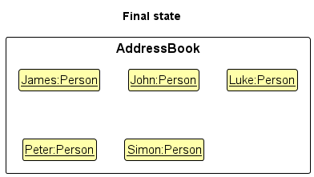

Now, James is at index 1, John is at index 2, Luke is at index 3, Peter is at index
4 and Simon is at index 5.

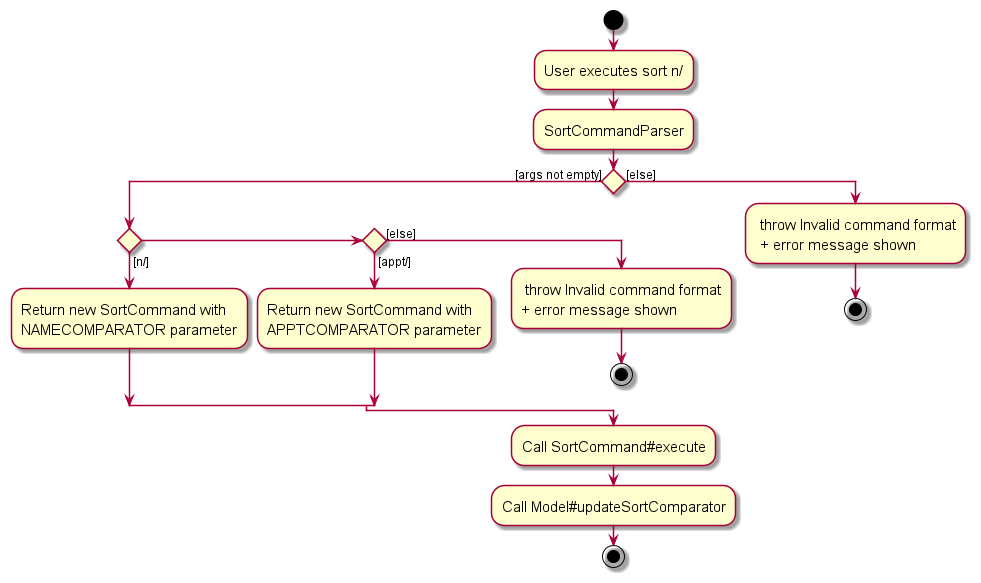

### Questionnaire feature

#### Implementation
The `questionnaire` feature shows a pop-up window for risk assessment multiple choice questions, including the grading and risk profile categories criteria

The questionnaire feature implements the following operations:
* `QuestionnaireCommand#execute(Model)`
* `MainWindow#handleQuestionnaire()`

Given below is an example usage scenario and how the `questionnaire` mechanism behaves at each step.

Step 1. The user launches the application for the first time.

Step 2. The user wants to add a risk profile level to a person using the `risk profile` command which requires the person's response to the risk assessment questions.

Step 3. The user executes `questionnaire` to view the risk assessment multiple choice questions, including the grading and risk profile categories criteria. 
        The command will invoke `QuestionnaireCommand#execute(Model)`, indicating that the questionnaire window should be shown.
        
Then it will trigger `MainWindow#handleQuestionnaire()`. If the questionnaire window is not showing, it is displayed. If it's already showing, the existing window is focused.

#### Design considerations:

**Aspect: How `questionnaiare` executes:**

* **Alternative 1 (current choice):** Shows the contents in a new window
    * Pros: Neat
    * Cons: Will have two windows open side by side, main and risk assessment questionnaire window

* **Alternative 2:** Shows the contents within the main application window
    * Pros: Only need to open the main application window
    * Cons: Will be cluttered since the content of the risk assessment questionnaire is dense

### Risk Profile feature

#### Implementation
The `riskprofile` feature adds and updates the risk profile of a person in the FAPro application.
Since `riskprofile` accepts two parameter, its mechanism is to validate both its index and result. If both are valid, then
it will generate the risk profile based on the response to a risk assessment questionnaire provided in the questionnaire window.

The risk profile feature implements the following operations:
* `RiskProfileCommandParser#parse(String)`
* `RiskProfileCommand#equals(Object)`
* `RiskProfileCommand#isValidResult(String)`
* `RiskProfileCommand#calculateTotalScore(String)`
* `RiskProfileCommand#calculateRiskLevel(int)`
* `RiskProfileCommand#generateSuccessMessage(Person)`
* `RiskProfileCommand#execute(Model)`

It also makes use of other operations exposed in the `Model` interface, which are:
* `Model#getFilteredPersonList()`
* `Model#setPerson()`
* `Model#updateFilteredPersonList()`

Given below is an example usage scenario and how the `riskprofile` mechanism behaves at each step.

Step 1. The user launches the application for the first time.

Step 2. The user executes `add n/Diego ...` to add a new person.
The `add` command will modified the initial address book causing the added person
to be saved.

Step 3. The user executes `riskprofile 7 res/a,b,c,d,e,e,b,c` to add risk profile level for 
person at index 7 of the address book, Diego based on his response to the questions in the questionnaire window.

Step 4. The `riskprofile` command will trigger the `RiskProfileCommandParser#parse(String)` 
to extract the index and result according to user input at **Step 3**.
If the given index or result, it will throw an `ParseException`.

Step 5. The extracted index and result are passed to the `RiskProfileCommand` constructor.
Then the `RiskProfileCommand#execute(Model)` is called which retrieve the current list of persons using
`Model#getFilteredPersonList()`. Followed by that, it checks if the provided index is within the valid range of the list.
If the index is invalid, it will throw a `CommandException`. 
However, if the index is valid, then `Person` object at the specified index is retrieved from the list.

After that, A new `Person` object is created with the same attributes as the retrieved one
with the risk profile field replace by a new risk profile provided from `RiskProfileCommand#calculateRiskLevel(int)`
that the value is obtained from `RiskProfileCommand#calculateTotalScore(String result)`.

Step 6. `Model#setPerson()` is used to update the person with the new risk profile level, replacing the original person in the model 
and `Model#updateFilteredPersonList()` is used to reflect the changes.

Step 7. The `CommandResult` is returned with success message generated by the `RiskProfileCommand#generateSuccessMessage(Person)`.
Concurrently, Diego's `PersonCard` will shows his risk profile level which is **Moderately High**.

#### Design considerations:

**Aspect: How `riskprofile` executes:**

* **Alternative 1 (current choice):** Listed the client response individually for all questions
  (a,b,c,d,e,e,a,c)
    * Pros: Efficient, no need to manually keep track the total of each multiple choice options
    * Cons: Can be tedious if there are many questions

* **Alternative 2:** Listed the client response cumulatively based on the multiple choice options for all questions
  (a:2,b:1,c:2,d:1,e:2)
    * Pros: More efficient if there are many questions
    * Cons: Will be difficult to keep track the total of each multiple choice options, defeating the purpose of this feature which is convenient

### Calendar feature

#### Implementation
The `calendar` feature shows a pop-up window for calendar using CalendarFX library.

The calendar feature implements the following operations:
* `CalendarCommand#execute(Model)`
* `MainWindow#handleCalendar()`

Given below is an example usage scenario and how the `calendar` mechanism behaves at each step.

Step 1. The user launches the application for the first time.

Step 2. The user wants to see clients' appointment date neatly shown in a calendar.

Step 3. The user executes `calendar` to view calendar window.
The command will invoke `CalendarCommand#execute(Model)`, indicating that the calendar window should be shown.

Then it will trigger `MainWindow#handleCalendar()`. If the calendar window is not showing, it is displayed. If it's already showing, the existing window is focused.

#### Design considerations:

**Aspect: How `calendar` executes:**

* **Alternative 1 (current choice):** Shows the contents in a new window
    * Pros: Neat, easily implemented as developers do not need to readjust the main window.
    * Cons: Will have two windows open side by side, main and calendar window.

* **Alternative 2:** Shows the contents within the main application window
    * Pros: Only need to open the main application window
    * Cons: Slightly difficult to implement due to time constraint as the data display box will also need to be readjusted. Clients' data will also be harder to see.

### Help feature

#### Implementation
The `help` feature shows a pop-up window for the basic commands and displays a link to FAPro’s user guide for other commands.

The help feature implements the following operations:
* `HelpCommand#execute(Model)`
* `MainWindow#handleHelp()`

Given below is an example usage scenario and how the `help` mechanism behaves at each step.

Step 1. The user launches the application for the first time.

Step 2. The user wants to quickly troubleshoot and learn how to operate the program.

Step 3. The user executes `help` to view the basic commands or FAPro’s user guide link.
The command will invoke `HelpCommand#execute(Model)`, indicating that the help window should be shown.

Then it will trigger `MainWindow#handleHelp()`. If the help window is not showing, it is displayed. If it's already showing, the existing window is focused.

#### Design considerations:

**Aspect: How `help` executes:**

* **Alternative 1 (current choice):** Shows the basic commands details and FAPro’s user guide link
    * Pros: Able to quickly troubleshoot for some basic commands
    * Cons: The content in the help window somewhat overlap with the user guide 

* **Alternative 2:** Only shows FAPro’s user guide link
    * Pros: Avoid overlapping content between the user guide and help window
    * Cons: Will be troublesome for user to access the user guide if they only need to view some basic commands

--------------------------------------------------------------------------------------------------------------------

## **Documentation, Logging, Testing, Configuration, Dev-ops**

* [Documentation guide](Documentation.md)
* [Testing guide](Testing.md)
* [Logging guide](Logging.md)
* [Configuration guide](Configuration.md)
* [DevOps guide](DevOps.md)

--------------------------------------------------------------------------------------------------------------------

## **Appendix A: Product Scope**

**Target user profile**:

* has a need to manage a significant number of contacts
* prefer desktop apps over other types
* can type fast
* prefers typing to mouse interactions
* is reasonably comfortable using CLI apps
* financial advisors
* has a need for sorting clients by schedule

**Value proposition**:
FApro seeks to improve the quality of life of financial advisors (FAs). It allows FAs to keep track of large numbers of contacts. It allows FAs to have a one-stop platform to manage their contacts and conduct financial analytics while providing a big-picture view of their clientele as a whole.

## **Appendix B: User Stories**

Priorities: High (must have) - `* * *`, Medium (nice to have) - `* *`, Low (unlikely to have) - `*`

| Priority | As a …​                          | I want to …​                                                              | So that I can…​                                                                         |
|----------|----------------------------------|---------------------------------------------------------------------------|-----------------------------------------------------------------------------------------|
| `* * *`  | user                             | add a new person                                                          | add entries that I need                                                                 |
| `* * *`  | user                             | delete a person                                                           | remove entries that I no longer need                                                    |
| `* * *`  | user                             | delete a few persons                                                      | remove multiple entries that I no longer need                                           |
| `* * *`  | user                             | find a person by name                                                     | locate details of persons without having to go through the entire list                  |
| `* * *`  | financial advisor                | find a person by address                                                  | line-up all my client meetings efficiently                                              |
| `* * *`  | financial advisor                | find all contacts by appointment date                                     | see what appointments I have for that date                                              |
| `* * *`  | financial advisor                | edit contact details of clients                                           | client details are up to date                                                           |
| `* * *`  | financial advisor                | be able to view the help page                                             | quickly troubleshoot and learn how to operate the program                               |
| `* * *`  | financial advisor                | know specific person's risk profile level                                 | give effective financial advice                                                         |
| `* *`    | lazy financial advisor           | be able to clone a person                                                 | I can easily replicate contacts that are similar                                        |
| `* *`    | financial advisor                | be able to sort clients contact list                                      | easier to find client contact that I am looking for                                     |
| `* *`    | clumsy financial advisor         | be able to undo commands done previously such as delete, clear, edit, add | undo my mistakes made with a simple command, rather than having to do multiple commands | 

## **Appendix C: Use Cases**

(For all use cases below, the **System** is the `FAPro` and the **Actor** is the `Financial Advisor`, unless specified otherwise)

**Use case: UC1 - Add a person**

**MSS**

1.  FAPro <u>lists out all contacts (UC10)</u>.
2.  Financial Advisor requests to add a new person.
3.  FAPro adds the person to the address book based on the specified parameter (name, address, phone number, email address, occupation, tag and appointment date).

    Use case ends.

**Extensions**

* 2a. The parameter is provided in an invalid format.

    * 2a1. FAPro shows an error message: "Invalid command format!", along with instructions on how to
      properly use the command.
  
        Use case resumes at step 1.

* 2b. The parameter is specified multiple times.

    * 2b1. FAPro shows an error message: "Multiple values specified for the following single-valued field(s): x", where
      x are the prefixes that have duplicates.
  
        Use case resumes at step 1.

* 2c. The person's name is the same as the existing name in the address book.

    * 2c1. FAPro shows an error message: "This person already exists in the address book."

        Use case resumes at step 1.

    
**Use case: UC2 - Delete a person**

**MSS**

1.  FAPro <u>lists out all contacts (UC10)</u>.
2.  Financial Advisor requests to delete at least one person.
3.  FAPro deletes the person(s).

    Use case ends.

**Extensions**

* 1a. The list is empty.

    Use case ends.

* 2a. One of the indexes provided is a positive integer but out of the range of the address book.

    * 2a1. FAPro shows an error message:  “The person index provided is invalid.”

        Use case resumes at step 1.

* 2b. One of the indexes provided does not adhere to the restrictions (must be positive integers, separated by spaces, no duplicates).

    * 2b1. FAPro shows and error message:  "Invalid command format!", along with instructions on how to
      properly use the command.
        
        Use case resumes at step 1.

**Use case: UC3 - Clone a person**

**MSS**

1.  FAPro <u>lists out all contacts (UC10)</u>.
2.  Financial Advisor requests to clone a specific person in the list.
3.  FAPro clones the person.

    Use case ends.

**Extensions**

* 2a. The parameter is provided in an invalid format.

    * 2a1. FAPro shows an error message: "Invalid command format!", along with instructions on how to
      properly use the command.

      Use case resumes at step 1.

* 2b. The given index is invalid (i.e. Not a positive integer and part of the address book).

    * 2b1. FAPro shows an error message:  “The person index provided is invalid.”

        Use case resumes at step 1.

**Use case: UC4 - Find a person**

**MSS**

1.  Financial Advisor requests to find person(s) using a specific input.
2.  FAPro shows a list of person(s) who fits the search input.

    Use case ends.

**Extensions**

* 1a. The parameter is provided in an invalid format.

    * 1a1. FAPro shows an error message: "Invalid command format!", along with instructions on how to
      properly use the command.

      Use case resumes at step 1.

* 2a. The list is empty because no contacts exist with the search input.

  Use case ends.

**Use case: UC5 - Edit a person**

**MSS**

1.  FAPro <u>lists out all contacts (UC10)</u>.
2.  Financial Advisor requests to edit specified parameter of a specific person in the list.
3.  FAPro edits the specified parameter (name, address, phone number, email address, occupation, and tag) of a person.

    Use case ends.

**Extensions**

* 1a. The list is empty.

    Use case ends.

* 2a. The given index is invalid.

    * 2a1. FAPro shows an error message: "Invalid command format!"

        Use case resumes at step 1.

* 2b. The parameter is provided in an invalid format.

    * 2b1. FAPro shows an error message: "Invalid command format!"

        Use case resumes at step 1.

* 2c. The parameter is specified multiple times.

    * 2c1. FAPro shows an error message: "The parameter can only be specified once."

        Use case resumes at step 1.

**Use case: UC6 - Viewing help**

Preconditions:

* The Financial Advisor has opened FAPro.
* The Financial Advisor is on the main application interface.

**MSS**

1.  Financial Advisor requests viewing help.
2.  FAPro shows a help window.
3.  Financial Advisor views a list of all the main commands and a link to FAPro's 
    user guide.

    Use case ends.

**Use case: UC7 - Sort contact list**

**MSS**

1.  FAPro <u>lists out all contacts (UC10)</u>.
2.  Financial Advisor requests to sort contacts by a parameter.
3.  FAPro shows a sorted list.

    Use case ends.

**Extensions**

* 1a. The list is empty.

  Use case ends.

* 2a. The parameter provided is invalid.

    * 2a1. FAPro shows an error message: "Invalid command format!"

      Use case resumes at step 1.

* 2b. The parameter is specified multiple times.

    * 2b1. FAPro shows an error message: "The parameter can only be specified once."

      Use case resumes at step 1.

**Use case: UC8 - Viewing risk assessment questionnaire**

Preconditions:

* The Financial Advisor has opened FAPro.
* The Financial Advisor is on the main application interface.

**MSS**

1.  Financial Advisor requests viewing risk assessment questionnaire.
2.  FAPro shows a questionnaire window.
3.  Financial Advisor views the risk assessment multiple choice questions, including the grading and risk profile categories criteria.

    Use case ends.

**Use case: UC9 - Adds risk profile level to a person**

Preconditions:

* The Financial Advisor has opened FAPro.
* The Financial Advisor is on the main application interface.

Guarantees:

* The person's contact details includes a risk profile label, derived from their responses to the risk assessment questionnaire only
  if both the given result and index are valid.

**MSS**

1.  Financial Advisor <u>views the risk assessment questionnaire (UC8)</u>. 
2.  FAPro <u>lists out all contacts (UC10)</u>.
3.  Financial Advisor requests to add risk profile level for a specific person in the list.
4.  FAPro adds the risk profile level to the person.

    Use case ends.

**Extensions**

* 2a. The list is empty.

  Use case ends.

* 3a. The given result is in an invalid format.

    * 3a1. FAPro shows an error message: "Result must have 8 comma-separated characters from 'a' to 'e'!", along with instructions on how to
      properly use the command.

      Use case resumes at step 2.

* 3b. The given index is invalid (e.g. Not a positive integer and part of the address book).

    * 3b1. FAPro shows an error message: “Invalid command format!”, along with instructions on how to
      properly use the command.

      Use case resumes at step 2.
      

**Use case: UC10 - List out all contacts**

Preconditions:

* The Financial Advisor has opened FAPro.

**MSS**

1.  Financial Advisor requests list persons.
2.  FAPro shows a list of persons with their details.

    Use case ends.

**Use case: UC11 - Exiting the program**

Preconditions:

* The Financial Advisor is currently using the FAPro.

**MSS**

1.  Financial Advisor requests exit the FAPro.
2.  FAPro closes its programme.

    Use case ends.
  

## **Appendix D: Non-Functional Requirements**

1. Should work on any _mainstream OS_ as long as it has Java `11` or above installed.
2. Should be able to hold up to 100 persons without a noticeable sluggishness in performance for typical usage.
3. A user with above average typing speed for regular English text (i.e. not code, not system admin commands) should be able to accomplish most of the tasks faster using commands than using the mouse.
4. The app should be responsive, with a maximum response time of 2 seconds for common user actions like searching for contacts or adding new ones.
5. The user interface should be intuitive enough for users who are not IT-savvy.
6. The app should not be required to handle the direct contacting of persons.
7. Should have easy-to-read and detailed User & Developer Guides.
8. Codebase should be structured using singular coding standard and style.
9. Testing should be implemented for easier maintenance.
10. The app should be designed to handle unexpected input and edge cases gracefully, without crashing the system.

## **Appendix E: Glossary**

* **Mainstream OS**: Windows, Linux, Unix, OS-X
* **Private contact detail**: A contact detail that is not meant to be shared with others
* **FA**: Short form for financial advisor
* **Parameter**: Values input by you. e.g. NAME, OCCUPATION, ADDRESS
* **Positive Integer**: An integer that is positive (i.e. greater than 0). Please note that we are excluding 0 as a positive integer.
* **Prefix**: Word that is added in front of parameter. e.g. n/, o/, a/
* **Suffix**: Number that is at the end of a persons name   e.g. for John Doe 1, the suffix would be 1. For John Doe, no suffix is present.   Please note that for contacts where the whole name is an integer (i.e 123 instead on John), there is no suffix as 123 will be treated as their name.

--------------------------------------------------------------------------------------------------------------------

## **Appendix F: Instructions for Manual Testing**

Given below are instructions to test the app manually.

:information_source: **Note:** These instructions only provide a starting point for testers to work on;
testers are expected to do more *exploratory* testing.

### Launch and Shutdown

1. Initial launch

   1. Download the jar file and copy into an empty folder
   2. Double-click the jar file Expected: Shows the GUI with a set of sample contacts. The window size may not be optimum.

2. Saving window preferences

   1. Resize the window to an optimum size. Move the window to a different location. Close the window.
   2. Re-launch the app by double-clicking the jar file. 
       Expected: The most recent window size and location is retained.

### Adding a person

1. Adding a person

    1. Prerequisites: None.
    2. Test case: `add n/Robert Johnson p/55512345 e/robertj@email.com o/Hairdresser a/789 Oak Street, Suite 10` 
       Expected: Robert Johnson is added to the address book. Details of the added contact shown in the status message.
    3. Test case: `add n/Robert-Johnson p/55512345 e/robertj@email.com o/Hairdresser a/789 Oak Street, Suite 10` 
       Expected: Similar to previous.
    4. Test case: `add n/Robert Johnson p/555a2345 e/robertj@email.com o/Hairdresser a/789 Oak Street, Suite 10` 
       Expected: Similar to previous.
    5. Test case: `add n/Robert Johnson p/55512345 e/robertj.com o/Hairdresser a/789 Oak Street, Suite 10` 
       Expected: Similar to previous.
   6. Test case: `add n/Robert Johnson p/55512345 e/robertj@email.com o/Hair-dresser a/789 Oak Street, Suite 10` 
       Expected: Similar to previous.
   7. Test case: `add n/Robert Johnson n/Robert p/55512345 e/robertj@email.com o/Hairdresser a/789 Oak Street, Suite 10` 
      Expected: Similar to previous.
   8. Test case: `add n/Robert Johnson e/robertj@email.com o/Hairdresser a/789 Oak Street, Suite 10` 
      Expected: Similar to previous.

### Deleting a person

1. Deleting a person while all persons are being shown

   1. Prerequisites: List all persons using the `list` command. Multiple persons in the list.
   2. Test case: `delete 1` 
      Expected: First contact is deleted from the list. Details of the deleted contact shown in the status message.
   3. Test case: `delete 0` 
      Expected: No person is deleted. Error details shown in the status message.
   4. Other incorrect delete commands to try: `delete`, `delete x`, `...` (where x is larger than the list size) 
      Expected: Similar to previous.

2. Deleting a few persons while all persons are being shown

   1. Prerequisites: List all persons using the `list` command. Multiple persons in the list.
   2. Test case: `delete 1 2 3`  
      Expected: Contacts at indexes 1, 2 and 3 are deleted from the list. Details of the deleted contact shown in the 
      status message.
   3. Test case: `delete 3 2 1`  
      Expected: Contacts at indexes 1, 2 and 3 are deleted from the list. Details of the deleted contact shown in the
      status message.
   4. Test case: `delete 1 2 x` (where x is larger than the list size)  
      Expected: No person is deleted. Error details shown in the status message.
   5. Test case: `delete 1 2 y`, (where y is anything that is not an integer)  
      Expected: Similar to previous.

### Cloning a person

1. Cloning a person while all persons are being shown.

   1. Prerequisites: List all persons using the `list` command. Multiple persons in the list.
   2. Test case: `clone 1` 
      Expected: First contact is cloned from the list. Details of the cloned contact shown in the status message.
   3. Test case: `clone 0` 
      Expected: No person is cloned. Error details shown in the status message.
   4. Other incorrect clone commands to try: `clone`, `clone x`, `...` (where x is larger than the list size) 
      Expected: Similar to previous.

### Adding risk profile to a person

1. Adding a risk profile level to a person while all persons are being shown.

   1. Prerequisites: List all persons using the `list` command. Multiple persons in the list.
   2. Test case: `riskprofile 1 res/a,a,a,a,a,a,b,b` 
      Expected: **Moderately Low** is added to first contact from the list. 
      Details of the updated contact shown in the status message. 
   3. Test case: `riskprofile 1 res/a, a, a, a, a, a, b, b` 
      Expected: Risk profile level is not added to a person. Error details shown in the status message.
   4. Test case: `riskprofile 1 res/aaaaaabb` 
      Expected: Similar to previous. 
   5. Other incorrect `riskprofile` commands to try: `risk profile`, `riskprofile x res/a,a,a,a,a,a,b,b`, `...`
      (where x is larger than the list size or not a positive integers). 
      Expected: Similar to previous.

### Editing a person

1.  Edit a person while all persons are being shown

    1. Prerequisites: Lists all persons using the `list` command. Multiple persons in the list.
    2. Test case: `edit 1 n/ John Doe` 
       Expected: The first contact name is changed to John Doe. Timestamp in the status bar is updated.
    3. Test case: `edit 1` 
       Expected: No person is edited. Error details shown in the status message. Status bar remains the same.
    4. Other incorrect edit commands to try: `edit 1 n/`, `edit 0 n/ John Doe`, `edit 1 n/ John-Doe`
       Expected: Similar to previous

### Finding a person

1. Find a person by name

   1. Prerequisites: Delete `addressbook.json` file in `data` subfolder.
   2. Test case: `find n/charlotte roy` 
      Expected: "Charlotte Oliveiro" and "Roy Balakrishnan" contacts are shown.
   3. Test case: `find n/` 
      Expected: No change in contacts shown. Error details of invalid command format shown in the status message. 

2. Find a person by address

   1. Prerequisites: Same as "Find person by name" portion above.
   2. Test case: `find a/geylang tampines` 
      Expected: "Alex Yeoh" and "Irfan Ibrahim" contacts are shown.
   3. Test case: `find a/` 
      Expected: No change in contacts shown. Error details of invalid command format shown in the status message.

3. Find a person by appointment date

   1. Prerequisites: Same as "Find person by name" portion above. Then, use `list` command to list out
      all the contacts. Then, enter `edit 1 appt/2024-01-01 10:00`, `edit 3 appt/2024-01-01 13:00` and 
      `edit 5 appt/2024-01-01 16:00`.
   2. Test case: `find appt/2024-01-01` 
      Expected: "Alex Yeoh", "Charlotte Oliveiro" and "Irfan Ibrahim" contacts are shown.
   3. Test case: `find appt/` 
      Expected: No change in contacts shown. Error details of invalid command format shown in the status message.
   4. Test case: `find appt/1999-01-01` 
      Expected: No change in contacts shown. Error details of invalid date input is shown in the status message.
   5. Test case: `find appt/hello` 
      Expected: No change in contacts shown. Error details of invalid date format is shown in the status message.

### Sorting contact list

1. Sorting contact list by NAME or APPOINTMENT_DATE prefix in ascending order

   1. Prerequisites: List all persons using the `list` command. Multiple persons in the list. The default order of contact list is by APPOINTMENT_DATE prefix.
   2. Test case: `sort n/`  
      Expected: The contact list is ordered by alphabetical order of the NAME prefix. Details of the number of contacts listed is shown in the result box.

### Undo and redo

1. Undo changes to address book done in the current session

   1. Prerequisites: Launch the app for the first time, `add` a contact, `clone` another contact, `clear` the address 
      book
   2. Test case: `undo`  
      Expected: All contacts are added back, including the cloned and added contact
   3. Test case: `undo` again  
      Expected: Cloned contact is deleted
   4. Test case: `undo` again  
      Expected: Added contact is deleted and address book is back to the initial state
   5. Test case: `undo` again  
      Expected: Address book is unchanged and error details are shown in the status message

2. Redo an undo command, and undo again

   1. Prerequisites: Launch the app for the first time, `add` a contact, `undo` 
   2. Test case: `redo`  
      Expected: Added contact is back in the address book
   3. Test case: `redo` again  
      Expected: Address book is unchanged and error details are shown in the status message
   4. Test case: `undo`  
      Expected: Added contact is deleted and not in the address book
   5. Test case: `undo`  
      Expected: Address book is unchanged and error details are shown in the status message

## **Appendix G: Future Implementations**

* Contacts list are only allowed to be sorted in ascending order for NAME and APPOINTMENT_DATE prefix only. We plan to allow users to sort by descending order in the future as well.
* When editing tags, the existing tags of the person will be removed i.e. adding of tags is not cumulative. We plan to allow tags to be added of the existing tags or remove the tags individually.
* An additional function to archive contacts rather than delete them. Financial Advisors might want to hold on to contacts of old clients even after a termination of service as the clients may return or refer other clients.
* Ability to store multiple appointment dates for individual clients and an additional window that displays the appointments of these clients.
* Provide financial advisors with the ability to dynamically customize the set of risk assessment questions and their corresponding grading criteria.

## **Appendix H: Planned Enhancements**

* The current calendar window is not dynamically updated when user change client's contact information. User would have to close and reopen the calendar window to show the updated information. We plan to allow calendar window to always listen to any changes that occur to the database and automatically update the information shown in the calendar window. 
* The application will start to experience lag after prolonged usage. This is most likely it is due to the extra storing of persons whenever a command modifies the address book. As extra memory are needed to be dedicated to such storage, this can be a reason for the lag after a large number (lets say 100) commands that modify the address book. In the future, we might plan to limit the amount of undoable commands that is allowed to reduce the storage load of the application.
* Currently, no matter the number of contacts listed for `find` functions, the message shown to the user uses "persons". We plan to change the message shown to reflect the correct grammar depending on the number of contacts listed in the future.
* We plan to enhance the error handling for addition of phone numbers such that there will be a hard limit of integers that users are able to input.
* We plan to restrict the user input for `riskprofile` command to only accept one **res/** prefix along its result.
* We plan to enhance the error handling related to invalid index for `riskprofile` command to give more specific error message to the user.
* The current redo feature does not allow the undoing of a previous redo command after a command that modifies the 
  address book is executed. Such commands are `add`, `clone`, `edit`, `delete` and `clear`. We plan to lift this restriction 
  in the future.

## **Appendix I: Acknowledgement**

* The feature Calendar reused codes with minimal changes from quick start guide from [CalendarFX developer guide](https://dlsc-software-consulting-gmbh.github.io/CalendarFX/)
