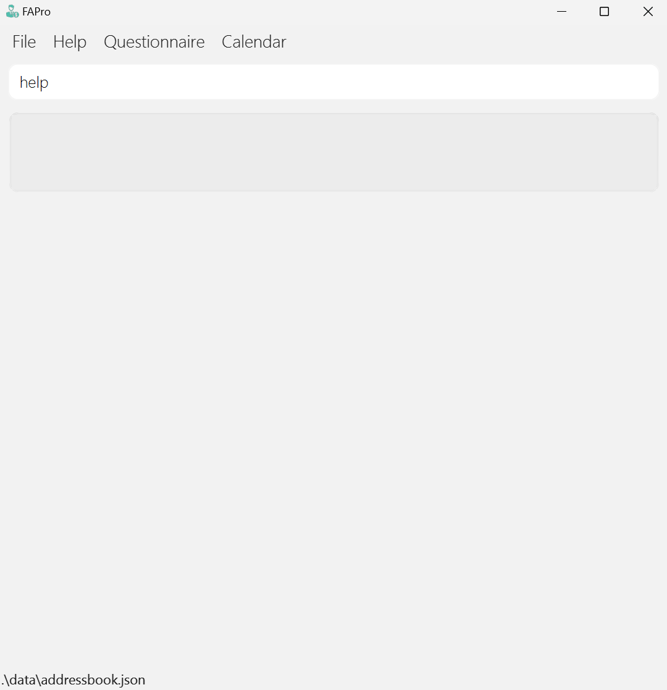
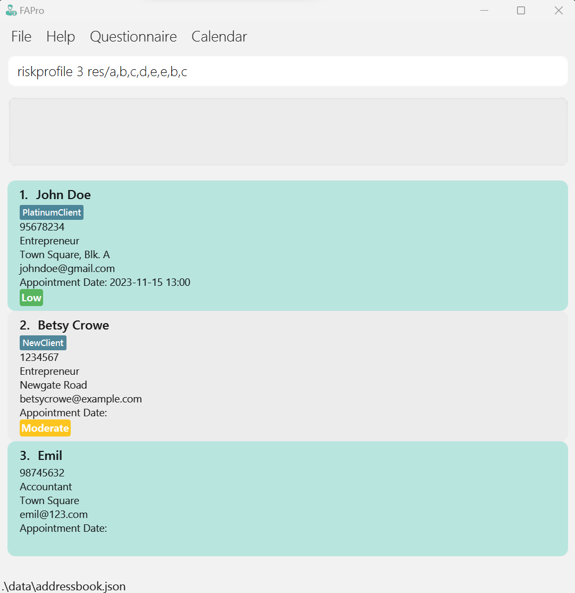
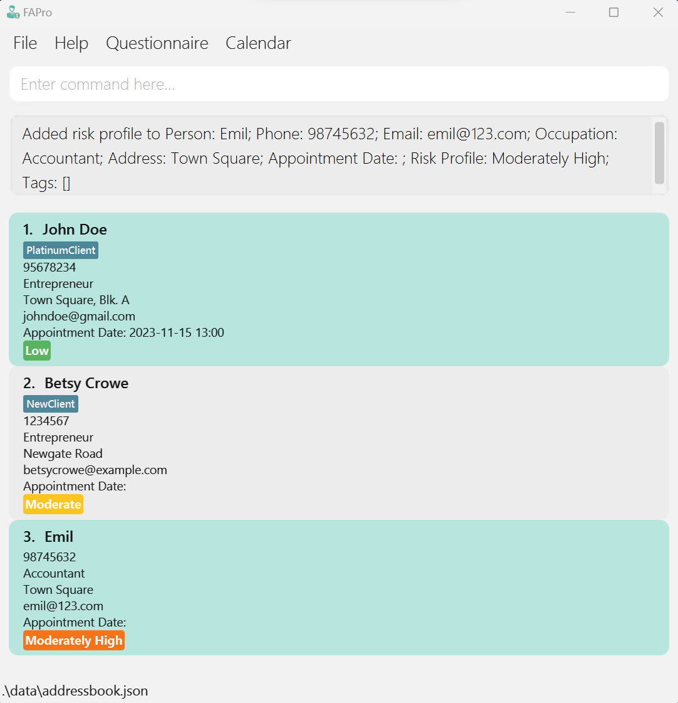
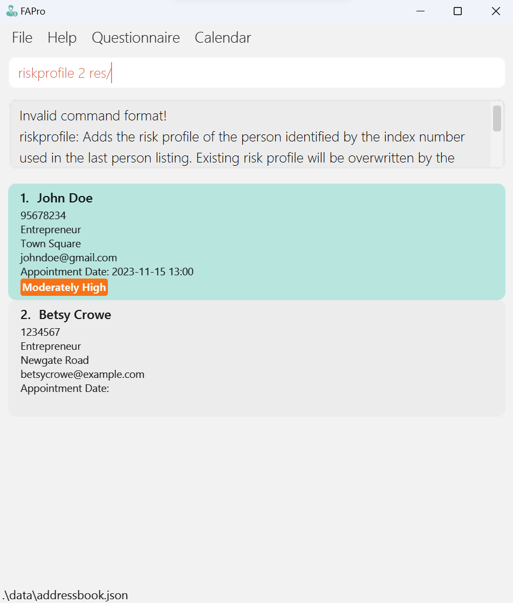
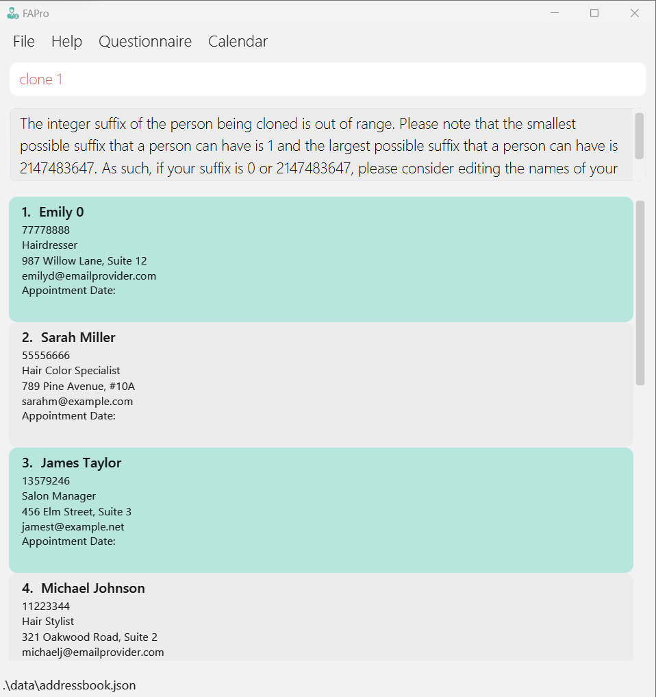
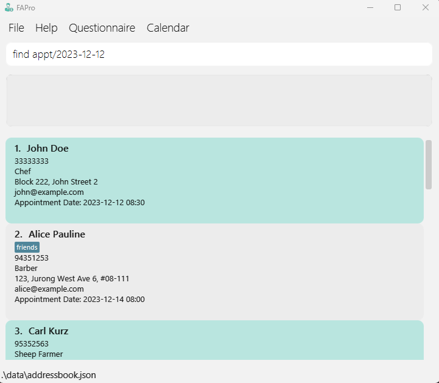
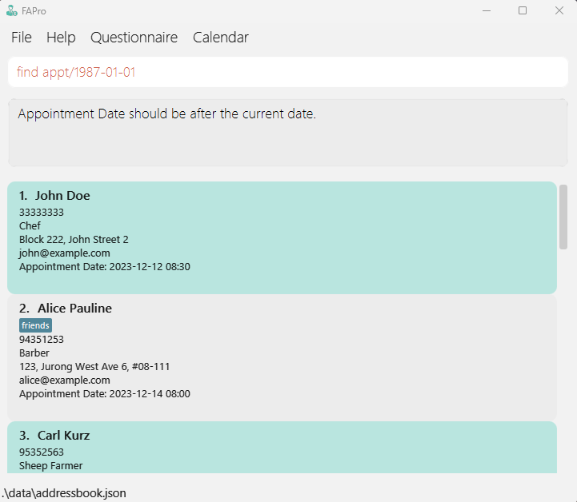

FApro seeks to improve the quality of life of financial advisors (FAs). It allows FAs to **keep track of large numbers of contacts**. It allows FAs to have a one-stop platform to manage their contacts and conduct financial analytics while providing a big-picture view of their clientele as a whole.

* Table of Contents
  {:toc}

--------------------------------------------------------------------------------------------------------------------

## Quick start

1. Ensure you have Java `11` or above installed in your Computer.

2. Download the latest `fapro.jar` from [here](https://github.com/AY2324S1-CS2103T-W09-1/tp/releases).

3. Copy the file to the folder you want to use as the _home folder_ for FAPro

4. Open a command terminal, `cd` into the folder you put the jar file in, and use the `java -jar fapro.jar` command to run the application.<br>
   A GUI similar to the below should appear in a few seconds. Note how the app contains some sample data.<br>
   

5. Type the command in the command box and press Enter to execute it. e.g. typing **`help`** and pressing Enter will open the help window.<br>
   Some example commands you can try:

  * `list` : Lists all contacts.

  * `add n/John Doe p/98765432 e/johnd@example.com o/Barber a/John Street, Block 123, #01-01` : Adds a contact named `John Doe` to the Address Book.

  * `delete 3` : Deletes the 3rd contact shown in the current list.

  * `clear` : Deletes all contacts.

  * `exit` : Exits the app.

6. Refer to the [Features](#features) below for details of each command.

--------------------------------------------------------------------------------------------------------------------

## Features

<div markdown="block" class="alert alert-info">

**:information_source: Notes about the command format:**<br>

* Words in `UPPER_CASE` are the parameters to be supplied by the user<br>
  e.g. in `add n/NAME`, `NAME` is a parameter which can be used as `add n/John Doe`

* Items in square brackets are optional<br>
  e.g. `n/NAME [t/TAG]` can be used as `n/John Doe t/friend` or as `n/John Doe`

* Items with `…` after them can be used multiple times including zero times<br>
  e.g. `[t/TAG]…` can be used as ` ` (i.e. 0 times), `t/friend`, `t/friend t/family` etc

* Parameters can be in any order<br>
  e.g. if the command specifies `n/NAME p/PHONE_NUMBER`, `p/PHONE_NUMBER n/NAME` is also acceptable

* Extraneous parameters for commands that do not take in parameters (such as `help`, `list`, `exit`, `clear`, `questionnaire`, `calendar`) will be ignored<br>
  e.g. if the command specifies `help 123`, it will be interpreted as `help`

* If you are using a PDF version of this document, be careful when copying and pasting commands that span multiple lines as space characters surrounding line-breaks may be omitted when copied over to the application
</div>

### Viewing help: `help`

Shows a message listing all the main commands and explaining how to access the user guide.

#### Format: 
* `help`



#### Precise expected outcome on success:
* Message shown to the user:
```
Opened help window.
```
* A pop-up window lists all the main commands and displays a link to FAPro's user guide


### Viewing risk assessment questionnaire: `questionnaire`

Displays questions that are used for generating client risk profile levels.

#### Format: 
* `questionnaire`


#### Precise expected outcome on success:
* Message shown to the user:
```
Opened questionnaire window.
```
* A pop-up window shows the risk assessment multiple choice questions, including the grading and risk profile categories criteria


### Adds risk profile level to a contact:`riskprofile`

Generates the client risk profile level based on their response of risk assessment questionnaire provided in Questionnaire tab and adds it to their contact.

#### Format:
* `riskprofile INDEX res/RESULT`

#### Example commands:
* `riskprofile 3 res/a,b,c,d,e,e,b,c`



<div markdown="span" class="alert alert-primary">:bulb: **Tip:**
This command can also be used to update the client risk profile
</div>

#### Acceptable values for each parameter:
* INDEX: Only accept positive integers less than the size of the contacts displayed
* RESULT: Valid result format, 8 comma-separated characters from 'a' - 'e' (e,b,a,c,b,b,a,e)

#### Precise expected outcome on success:
* Message shown to the user:
```
Added risk profile to Person: X
```
where X are the details of the person edited
* A risk profile label with a specified color will be added to the contact which has 5 categories:
  <span style="background-color:#4CAF50; color:white;">**Low**</span>,
  <span style="background-color:#2196F3; color:white;">**Moderately Low**</span>,
  <span style="background-color:#FFC107; color:white;">**Moderate**</span>,
  <span style="background-color:#FF6600; color:white;">**Moderately High**</span>,
  <span style="background-color:#F44336; color:white;">**High**</span>



<div markdown="span" class="alert alert-warning">
:warning: **Warning:**
Once the risk profile label is added to the contact, it cannot be removed
</div>

#### Precise expected outputs on failure:
If the RESULT is empty
* Error message shown to the user:
```
Invalid command format! 
riskprofile: Adds the risk profile of the person identified by the index number used in the last person listing. 
Existing risk profile will be overwritten by the input.
Parameters: INDEX (must be a positive integer) res/[RESULT]
Example: riskprofile 1 res/a,e,b,d,c,a,d,e
```


If the RESULT is not separated by commas or not in the range of 'a' - 'e'
* Error message shown to the user:
```
Result must have 8 comma-separated characters from 'a' to 'e'!
riskprofile: Adds the risk profile of the person identified by the index number used in the last person listing. 
Existing risk profile will be overwritten by the input.
Parameters: INDEX (must be a positive integer) res/[RESULT]
Example: riskprofile 1 res/a,e,b,d,c,a,d,e
```


### Adding a person: `add`

Adds a new entry to their address book for financial advisors, including personal details such as name, address, occupation, phone number and email.

#### Format:
* `add n/NAME p/PHONE_NUMBER e/EMAIL o/OCCUPATION a/ADDRESS [t/TAG]… [appt/APPOINTMENT_DATE]`

#### Example commands:
* `add n/John Doe p/98765432 e/johnd@example.com o/Barber a/John Street, Block 123, #01-01 appt/12-12-2023 08:30`
* `add n/Betsy Crowe t/Friend e/betsycrowe@example.com o/Entrepreneur a/Newgate Prison p/1234567`

#### Acceptable values for each parameter:
* NAME: Must be alphanumeric characters only. Name must be unique. (John Doe)
* ADDRESS: Can take any values except blank (8 College Ave West)
* PHONE NUMBER: Numbers only. Must be at least 3 digits long. (81234567)
* EMAIL ADDRESS: Valid email address format. Accepts any alphanumeric characters other than underscore (johnd@example.com)
* OCCUPATION: Must be alphanumeric characters only
* TAG: Must be alphanumeric characters only
* APPOINTMENT DATE: Valid string appointment date format (yyyy-mm-dd HH:mm, mm/dd/yyyy HH:mm or dd-mm-yyyy HH:mm) (date and time must be after the current date and time) 

<div markdown="span" class="alert alert-primary">:bulb: **Tip:**
A person can have any number of tags (including 0)
</div>


#### Precise expected outputs on success:
* Message shown to the user:

```
New Person added: X
```

where X are the details of the person added

* For example, for Robert Johnson (the example command), it would be:<br> `New person added: Robert Johnson; Phone: 55512345; Email: robertj@email.com; Occupation: Hairdresser; Address: 789 Oak Street, Suite 10; AppointmentDate: ; Tags: `<br> Please note that both Appointment Date and Tags are empty as they are not necessary for adding a person
* The new entry is displayed in the address book GUI


#### Precise expected outputs on failure:

If a required parameter is missing (e.g., NAME, EMAIL)

* Error message shown to the user:

```
Invalid command format! add: Adds a person to the address book. Parameters: n/NAME p/PHONE e/EMAIL a/ADDRESS [t/TAG]... Example: add n/John Doe p/98765432 e/johnd@example.com a/311, Clementi Ave 2, #02-25 t/friends t/owesMoney
```


If a parameter is provided in an invalid format (e.g., an invalid email address), an error message should indicate the invalid format.

* Error message shown to the user:

```
Emails should be of the format local-part@domain and adhere to the following constraints:
1. The local-part should only contain alphanumeric characters and these special characters, excluding the parentheses, (+_.-). The local-part may not start or end with any special characters.
2. This is followed by a '@' and then a domain name. The domain name is made up of domain labels separated by periods.
The domain name must:
    - end with a domain label at least 2 characters long
    - have each domain label start and end with alphanumeric characters
    - have each domain label consist of alphanumeric characters, separated only by hyphens, if any.
```


If a parameter is specified multiple times (e.g., --name John --name Doe), an error should indicate that the parameter can only be specified once.

* Error message shown to the user:

```
Multiple values specified for the following single-valued field(s): n/
```


### Cloning a person : `clone`

Clones a contact from FAPro at the specified index. Makes it easier for the user when adding a contact with very similar details (i.e from the same household)

#### Format:
* `clone INDEX`
* Clones the person at the specified `INDEX`
* The index refers to the index number shown in the displayed person list

#### Example commands:
After cloning, the clone is the exact same as the original, other than a suffix either being attached at the end of their name or, if a suffix is already present, the suffix at the end of their name is incremented
* `list` followed by `clone 2` clones the 2nd person in the address book
* `find Betsy` followed by `clone 1` clones the 1st person in the results of the `find` command

#### Acceptable values for each parameter:
* INDEX: Only accept **non-negative** int values that are less than the size of the address book. Must have at least one
* PERSON: If the person being cloned has a suffix at the end, the suffix cannot be 0 or 2147483647 (MAX_INT)


#### Precise expected outputs on success:
* Message shown to the user:

```
Cloned Person: X
```

where X are the details of the person the clone is based off

* For example, if

```
Name: John Doe; Phone: 98765432; Email: johnd@example.com; Occupation: Barber; Address: Hougang Avenue 1; AppointmentDate: 2024-02-02; Tags:
```

is the person being cloned, then the output is:

```
Cloned Person: John Doe; Phone: 98765432; Email: johnd@example.com; Occupation: Barber; Address: Hougang Avenue 1; AppointmentDate: 2024-02-02; Tags:
```


#### Precise expected outputs on failure:

If no index, 0 or a negative index is entered next to the clone command

* Error message shown to the user:

```
Invalid command format! clone: Clones the person identified by the index number used in the displayed person list. Parameters: INDEX (must be a positive integer).
```


If the index entered is greater than the current number of contacts in the address book

* Error message shown to the user:

```
The person index provided is invalid.
```


If the suffix of the person being cloned is either 0 or 2147483647 (MAX_INT)

* Error message shown to the user:

```
The integer suffix of the person being cloned is out of range. Please note that the smallest possible suffix that a person can have is 1 and the largest possible suffix that a person can have is 2147483647. As such, if your suffix is 0 or 2147483647, please consider editing the names of your contacts first.
```



### Deleting a person : `delete`

Deletes a contact from FAPro at the specified indexes.

#### Format: 
* `delete INDEX [MORE INDEXES]`
* Deletes the person at `INDEX` (and the persons at other specified INDEXES)
* The index refers to the index number shown in the displayed person list

#### Acceptable values for each parameter:
* INDEX: **Must be positive integers** (i.e 1 2 3 etc.) (less than the size of the contact list in FAPro), must have a space in between and no commas (i.e delete 1,2,3 is invalid)

#### Example commands:
* `list` followed by `delete 2` deletes the 2nd person in the address book
* `find Betsy` followed by `delete 1` deletes the 1st person in the results of the `find` command
* `list` followed by `delete 2 5` deletes the 2nd and 5th person in the address book


#### Precise expected outputs on success:

* Message shown to the user:

```
Deleted Person(s): X
```

where X are the details of the deleted persons
* Size of address book is reduced by however many indexes were entered (i.e if you entered delete 2 3 4, as you entered 3 indexes, the size of the address book decreases by 3) 
* GUI reflects that deleted contacts are now no longer there


#### Precise expected outputs on failure:

If any of the entered indexes are invalid:
* Error message shown to the user:

```
The person index provided is invalid.
```


If no index is placed after the delete command:
* Error message shown to the user:

```
Invalid command format! 
delete: Deletes the person(s) identified by the index number used in the displayed person list. 
Parameters: INDEXES (must be positive integers, separated by spaces)
Example: delete 1 3 5"
```


### List out all contacts : `list`

Shows a list of all contacts.

#### Format: 
* `list`

#### Precise expected outputs on success:
* Message shown to the user:
```
Listed all persons
```

* List all contacts with their details


### Editing a person : `edit`

Edits an existing client's parameter in FAPro.

#### Format:
* `edit INDEX [n/NAME] [p/PHONE] [e/EMAIL] [o/OCCUPATION] [appt/APPOINTMENTDATE] [a/ADDRESS] [t/TAG]…`

* Edits the person at the specified `INDEX`. The index refers to the index number shown in the displayed person list. The index **must be a positive integer** 1, 2, 3, …
* At least one of the optional fields must be provided
* Existing values will be updated to the input values
* When editing tags, the existing tags of the person will be removed i.e. adding of tags is not cumulative
* You can remove all the person’s tags by typing `t/` without
  specifying any tags after it

#### Acceptable values for each parameter:
* Refer to `add` command

#### Example commands:
*  `edit 1 p/91234567 e/johndoe@example.com` Edits the phone number and email address of the 1st person to be `91234567` and `johndoe@example.com` respectively
*  `edit 2 n/Betsy Crower t/` Edits the name of the 2nd person to be `Betsy Crower` and clears all existing tags


#### Precise expected outputs on success:
* Message shown to the user:
```
Edited Person:[NAME], Phone Number:[PHONE_NUMBER], Email:[EMAIL], Occupation:[OCCUPATION], Address:[ADDRESS]…
```
* The new entry is displayed in the address book GUI.


#### Precise expected outputs on failure:

If a required parameter is missing (e.g., name, email), an error message should specify which parameter is missing.
* Message shown to the user:
```
Invalid command format! 
edit: Edits the details of the person identified by the index number used in the displayed person list. Existing values will be overwritten by the input values.
Parameters: INDEX (must be a positive integer) [n/NAME] [p/PHONE] [e/EMAIL] [o/OCCUPATION] [a/ADDRESS] [appt/APPOINTMENTDATE] [t/TAG]...
Example: edit 1 p/91234567 e/johndoe@example.com
```


### Locating persons by name: `find`

Finds persons based on the given keywords.

#### Format: 

* `find n/NAME [MORE NAMES]`

* `find a/ADDRESS [MORE ADDRESSES]` 

* `find appt/APPOINTMENT DATE`

#### Example commands:
* `find n/John Alice`, finds all contacts whose names include "John" and "Alice"
* `find a/Tokyo Geylang`, finds all contacts whose address include "Tokyo" and "Geylang"
* `find appt/2024-01-01`, finds all contacts whose appointment date matches "2024-01-01"

#### Acceptable values for each parameter:
* NAME: Valid string name
* ADDRESS: Valid string address
* APPOINTMENT DATE: Valid dates (after current date), in the format of `yyyy-mm-dd`

#### _Name_


#### Precise expected outputs on success:
* Message shown to the user: 
```
X persons listed!
```
where X is the number of contacts listed
* The list of contacts whose names contain the input name is shown


#### Precise expected outputs on failure:
If no name is input after the find command, an error message explaining the error will be shown, 
reminding the user to follow the correct input format

* Error message shown to the user:

```
Invalid command format! find n/: Finds all persons whose names contain any of the specified keywords (case-insensitive) and displays them as a list with index numbers.
```


#### _Address_


#### Precise expected outputs on success:

* Message shown to the user:
```
X persons listed!
```
where X is the number of contacts listed
* The list of contacts whose address contain the input address is shown


#### Precise expected outputs on failure:
If no address is input after the find command, an error message explaining the error will be shown,
reminding the user to follow the correct input format

* Error message shown to the user:

```
Invalid command format! find a/: Finds all persons whose address contain any of the specified keywords (case-insensitive) and displays them as a list with index numbers.
```


#### _Appointment Date_



#### Precise expected outputs on success:
* Message shown to the user:
```
X persons listed!
```
where X is the number of contacts listed
* The list of contacts whose appointment date matches the input date is shown


#### Precise expected outputs on failure:
If no date is input after the find command, an error message explaining the error will be shown,
reminding the user to follow the correct input format

* Error message shown to the user:
```
Invalid command format! find_appt: Finds all persons whose appointment date matches the specified input date and displays them as a list with index numbers.
```


If an input date does not follow the accepted format, an error message explaining the error will be shown,
reminding the user to follow the correct input format

* Error message shown to the user:
```
Appointment Date should follow the format of [mm/dd/yyyy] or [dd-mm-yyyy] or [yyyy-mm-dd].
```


If an input date is a past date (a date before the current date), an error message explaining the error will be shown, 
reminding the user to input a valid date

* Error message shown to the user:
```
Appointment Date should be after the current date.
```



### Undoing a command : `undo`

Undoes the most recent undoable command. Undoable commands include: add, clone, delete, clear, edit.

#### Format: 
* `undo`

#### Example commands:
* `add n/John Doe p/98765432 e/johnd@example.com o/Barber a/John Street, Block 123, #01-01` followed by `undo` will
  delete the added contact
* `clone 1`, assuming there is a contact to clone, followed by `undo` will delete the cloned contact
* `delete 1`, assuming there is a contact to delete, followed by `undo` will add the contact back
* `clear`, assuming there is at least one contact to clear, followed by `undo` will add all cleared contacts back
* `edit 1 p/91234567`, assuming there is a contact to edit, followed by `undo` will revert the edit of the contact
* Assuming there are 3 contacts, `delete 1`, which deletes the first contact, followed by `clear`, which clears the
  remaining 2 contacts, followed by `undo` will only add the 2 cleared contacts back. A subsequent `undo` will add
  the contact deleted at the beginning back
* `edit 1 p/91234567`, assuming there is a contact to edit, edits the first contact, followed by `delete 1`, deletes
  the first contact. Then, `undo` will add back the deleted contact, and the next `undo` will revert the edit of the
  contact (which was also just added back)

#### Precise expected outputs on success:

For undoing an add command:

* Add a contact


* Undo
* Message shown to the user:

```
Undo Successful! Deleted Person: X
```
where X are the details of the person who was just added, and now deleted
* GUI reflects that the most recently added contact is deleted


For undoing a clone command:

* Clone a contact


* Undo
* Message shown to the user: 

```
Undo Successful! Deleted Person: X
```
where X are the details of the person who was just cloned, and now deleted
* GUI reflects that the most recently cloned contact is deleted


For undoing a delete command:

* Delete a contact


* Undo
* Message shown to the user: 

```
Undo Successful! Contact(s) added back: X
```
where X are the details of the person who was just deleted, and now added back
* GUI reflects that the most recently deleted contact is added back


* Delete multiple contacts (In this case, 2 contacts)


* Undo
* Message shown to the user: 

```
Undo Successful! Contact(s) added back: X
```
where X are the details of the persons who were just deleted, and now added back
* GUI reflects that the most recently deleted contacts are added back


For undoing a clear command:

* Clear all contacts


* Undo
* Message shown to the user: 

```
Undo Successful! All contacts have been added back!
```

* GUI reflects that all cleared contacts are added back


For undoing an edit command:

* Edit a contact


* Undo
* Message shown to the user: 

```
Undo Successful! Reverted back to: X
```

where X are the details of the person before the edit
* GUI reflects that the edited contact has been reverted


#### Precise expected outputs on failure:

When there is no command to undo, i.e. no previous `add`, `clone`, `delete`, `clear`, or `edit` command

* Error message shown to the user:

```
There is no command to undo!
```


### Redoing an undo command : `redo`

Redoes the most recent undo command. 


#### Format:
* `redo`


#### Example commands:

* `delete 1` will delete the first contact in the address book

  `undo` will then reverse the `delete 1` command

  `redo` will then reapply the `delete 1` command


* `add n/John Doe p/98765432 e/johnd@example.com o/Barber a/John Street, Block 123, #01-01` will add this contact in 
  the address book

  `undo` will then reverse the `add` command (i.e. John Doe is no longer in the address book)

  `redo` will then reapply the `add` command (i.e. John Doe is back in the address book)

  `undo` will then reverse the `redo` command (i.e. John Doe is no longer in the address book)

  #### Note: while it is possible to `undo` `redo` commands, this is only possible before any other `add`, `clone`, `edit`, `delete`, `clear` command is executed.

  Now, `redo` will reapply the `add` command (i.e John Doe is back in the address book) 

  `delete 1` will delete the first contact in the address book

  `undo` will reverse the `delete 1` command

  `undo` once again will not reverse the `redo` command


#### Precise expected outputs on success:

For example, `add` a contact, then `undo`, then `redo`

* Add a contact


* Undo 


* Redo
* Message shown to the user: 

```
Redo successful!
```


* If wanted, undo again
* Message shown to the user: 

```
Undo successful!
```


#### Precise expected outputs on failure:

When there is no command to redo, i.e. no previous `undo` command

* Error message shown to the user:

```
Redo unsuccessful! There is nothing to redo!
```


### Sorting contacts : `sort`

Sort contact lists by prefix name or appointment date.

#### Format: 
* `sort PREFIX`

#### Example commands:
* `sort n/`
* `sort appt/`

#### Acceptable values for prefix:
* `n/` sort by Name prefix
* `appt/` sort by Appointment Date prefix


#### Precise expected output on success:
* Message shown to the user:
```
'X person listed!'
```
where X is the number of clients in the address book.
* The sorted entry is displayed in the address book GUI.


Precise expected outputs on failure:
<br> If either a required parameter is missing or a parameter provided is invalid (e.g., e/), an error message should indicate the invalid format.

* Error message shown to the user:

```
Invalid command format!
sort: Sort all persons by name or appointmnet date.
Parameters: KEYWORD [PREFIX n/ or appt/]
Example: sort n/
```


### Opening calendar window : `calendar`

Open a new calendar window.

#### Format:
* `calendar`

#### Example commands:
* `calendar`

<div markdown="span" class="alert alert-primary">:bulb: **Tip:**
<li>You can open calendar window by pressing f3 key
<li>Arrow key navigate you to different months
<li>Enter key navigate you back to the current month
</div>

#### Precise expected outputs on success:
* A pop-up of a new calendar window of the current month that indicate client's appointments in the date


### Clearing all entries : `clear`

Clears all contacts in the address book.

Format: `clear`

Example:
* `clear`

Precise expected outputs on success:

* Message shown to the user: 
```
Address book has been cleared!
```
* GUI reflects that there are 0 contacts left


Precise expected outputs on failure:

* Error message shown to the user:
```
Address book is empty. There is nothing to clear.
```


### Exiting the program : `exit`

Exits the application.

#### Format: 
* `exit`

#### Precise expected outcome on success:
* The FAPro application will be closed

### Saving the data

FAPro data is saved in the hard disk automatically after any command that changes the data. There is no need to save manually.

### Editing the data file

FAPro data is saved automatically as a JSON file `[JAR file location]/data/fapro.json`. Advanced users are welcome to update data directly by editing that data file.

<div markdown="span" class="alert alert-warning">:exclamation: **Caution:**
If your changes to the data file makes its format invalid, FAPro will discard all data and start with an empty data file at the next run. Hence, it is recommended to take a backup of the file before editing it.
</div>

--------------------------------------------------------------------------------------------------------------------

## FAQ

**Q**: How do I transfer my data to another Computer?<br>
**A**: Install the app in the other computer and overwrite the empty data file it creates with the file that contains the data of your previous FAPro home folder.

**Q**: How do I view the main commands and refer to the FAPro’s User Guide?<br>
**A**: Click the Help tab or type the `help` in the command box.

--------------------------------------------------------------------------------------------------------------------

## Common Questions

**Q**: Why can't I add clients with the same name? <br>
**A**:
As financial advisors, while you might deal with clients with the same name, as the name is the primary identifier for a person in the address book, the app was designed so as to prevent duplicate names. <br>

To circumvent this, you can add additional details to the name to differentiate contacts. For example, if you have two contacts names John Tan, one could be John Tan (Google) and John Tan (Facebook) (if they work at the respective companies).

**Q**: Using that logic, why not use another field as the unique identifying field (such as email or phone number)? <br>
**A**: Other fields might be shared among individuals. For example, those from the same household might have the same landline. And some married couples share the same email. As such, using the name of an individual was the ideal choice in terms of an identifier for a contact.

**Q**: Is adding the same appointment date and time for different clients allowed? <br>
**A**: Yes! Our thinking is that if an FA wants to host a group session with several clients, FAPro allows them to schedule multiple clients for the same appointment date and time, making it convenient for FA to manage group meetings.
--------------------------------------------------------------------------------------------------------------------

## Known issues

1. **When using multiple screens**, if you move the application to a secondary screen, and later switch to using only the primary screen, the GUI will open off-screen. The remedy is to delete the `preferences.json` file created by the application before running the application again.

--------------------------------------------------------------------------------------------------------------------

## Command summary
                                                                                                                                         
| Action              | Format, Examples                                                                                                                                                                                                                      |
|---------------------|---------------------------------------------------------------------------------------------------------------------------------------------------------------------------------------------------------------------------------------|
| **Add**             | `add n/NAME p/PHONE_NUMBER e/EMAIL o/OCCUPATION a/ADDRESS [t/TAG]… [appt/APPOINTMENT_DATE]` <br> e.g. `add n/James Ho p/22224444 e/jamesho@example.com o/SWE, a/123, Clementi Rd, 1234665 t/friend t/colleague appt/12-12-2023 08:30` |
| **Calendar**        | `calendar`                                                                                                                                                                                                                            |
| **Clone**           | `clone INDEX`<br> e.g. `clone 3`                                                                                                                                                                                                      |
| **Clear**           | `clear`                                                                                                                                                                                                                               |
| **Delete**          | `delete INDEXES`<br> e.g., `delete 1 2 3`                                                                                                                                                                                             |
| **Edit**            | `edit INDEX [n/NAME] [p/PHONE_NUMBER] [e/EMAIL] [o/OCCUPATION] [a/ADDRESS] [t/TAG]… [appt/APPOINTMENT_DATE]`<br> e.g.`edit 2 n/James Lee e/jameslee@example.com`                                                                      |
| **Undo**            | `undo`                                                                                                                                                                                                                                |
| **Redo**            | `redo`                                                                                                                                                                                                                                |
| **Find**            | `find PREFIX KEYWORD` <br> e.g. `find n/ James Jake`, `find a/Tokyo Geylang`, `find appt/2040-01-01`                                                                                                                                  |
| **List**            | `list`                                                                                                                                                                                                                                |
| **Help**            | `help`                                                                                                                                                                                                                                |
| **Questionnaire**   | `questionnaire`                                                                                                                                                                                                                       |
| **Sort**            | `sort PREFIX` <br> e.g. `sort appt/` `sort n/`                                                                                                                                                                                        |
| **Risk Profile**    | `riskprofile 3 res/a,b,c,d,e,e,b,c`                                                                                                                                                                                                   |
| **Exit**            | `exit`                                                                                                                                                                                                                                |

## Glossary

| Word                 | Meaning                                                                                                                         |
|----------------------|---------------------------------------------------------------------------------------------------------------------------------|
| **FA**               | short form for financial advisor                                                                                                |
| **Parameter**        | values inputted by the user.<br/>e.g. NAME, OCCUPATION, ADDRESS                                                                 |
| **Positive Integer** | An integer that is positive (i.e greater than 0). Please note that we are excluding 0 as a positive integer.                    |
| **Prefix**           | word that is added in front of parameter.<br/>e.g. n/, o/, a/                                                                   |
| **Suffix**           | number that is at the end of a persons name <br/>e.g. for John Doe 1, the suffix would be 1. For John Doe, no suffix is present |
