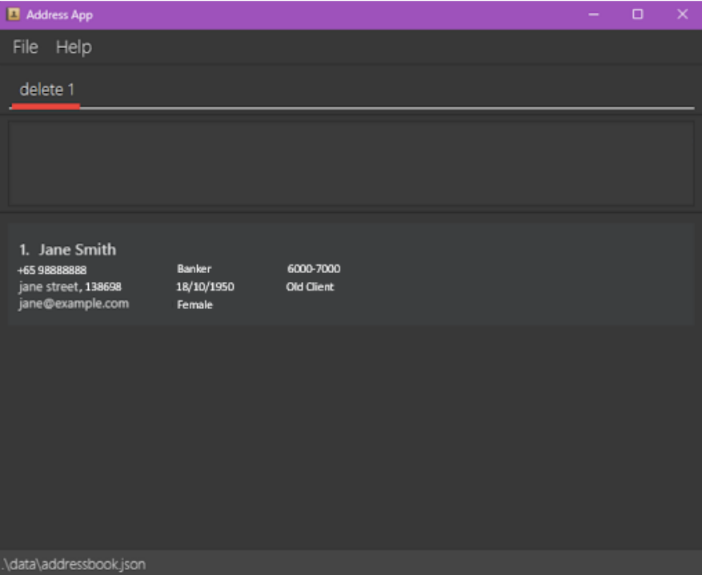
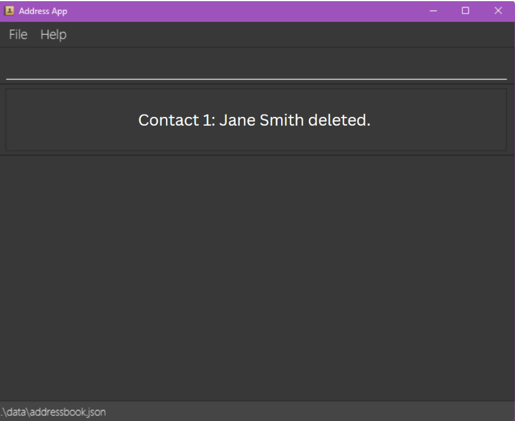
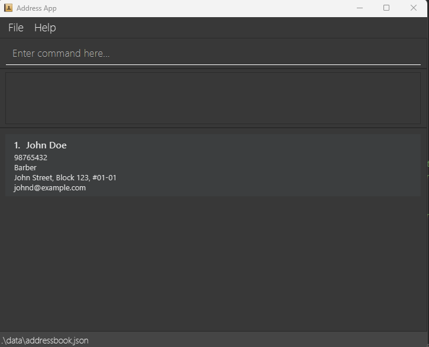
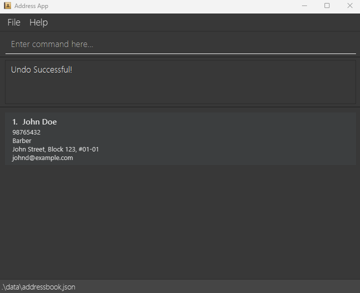

FApro seeks to improve the quality of life of financial advisors (FAs). It allows FAs to **keep track of large numbers of contacts**. It allows FAs to have a one-stop platform to manage their contacts and conduct financial analytics while providing a big-picture view of their clientele as a whole.

* Table of Contents
{:toc}

--------------------------------------------------------------------------------------------------------------------

## Quick start

1. Ensure you have Java `11` or above installed in your Computer.

1. Download the latest `fapro.jar` from [here](https://github.com/AY2324S1-CS2103T-W09-1/tp/releases).

1. Copy the file to the folder you want to use as the _home folder_ for FAPro

1. Open a command terminal, `cd` into the folder you put the jar file in, and use the `java -jar fapro.jar` command to run the application.<br>
   A GUI similar to the below should appear in a few seconds. Note how the app contains some sample data.<br>
   

1. Type the command in the command box and press Enter to execute it. e.g. typing **`help`** and pressing Enter will open the help window.<br>
   Some example commands you can try:

   * `list` : Lists all contacts.

   * `add n/John Doe p/98765432 e/johnd@example.com o/Barber a/John Street, Block 123, #01-01` : Adds a contact named `John Doe` to the Address Book.

   * `delete 3` : Deletes the 3rd contact shown in the current list.

   * `clear` : Deletes all contacts.

   * `exit` : Exits the app.

1. Refer to the [Features](#features) below for details of each command.

--------------------------------------------------------------------------------------------------------------------

## Features

<div markdown="block" class="alert alert-info">

**:information_source: Notes about the command format:**<br>

* Words in `UPPER_CASE` are the parameters to be supplied by the user.<br>
  e.g. in `add n/NAME`, `NAME` is a parameter which can be used as `add n/John Doe`.

* Items in square brackets are optional.<br>
  e.g `n/NAME [t/TAG]` can be used as `n/John Doe t/friend` or as `n/John Doe`.

* Items with `…`​ after them can be used multiple times including zero times.<br>
  e.g. `[t/TAG]…​` can be used as ` ` (i.e. 0 times), `t/friend`, `t/friend t/family` etc.

* Parameters can be in any order.<br>
  e.g. if the command specifies `n/NAME p/PHONE_NUMBER`, `p/PHONE_NUMBER n/NAME` is also acceptable.

* Extraneous parameters for commands that do not take in parameters (such as `help`, `list`, `exit` and `clear`) will be ignored.<br>
  e.g. if the command specifies `help 123`, it will be interpreted as `help`.

* If you are using a PDF version of this document, be careful when copying and pasting commands that span multiple lines as space characters surrounding line-breaks may be omitted when copied over to the application.
</div>

### Viewing help: `help`

Shows a message listing all the main commands and explaining how to access the user guide.

#### Format: `help`


#### Precise expected outcome on success:
* Successful message: Opened help window
* A pop-up window lists all the main commands and displays a link to FAPro's user guide


### Viewing risk assessment questionnaire: `questionnaire`

Displays questions that are going to be used for generating client risk profile levels.

#### Format: `questionnaire`


#### Precise expected outcome on success:
* Successful message: Opened questionnaire window
* A pop-up window shows the risk assessment multiple choice questions, including the grading and risk profile categories criteria


### Adds risk profile level to a contact:`riskprofile`

Generates the client risk profile level based on their response of risk assessment questionnaire provided in Questionnaire tab and adds it to their contact.

#### Format:
* `riskprofile INDEX res/RESULT`

#### Example commands:
* `riskprofile 3 res/a,b,c,d,e,e,b,c`


<div markdown="span" class="alert alert-primary">:bulb: **Tip:**
This command can also be used to update the client risk profile
</div>

#### Acceptable values for each parameter:
* INDEX: Only accept positive integers less than the size of the contacts displayed
* RESULT: Valid result format, 8 comma-separated characters from 'a' - 'e' (e,b,a,c,b,b,a,e)

#### Precise expected outcome on success:
* Successful message: "Added risk profile to Person: X", where X are the details of the person edited
* A risk profile label with a specified color will be added to the contact.
  There are 5 categories:
  <span style="background-color:#4CAF50; color:white;">**Low**</span>,
  <span style="background-color:#2196F3; color:white;">**Moderately Low**</span>.
  <span style="background-color:#FFC107; color:white;">**Moderate**</span>,
  <span style="background-color:#FF6600; color:white;">**Moderately High**</span>,
  <span style="background-color:#F44336; color:white;">**High**</span>


<div markdown="span" class="alert alert-warning">
:warning: **Warning:**
Once the risk profile label is added to the contact, it cannot be removed
</div>

#### Precise expected outputs on failure:
If the RESULT is empty
* Error message:
```
Invalid command format! 
riskprofile: Adds the risk profile of the person identified by the index number used in the last person listing. 
Existing risk profile will be overwritten by the input.
Parameters: INDEX (must be a positive integer) res/[RESULT]
Example: riskprofile 1 res/a,e,b,d,c,a,d,e
```


If the RESULT is not separated by commas or not in the range of 'a' - 'e'
* Error message:
```
Result must have 8 comma-separated characters from 'a' to 'e'!
riskprofile: Adds the risk profile of the person identified by the index number used in the last person listing. 
Existing risk profile will be overwritten by the input.
Parameters: INDEX (must be a positive integer) res/[RESULT]
Example: riskprofile 1 res/a,e,b,d,c,a,d,e
```


### Adding a person: `add`

Adds a new entry to their address book for financial advisors, including personal details such as name, address, occupation, phone number and email.

Format: `add n/NAME p/PHONE_NUMBER e/EMAIL o/OCCUPATION a/ADDRESS [t/TAG]…​`

Acceptable values for each parameter:
* Name: Valid string name.
* Address: Valid string address. Contains postal code. (8 College Ave West, Singapore 138608).
* Phone number: Valid string and phone number format (+65 8123 4567).
* Email address: Valid string and email address format (johnd@example.com).
* Occupation: Valid string occupation.
* Tag: Valid string.

<div markdown="span" class="alert alert-primary">:bulb: **Tip:**
A person can have any number of tags (including 0)
</div>

Examples:
* `add n/John Doe p/98765432 e/johnd@example.com o/Barber a/John Street, Block 123, #01-01`
* `add n/Betsy Crowe t/Friend e/betsycrowe@example.com o/Entrepreneur a/Newgate Prison p/1234567 t/Criminal`


Precise expected outputs on success:
* Successful addition message. ‘John Doe has been added to your client list’
* The new entry is displayed in the address book GUI.


Precise expected outputs on failure:
* If a required parameter is missing (e.g., name, email), an error message should specify which parameter is missing.
* If a parameter is provided in an invalid format (e.g., an invalid email address), an error message should indicate the invalid format.
* If a parameter is specified multiple times (e.g., --name John --name Doe), an error should indicate that the parameter can only be specified once.

### List out all contacts : `list`

Shows a list of all contacts.

#### Format: `list`


#### Precise expected outputs on success:
* Successful message: Listed all persons
* List all contacts with their details


### Editing a person : `edit`

Edits an existing client's parameter in FAPro.

Format: `edit INDEX [n/NAME] [p/PHONE] [e/EMAIL] [o/OCCUPATION] [a/ADDRESS] [t/TAG]…​`

* Edits the person at the specified `INDEX`. The index refers to the index number shown in the displayed person list. The index **must be a positive integer** 1, 2, 3, …​
* At least one of the optional fields must be provided.
* Existing values will be updated to the input values.
* When editing tags, the existing tags of the person will be removed i.e adding of tags is not cumulative.
* You can remove all the person’s tags by typing `t/` without
    specifying any tags after it.

Examples:
*  `edit 1 p/91234567 e/johndoe@example.com` Edits the phone number and email address of the 1st person to be `91234567` and `johndoe@example.com` respectively.
*  `edit 2 n/Betsy Crower t/` Edits the name of the 2nd person to be `Betsy Crower` and clears all existing tags.


* Precise expected outputs on success:
* Successful addition message. ‘Edited Person:[NAME], Phone Number:[PHONE_NUMBER], Email:[EMAIL], Occupation:[OCCUPATION], Address:[ADDRESS]…’
* The new entry is displayed in the address book GUI.


Precise expected outputs on failure:
* If a required parameter is missing (e.g., name, email), an error message should specify which parameter is missing.
* If a parameter is provided in an invalid format (e.g., an invalid email address), an error message should indicate the invalid format.
* If a parameter is specified multiple times (e.g., --name John --name Doe), an error should indicate that the parameter can only be specified once.

### Locating persons by name: `find`

Finds persons whose names contain any of the given keywords.

Format: `find KEYWORD [MORE_KEYWORDS]`

* The search is case-insensitive. e.g `hans` will match `Hans`
* The order of the keywords does not matter. e.g. `Hans Bo` will match `Bo Hans`
* Only the name is searched.
* Only full words will be matched e.g. `Han` will not match `Hans`
* Persons matching at least one keyword will be returned (i.e. `OR` search).
  e.g. `Hans Bo` will return `Hans Gruber`, `Bo Yang`

### Locating persons by address: `find_add`

Finds persons whose address contain any of the given keywords.

Format: `find KEYWORD [MORE_KEYWORDS]`

* The search is case-insensitive. e.g `tokyo` will match `Tokyo`
* The order of the keywords does not matter. e.g. `Little Tokyo` will match `Tokyo Little`
* Only the address is searched.
* Only full words will be matched e.g. `Toky` will not match `Tokyo`
* Persons matching at least one keyword will be returned (i.e. `OR` search).
  e.g. `Little Geylang` will return `Little Tokyo`, `Tokyo`

Examples:
* `find_add geylang` returns all users whose addresses contain `geylang`

### Deleting a person : `delete`

Deletes a contact from FAPro at the specified index.

Format: `delete INDEX`
* Deletes the person at the specified `INDEX`.
* The index refers to the index number shown in the displayed person list.

Acceptable parameters for INDEX:
* The index **must be a positive integer** 1, 2, 3, …​ (less than the size of the contact list in FAPro)

Examples:
* `list` followed by `delete 2` deletes the 2nd person in the address book.
* `find Betsy` followed by `delete 1` deletes the 1st person in the results of the `find` command.



Precise expected outputs on success:
* Message shown to user: "Contact x: name deleted".
* Size of address book is reduced by 1.
* GUI reflects that deleted contact is now no longer there.



Precise expected outputs on failure:
* Error message shown to the user: "Sorry, that value is not accepted! Please specify the number of the contact you 
  would like to delete! It should be a positive integer and within FAPro!"

### Undoing a delete : `undo`

Undoes a single delete done previously. 

Format: `undo`

First, delete a contact. This assumes there are contacts to delete.




Then, undo the delete.


Precise expected output on success:
* Message shown to user: "Undo Successful!"
* Size of address book increased by 1.
* GUI reflects that most recently deleted contact is added.


Precise expected outputs on failure:
* Error message shown to the user: "The person already exists in the address book"


### Clearing all entries : `clear`

Clears all entries from the address book.

Format: `clear`

### Exiting the program : `exit`

Exits the application.

#### Format: 
* `exit`

#### Precise expected outcome on success:
* The FAPro application will be closed


### Saving the data

FAPro data is saved in the hard disk automatically after any command that changes the data. There is no need to save manually.

### Editing the data file

FAPro data is saved automatically as a JSON file `[JAR file location]/data/fapro.json`. Advanced users are welcome to update data directly by editing that data file.

<div markdown="span" class="alert alert-warning">:exclamation: **Caution:**
If your changes to the data file makes its format invalid, FAPro will discard all data and start with an empty data file at the next run. Hence, it is recommended to take a backup of the file before editing it.
</div>

### Archiving data files `[coming in v2.0]`

_Details coming soon ..._

--------------------------------------------------------------------------------------------------------------------

## FAQ

**Q**: How do I transfer my data to another Computer?<br>
**A**: Install the app in the other computer and overwrite the empty data file it creates with the file that contains the data of your previous FAPro home folder.

**Q**: How do I view the main commands and refer to the FAPro’s User Guide?<br>
**A**: Click the Help tab or type the `help` in the command box.

--------------------------------------------------------------------------------------------------------------------

## Known issues

1. **When using multiple screens**, if you move the application to a secondary screen, and later switch to using only the primary screen, the GUI will open off-screen. The remedy is to delete the `preferences.json` file created by the application before running the application again.

--------------------------------------------------------------------------------------------------------------------

## Command summary

| Action            | Format, Examples                                                                                                                                                                             |
|-------------------|----------------------------------------------------------------------------------------------------------------------------------------------------------------------------------------------|
| **Add**           | `add n/NAME p/PHONE_NUMBER e/EMAIL o/OCCUPATION a/ADDRESS [t/TAG]…​` <br> e.g., `add n/James Ho p/22224444 e/jamesho@example.com o/SWE, a/123, Clementi Rd, 1234665 t/friend t/colleague`    |
| **Clear**         | `clear`                                                                                                                                                                                      |
| **Delete**        | `delete INDEX`<br> e.g., `delete 3`                                                                                                                                                          |
| **Edit**          | `edit INDEX [n/NAME] [p/PHONE_NUMBER] [e/EMAIL] [o/OCCUPATION] [a/ADDRESS] [t/TAG]…​`<br> e.g.,`edit 2 n/James Lee e/jameslee@example.com`                                                   |
| **Find**          | `find KEYWORD [MORE_KEYWORDS]`<br> e.g., `find James Jake`                                                                                                                                   |
| **List**          | `list`                                                                                                                                                                                       |
| **Help**          | `help`                                                                                                                                                                                       |
| **Questionnaire** | `questionnaire`                                                                                                                                                                              |
| **Risk Profile**  | `riskprofile 3 res/a,b,c,d,e,e,b,c`                                                                                                                                                          |
| **Exit**          | `exit`                                                                                                                                                                                       |