FApro seeks to improve the quality of life of financial advisors (FAs). It allows FAs to **keep track of large numbers of contacts**. It allows FAs to have a one-stop platform to manage their contacts and conduct financial analytics while providing a big-picture view of their clientele as a whole.

* Table of Contents
  {:toc}

--------------------------------------------------------------------------------------------------------------------

## Quick start

1. Ensure you have Java `11` or above installed in your Computer.

1. Download the latest `fapro.jar` from [here](https://github.com/AY2324S1-CS2103T-W09-1/tp/releases).

1. Copy the file to the folder you want to use as the _home folder_ for FAPro

1. Open a command terminal, `cd` into the folder you put the jar file in, and use the `java -jar fapro.jar` command to run the application.<br>
   A GUI similar to the below should appear in a few seconds. Note how the app contains some sample data.<br>
   

1. Type the command in the command box and press Enter to execute it. e.g. typing **`help`** and pressing Enter will open the help window.<br>
   Some example commands you can try:

  * `list` : Lists all contacts.

  * `add n/John Doe p/98765432 e/johnd@example.com o/Barber a/John Street, Block 123, #01-01` : Adds a contact named `John Doe` to the Address Book.

  * `delete 3` : Deletes the 3rd contact shown in the current list.

  * `clear` : Deletes all contacts.

  * `exit` : Exits the app.

1. Refer to the [Features](#features) below for details of each command.

--------------------------------------------------------------------------------------------------------------------

## Features

<div markdown="block" class="alert alert-info">

**:information_source: Notes about the command format:**<br>

* Words in `UPPER_CASE` are the parameters to be supplied by the user.<br>
  e.g. in `add n/NAME`, `NAME` is a parameter which can be used as `add n/John Doe`.

* Items in square brackets are optional.<br>
  e.g `n/NAME [t/TAG]` can be used as `n/John Doe t/friend` or as `n/John Doe`.

* Items with `…`​ after them can be used multiple times including zero times.<br>
  e.g. `[t/TAG]…​` can be used as ` ` (i.e. 0 times), `t/friend`, `t/friend t/family` etc.

* Parameters can be in any order.<br>
  e.g. if the command specifies `n/NAME p/PHONE_NUMBER`, `p/PHONE_NUMBER n/NAME` is also acceptable.

* Extraneous parameters for commands that do not take in parameters (such as `help`, `list`, `exit` and `clear`) will be ignored.<br>
  e.g. if the command specifies `help 123`, it will be interpreted as `help`

* If you are using a PDF version of this document, be careful when copying and pasting commands that span multiple lines as space characters surrounding line-breaks may be omitted when copied over to the application
</div>

### Viewing help: `help`

Shows a message listing all the main commands and explaining how to access the user guide.

Precise command format: `help`

Precise expected outcome on success:
A pop-up of a new window that lists out all the main commands with their respective details and displays a link to FAPro’s user guide.

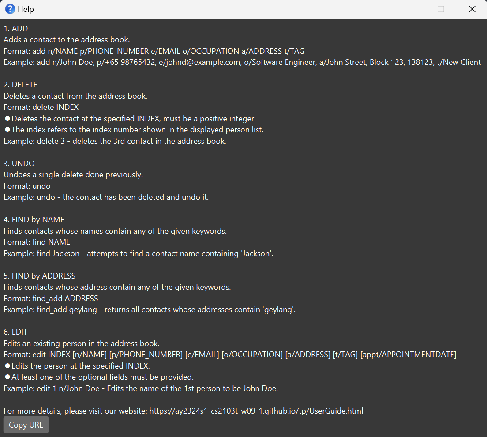

### Adding a person: `add`

Adds a new entry to their address book for financial advisors, including personal details such as name, address, occupation, phone number and email.

#### Format:
* `add n/NAME p/PHONE_NUMBER e/EMAIL o/OCCUPATION a/ADDRESS [t/TAG] [appt/APPOINTMENT_DATE]

#### Example commands:
* `add n/John Doe p/98765432 e/johnd@example.com o/Barber a/John Street, Block 123, #01-01 appt/12-12-2023 08:30`
* `add n/Betsy Crowe t/Friend e/betsycrowe@example.com o/Entrepreneur a/Newgate Prison p/1234567`

#### Acceptable values for each parameter:
* Name: Valid string name
* Address: Valid string address (8 College Ave West)
* Phone number: Valid string (Numbers only) (81234567)
* Email address: Valid string and email address format (johnd@example.com)
* Occupation: Valid string occupation
* Tag: Valid string
* Appointment date: Only accepted in yyyy-mm-dd HH:mm, mm/dd/yyyy HH:mm or dd-mm-yyyy HH:mm format

<div markdown="span" class="alert alert-primary">:bulb: **Tip:**
A person can have any number of tags (including 0)
</div>

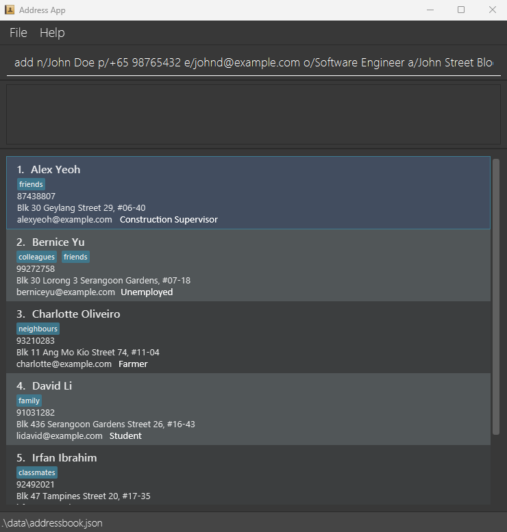

#### Precise expected outputs on success:
* Successful addition message. ‘New Person added: X ’, where X are the details of the person added
* For example, for Robert Johnson (the example command), it would be: “New person added: Robert Johnson; Phone: 55512345; Email: robertj@email.com; Occupation: Hairdresser; Address: 789 Oak Street, Suite 10; AppointmentDate: ; Tags: “. Please note that both Appointment Date and Tags are empty as they are not necessary for adding a person
* The new entry is displayed in the address book GUI

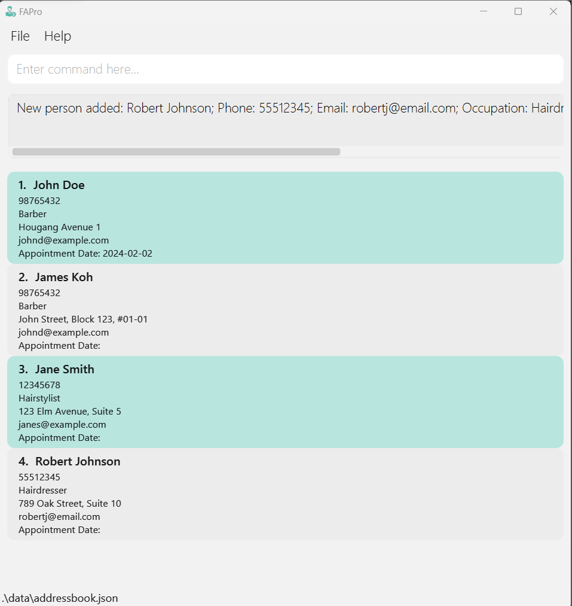

#### Precise expected outputs on failure:

If a required parameter is missing (e.g., name, email), an error message should specify which parameter is missing.

* Error Message:

```
Invalid command format! add: Adds a person to the address book. Parameters: n/NAME p/PHONE e/EMAIL a/ADDRESS [t/TAG]... Example: add n/John Doe p/98765432 e/johnd@example.com a/311, Clementi Ave 2, #02-25 t/friends t/owesMoney
```

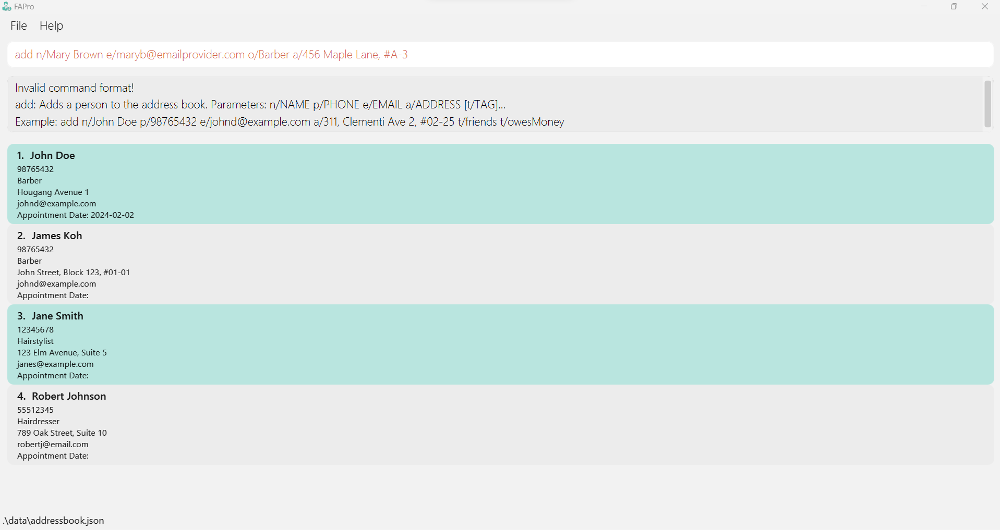

If a parameter is provided in an invalid format (e.g., an invalid email address), an error message should indicate the invalid format.

```
Emails should be of the format local-part@domain and adhere to the following constraints:
1. The local-part should only contain alphanumeric characters and these special characters, excluding the parentheses, (+_.-). The local-part may not start or end with any special characters.
2. This is followed by a '@' and then a domain name. The domain name is made up of domain labels separated by periods.
The domain name must:
    - end with a domain label at least 2 characters long
    - have each domain label start and end with alphanumeric characters
    - have each domain label consist of alphanumeric characters, separated only by hyphens, if any.
```

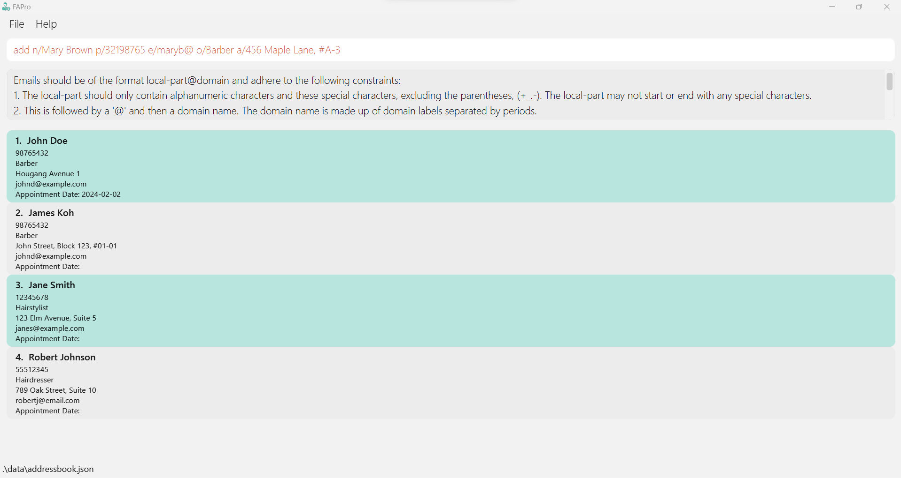

If a parameter is specified multiple times (e.g., --name John --name Doe), an error should indicate that the parameter can only be specified once.

```
Multiple values specified for the following single-valued field(s): n/
```

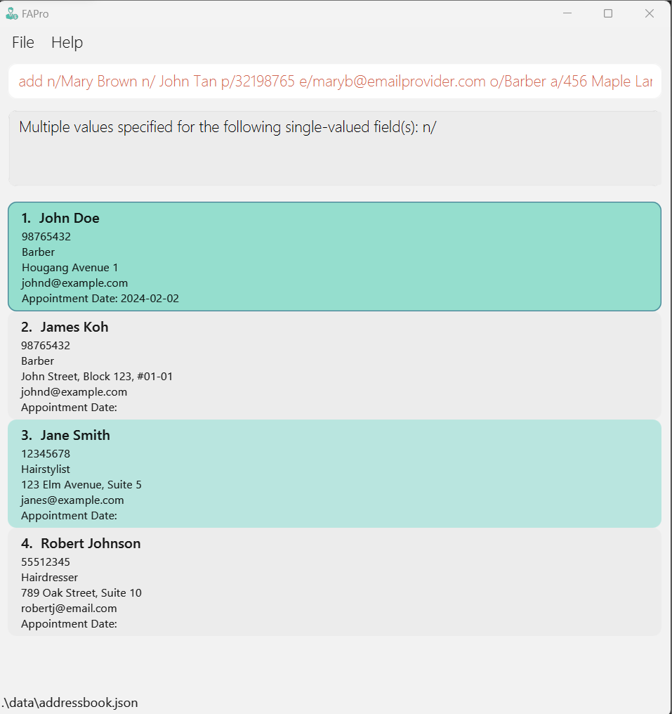

### Search by appointment day: `cal`

Lists out all persons who have an appointment on the input date.

Format: `cal KEYWORD`

* The input date has to be the exact date in YYYY-MM-DD format.
  e.g. `cal 2023-12-12` will not match `cal 12-12-2023` .
* Only the appointment date is searched.

Examples:
* `cal 2023-12-12`

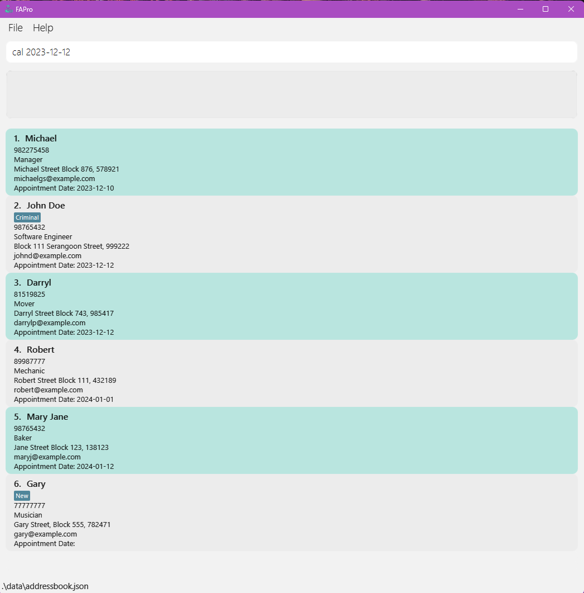

* Precise expected outputs on success:
* Successful calendar message. “X persons listed!”, where X is the number of contacts who have the same
  appointment date as the input date. The list of contacts whose appointment dates match the input is listed.

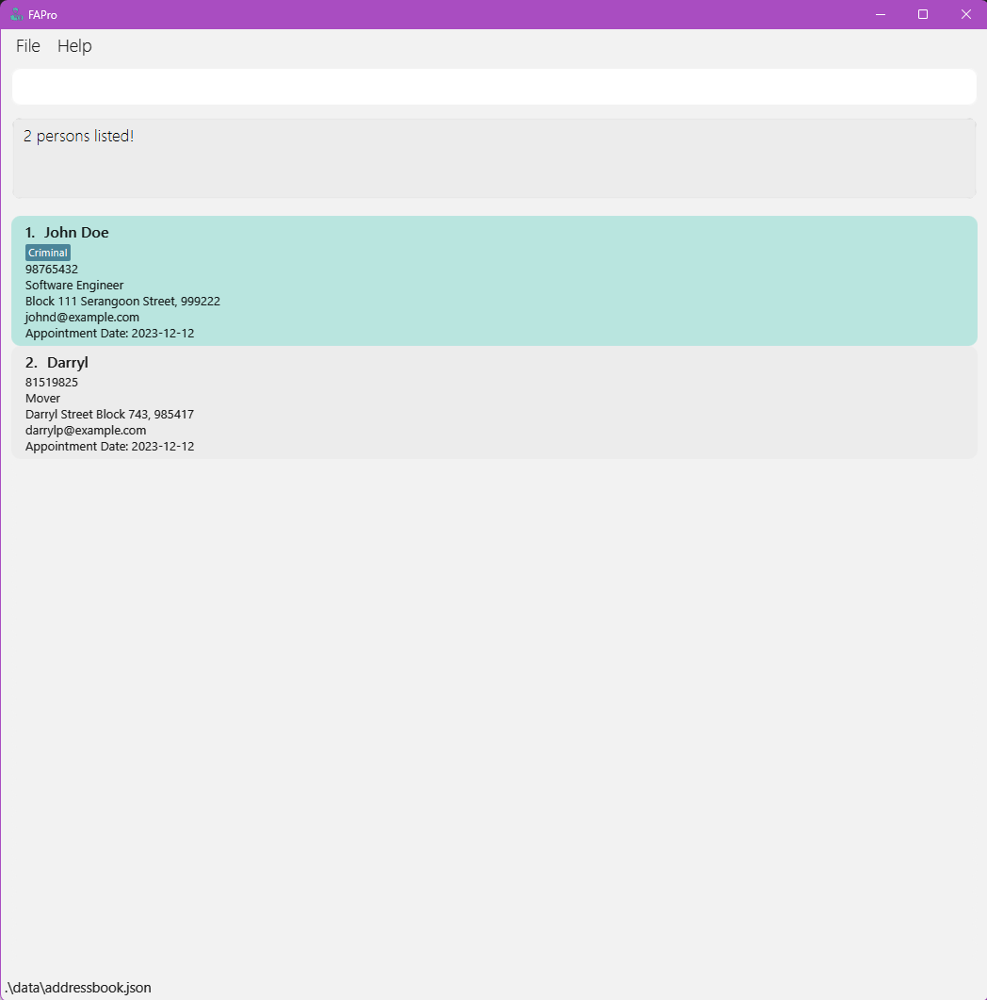

* Precise expected outputs on failure:
* If no date is input after the cal command, an error message explaining the error will be shown,
  reminding the user to follow the correct input format.


### Cloning a person : `clone`

Clones a contact from FAPro at the specified index.

Format: `clone INDEX`
* Clones the person at the specified `INDEX`.
* The index refers to the index number shown in the displayed person list.

Examples:
* `list` followed by `clone 2` clones the 2nd person in the address book.
* `find Betsy` followed by `clone 1` clones the 1st person in the results of the `find` command.

Acceptable parameters for INDEX:
* Only accept **non-negative** int values that are less than the size of the address book. Cannot be 0. Index must be for a contact that has not already been cloned.

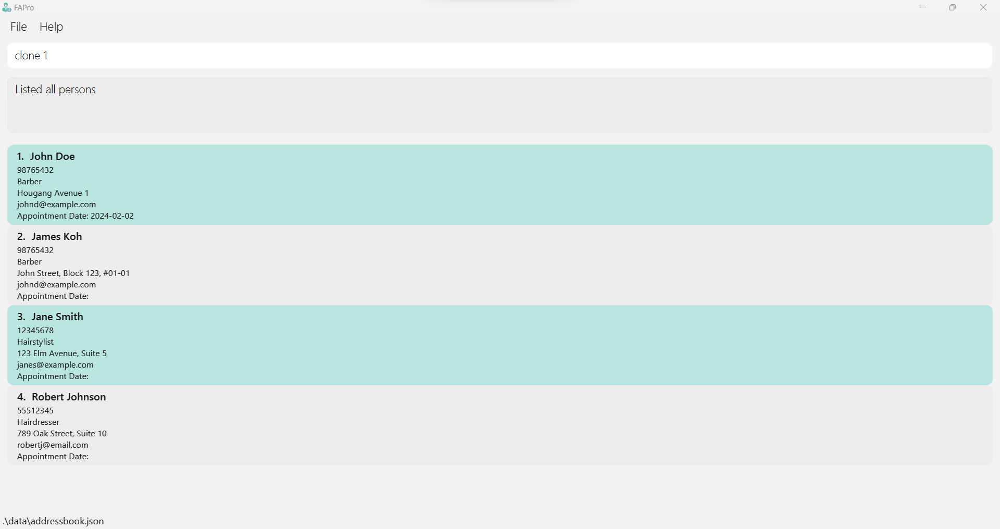

Precise expected outputs on success:
* Message shown to the user: "Cloned Person: X", where X are the details of the person who was cloned.
* For example, if
* "Name: John Doe; Phone: 98765432; Email: johnd@example.com; Occupation: Barber; Address: Hougang Avenue 1; AppointmentDate: 2024-02-02; Tags:" was cloned, then the output is
* "Cloned Person: John Doe; Phone: 98765432; Email: johnd@example.com; Occupation: Barber; Address: Hougang Avenue 1; AppointmentDate: 2024-02-02; Tags: "


Precise expected outputs on failure:
* When no index, zero or a negative index is entered next to the clone command, the error message
* "Invalid command format!
* clone: Clones the person identified by the index number used in the displayed person list.
* Parameters: INDEX (must be a positive integer)."
* is returned to the user.

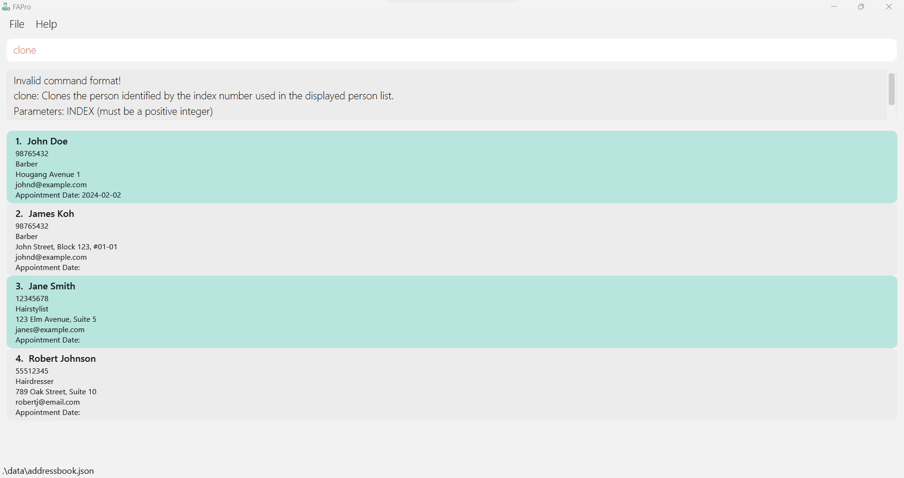

* When the index entered is greater than the current number of contacts in the address book, the error message
* “The person index provided is invalid.”
* is returned to the user.

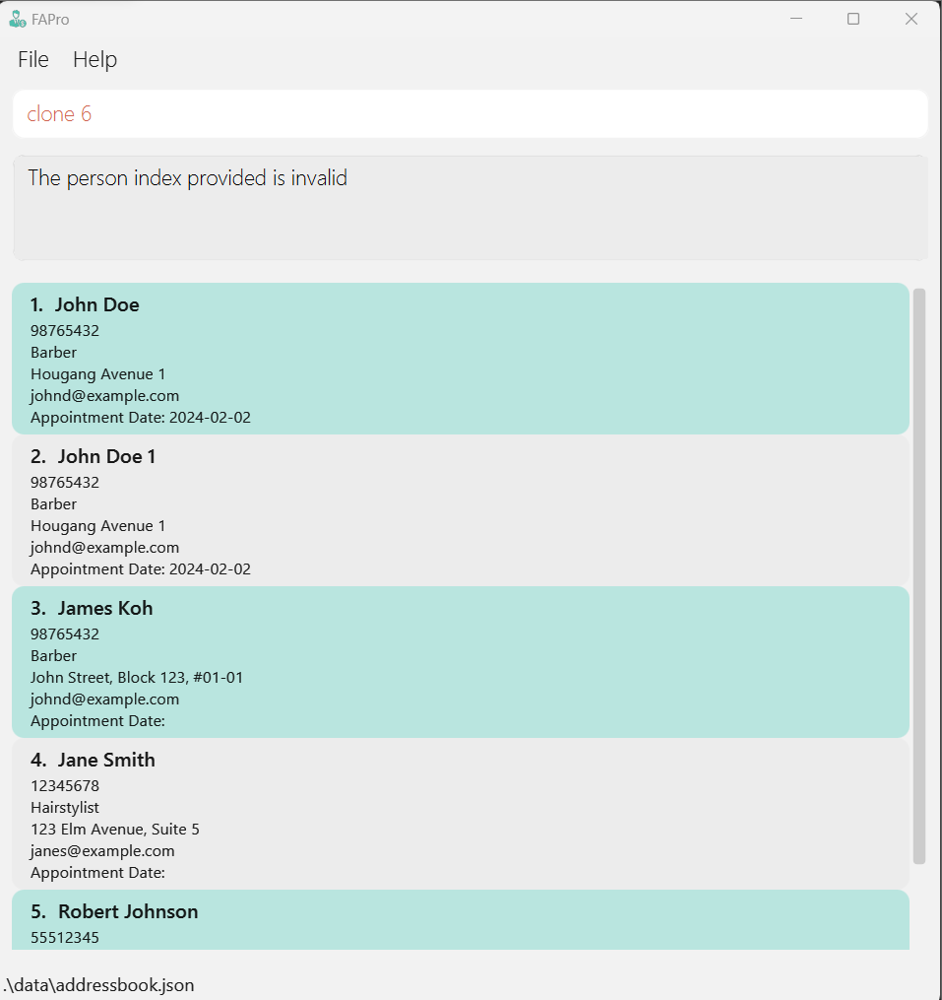

* When the person at index entered has already been cloned in FAPro, the error message
* “A clone of this person already exists.
* To clone again, please edit the previous clone first or alternatively, clone the previous clone.”
* is returned to the user.

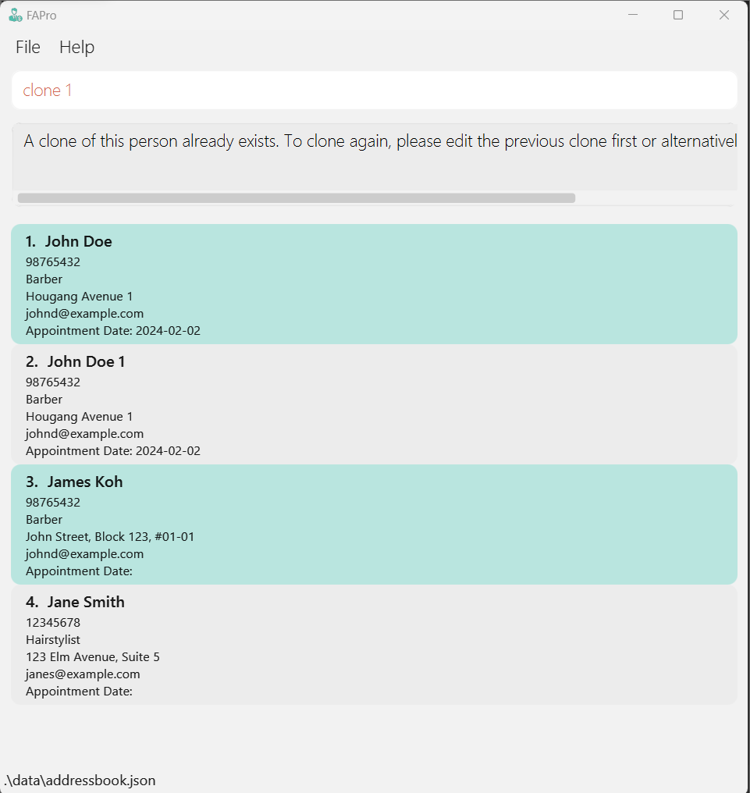

### Deleting a person : `delete`

Deletes a contact from FAPro at the specified index.

Format: `delete INDEX`
* Deletes the person at the specified `INDEX`.
* The index refers to the index number shown in the displayed person list.

Acceptable parameters for INDEX:
* The index **must be a positive integer** 1, 2, 3, …​ (less than the size of the contact list in FAPro)

Examples:
* `list` followed by `delete 2` deletes the 2nd person in the address book.
* `find Betsy` followed by `delete 1` deletes the 1st person in the results of the `find` command.


Precise expected outputs on success:

* Message shown to user: "Deleted Person: X", where X are the details of the deleted person.
* Size of address book is reduced by 1.
* GUI reflects that deleted contact is now no longer there.

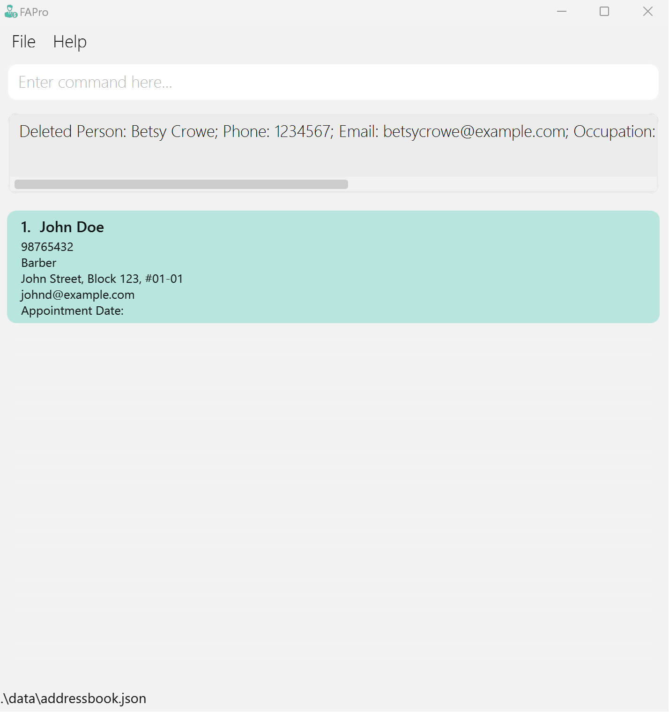

Precise expected outputs on failure:
* Error message shown to the user: "The person index provided is invalid".
* GUI reflects that delete is in red font.

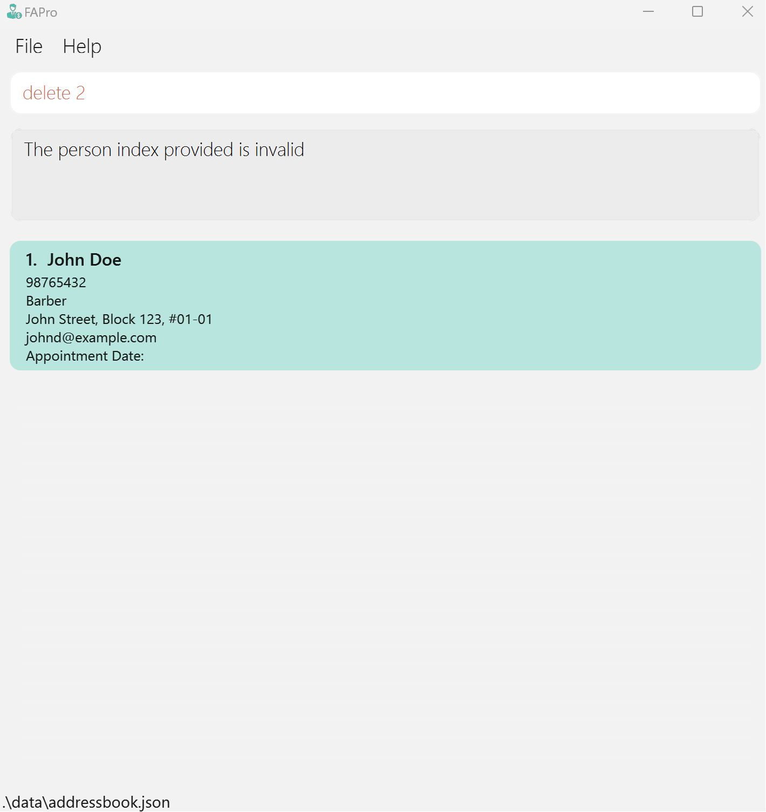

### List out all contacts : `list`

Shows a list of all contacts.

Precise command format: `list`

Precise expected outputs on success:
A list of all contacts with their details will be shown.


### Editing a person : `edit`

Edits an existing client's parameter in FAPro.

Format: `edit INDEX [n/NAME] [p/PHONE] [e/EMAIL] [o/OCCUPATION] [a/ADDRESS] [t/TAG]…​`

* Edits the person at the specified `INDEX`. The index refers to the index number shown in the displayed person list. The index **must be a positive integer** 1, 2, 3, …​
* At least one of the optional fields must be provided.
* Existing values will be updated to the input values.
* When editing tags, the existing tags of the person will be removed i.e adding of tags is not cumulative.
* You can remove all the person’s tags by typing `t/` without
  specifying any tags after it.

Examples:
*  `edit 1 p/91234567 e/johndoe@example.com` Edits the phone number and email address of the 1st person to be `91234567` and `johndoe@example.com` respectively.
*  `edit 2 n/Betsy Crower t/` Edits the name of the 2nd person to be `Betsy Crower` and clears all existing tags.

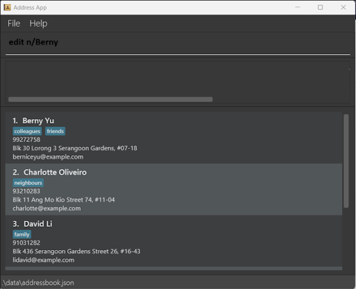

* Precise expected outputs on success:
* Successful addition message. ‘Edited Person:[NAME], Phone Number:[PHONE_NUMBER], Email:[EMAIL], Occupation:[OCCUPATION], Address:[ADDRESS]…’
* The new entry is displayed in the address book GUI.

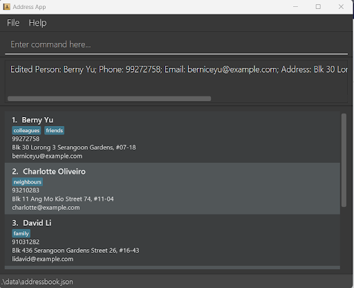

* Precise expected outputs on failure:
* If a required parameter is missing (e.g., name, email), an error message should specify which parameter is missing.
* If a parameter is provided in an invalid format (e.g., an invalid email address), an error message should indicate the invalid format.
* If a parameter is specified multiple times (e.g., --name John --name Doe), an error should indicate that the parameter can only be specified once.

### Locating persons by name: `find`

Finds persons whose names contain any of the given keywords.

Format: `find KEYWORD [MORE_KEYWORDS]`

* The search is case-insensitive. e.g `hans` will match `Hans`.
* The order of the keywords does not matter. e.g. `Hans Bo` will match `Bo Hans`.
* Only the name is searched.
* Only full words will be matched e.g. `Han` will not match `Hans`.
* Persons matching at least one keyword will be returned (i.e. `OR` search).
  e.g. `Hans Bo` will return `Hans Gruber`, `Bo Yang`.


* Precise expected outputs on success:
* Successful find message. ‘X persons listed!’’, where X is the number of contacts listed.
  The list of contacts whose names contain the input name is shown.


* Precise expected outputs on failure:
* If no name is input after the find command, an error message explaining the error will be shown,
  reminding the user to follow the correct input format.

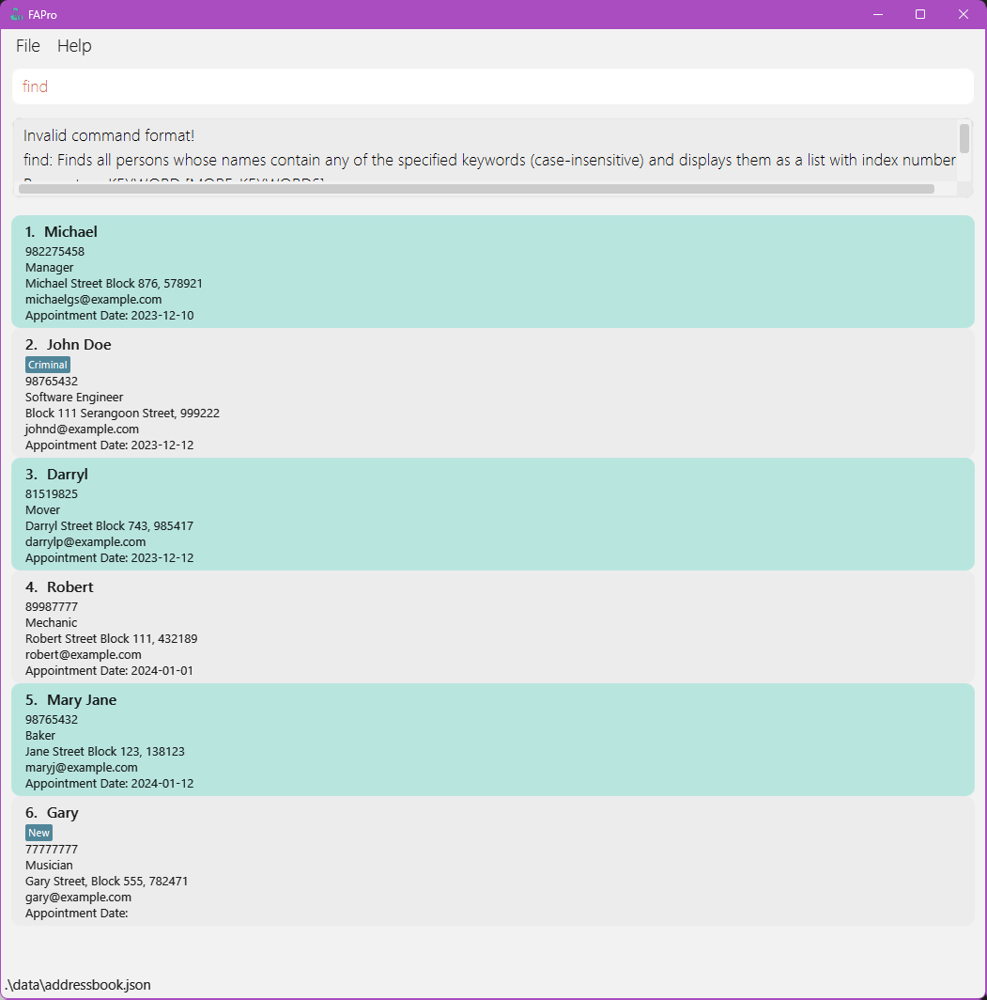

### Locating persons by address: `find_add`

Finds persons whose address contain any of the given keywords.

Format: `find_add KEYWORD [MORE_KEYWORDS]`

* The search is case-insensitive. e.g `tokyo` will match `Tokyo`.
* The order of the keywords does not matter. e.g. `Little Tokyo` will match `Tokyo Little`.
* Only the address is searched.
* Only full words will be matched e.g. `Toky` will not match `Tokyo`.
* Persons matching at least one keyword will be returned (i.e. `OR` search).
  e.g. `Little Geylang` will return `Little Tokyo`, `Tokyo`.

Examples:
* `find_add geylang` returns all users whose addresses contain `geylang`.


* Precise expected outputs on success:
* Successful find message. ‘X persons listed!’’, where X is the number of contacts listed.
  The list of contacts whose address contains the input address is shown.


* Precise expected outputs on failure:
* If no name is input after the find command, an error message explaining the error will be shown,
  reminding the user to follow the correct input format.


### Undoing a command : `undo`

Undoes the most recent undoable command. Undoable commands include: add, clone, delete, clear, edit.

Format: `undo`

Examples:
* `add n/John Doe p/98765432 e/johnd@example.com o/Barber a/John Street, Block 123, #01-01` followed by `undo` will
  delete the added contact.
* `clone 1`, assuming there is a contact to clone, followed by `undo` will delete the cloned contact.
* `delete 1`, assuming there is a contact to delete, followed by `undo` will add the contact back.
* `clear`, assuming there is at least one contact to clear, followed by `undo` will add all cleared contacts back.
* `edit 1 p/91234567`, assuming there is a contact to edit, followed by `undo` will revert the edit of the contact.
* Assuming there are 3 contacts, `delete 1`, which deletes the first contact, followed by `clear`, which clears the
  remaining 2 contacts, followed by `undo` will only add the 2 cleared contacts back. A subsequent `undo` will add
  back the contact deleted.
* `edit 1 p/91234567`, assuming there is a contact to edit, edits the first contact, followed by `delete 1`, deletes
  the first contact. Then, `undo` will add back the deleted contact, and the next `undo` will revert the edit of the
  contact (which was also just added back).

#### Precise expected outputs on success:

For undoing an add command:

* Add a contact.

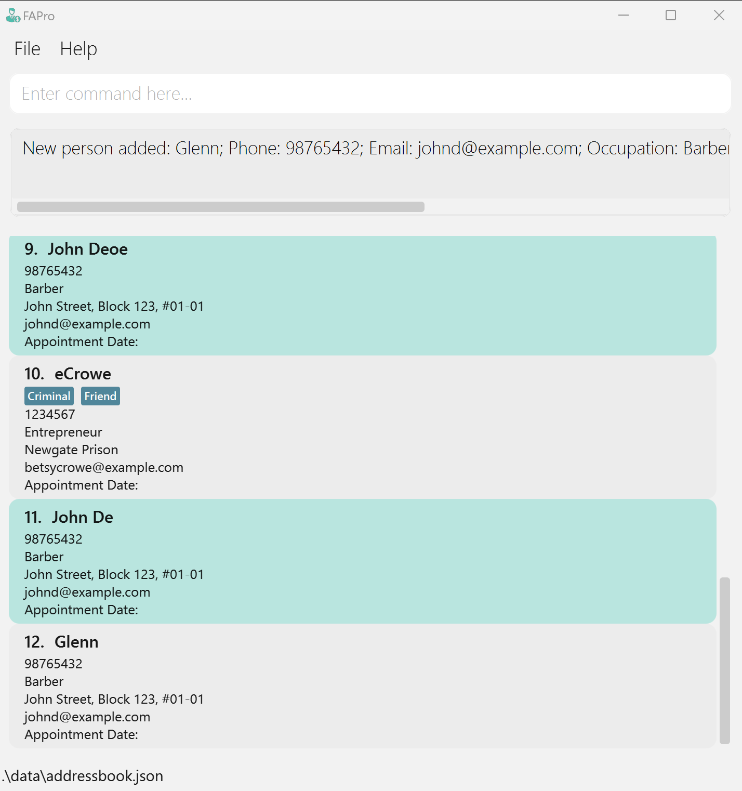

* Undo.
* Message shown to the user: "Undo Successful! Deleted Person: X", where X are the details of the person who was
  just added, and now deleted.
* GUI reflects that the most recently added contact is deleted.

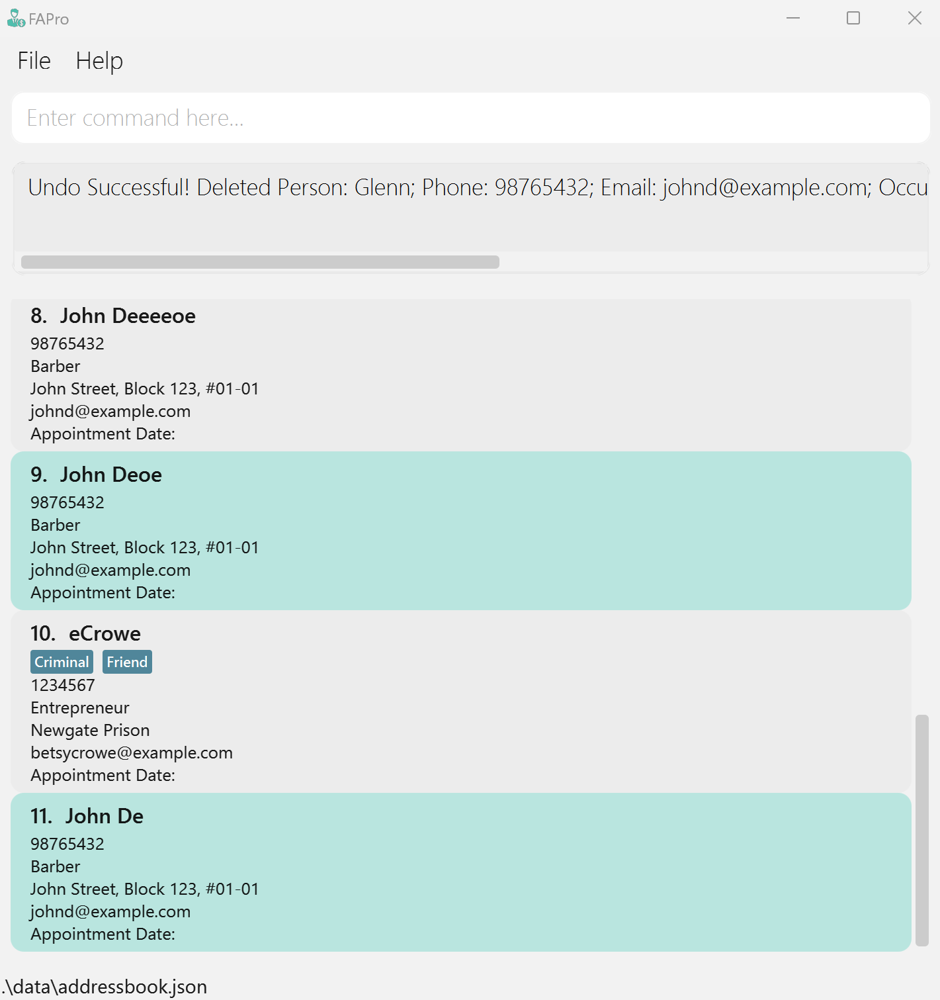

For undoing a clone command:

* Clone a contact.

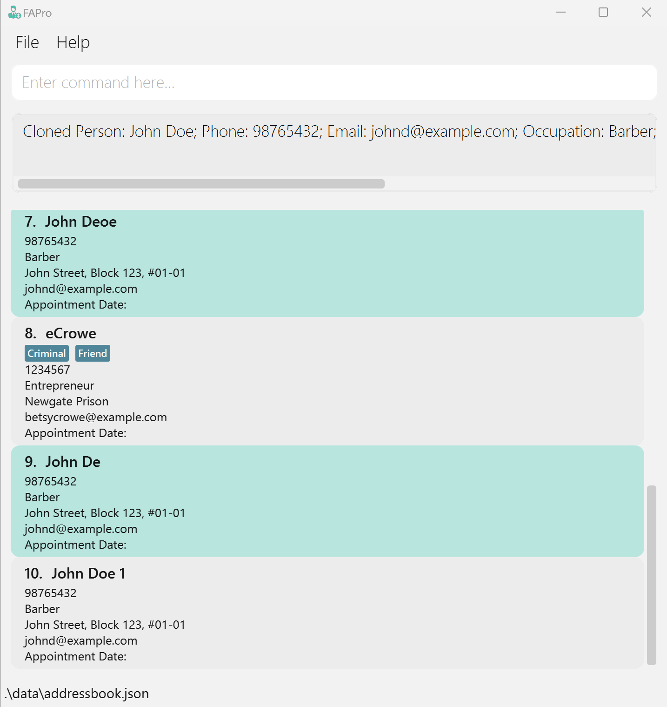

* Undo.
* Message shown to the user: "Undo Successful! Deleted Person: X", where X are the details of the person who was
  just cloned, and now deleted.
* GUI reflects that the most recently cloned contact is deleted.

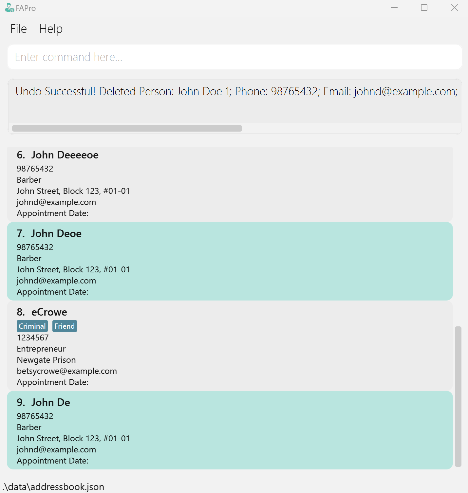

For undoing a delete command:

* Delete a contact.


* Undo.
* Message shown to the user: "Undo Successful! Contact added back: X", where X are the details of the person who was
  just deleted, and now added back.
* GUI reflects that the most recently deleted contact is added back.

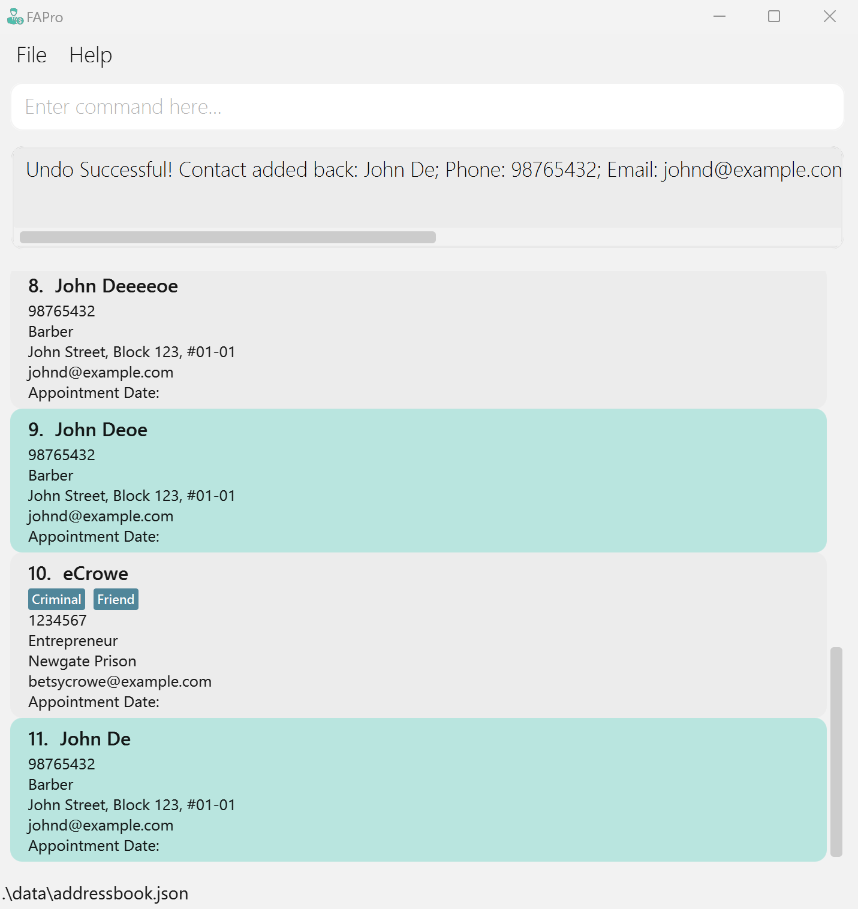

For undoing a clear command:

* Clear all contacts.


* Undo.
* Message shown to the user: "Undo Successful! ALl contacts have been added back!".
* GUI reflects that all cleared contacts are added back.


For undoing an edit command:

* Edit a contact.

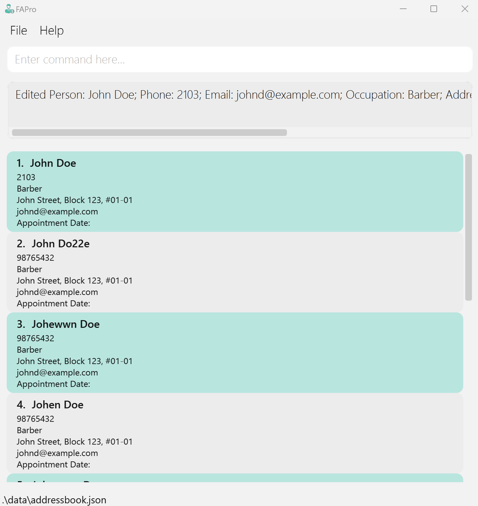

* Undo.
* Message shown to the user: "Undo Successful! Reverted back to: X", where X are the details of the person before
  the edit.
* GUI reflects that the edited contact has been reverted.


#### Precise expected outputs on failure:
* Caused by using undo when there are no previous commands to undo.
* Error message shown to the user: "There is no command to undo!".
* GUI reflects undo text in red font.


### Sorting contacts : `sort`

Sort contact lists by prefix name or appointment date.

#### Format: 
* `sort PREFIX`

#### Example commands:
* `sort n/`
* `sort appt/`

#### Acceptable prefix tag:
* `n/` sort by Name prefix
* `appt/` sort by Appointment Date prefix


#### Precise expected output on success:
* Successful addition message. 'X person listed!', where X is the number of clients in the address book.
* The sorted entry is displayed in the address book GUI.


Precise expected outputs on failure:
<br> If either a required parameter is missing or a parameter provided is invalid (e.g., e/), an error message should indicate the invalid format.

* Error Message:

```
Invalid command format!
sort: Sort all persons by name or appointmnet date.
Parameters: KEYWORD [PREFIX n/ or appt/]
Example: sort n/
```


### Clearing all entries : `clear`

Clears all contacts in the address book.

Format: `clear`

Example:
- `clear`

Precise expected outputs on success:

* Message shown to the user: "Address book has been cleared!".
* GUI reflects that there are 0 contacts left.


Precise expected outputs on failure:

* Message shown to the user: "Address book is empty. There is nothing to clear".
* GUI reflects clear is in red font.


### Exiting the program : `exit`

Exits the application.

Precise command format: `exit`

Precise expected outcome on success:
The FAPro application will be closed.


### Saving the data

FAPro data is saved in the hard disk automatically after any command that changes the data. There is no need to save manually.

### Editing the data file

FAPro data is saved automatically as a JSON file `[JAR file location]/data/fapro.json`. Advanced users are welcome to update data directly by editing that data file.

<div markdown="span" class="alert alert-warning">:exclamation: **Caution:**
If your changes to the data file makes its format invalid, FAPro will discard all data and start with an empty data file at the next run. Hence, it is recommended to take a backup of the file before editing it.
</div>

--------------------------------------------------------------------------------------------------------------------

## FAQ

**Q**: How do I transfer my data to another Computer?<br>
**A**: Install the app in the other computer and overwrite the empty data file it creates with the file that contains the data of your previous FAPro home folder.

--------------------------------------------------------------------------------------------------------------------

## Known issues

1. **When using multiple screens**, if you move the application to a secondary screen, and later switch to using only the primary screen, the GUI will open off-screen. The remedy is to delete the `preferences.json` file created by the application before running the application again.

--------------------------------------------------------------------------------------------------------------------

## Command summary

| Action           | Format, Examples                                                                                                                                                                      |
|------------------|---------------------------------------------------------------------------------------------------------------------------------------------------------------------------------------|
| **Add**          | `add n/NAME p/PHONE_NUMBER e/EMAIL o/OCCUPATION a/ADDRESS [t/TAG]…​` <br> e.g., `add n/James Ho p/22224444 e/jamesho@example.com o/SWE, a/123, Clementi Rd, 1234665 t/friend t/colleague` |
| **Calendar**     | `cal KEYWORD`<br> e.g., `cal 2023-12-12`                                                                                                                                              |
| **Clone**        | `clone INDEX`<br> e.g., `clone 3`                                                                                                                                                     |
| **Clear**        | `clear`                                                                                                                                                                               |
| **Delete**       | `delete INDEX`<br> e.g., `delete 3`                                                                                                                                                   |
| **Edit**         | `edit INDEX [n/NAME] [p/PHONE_NUMBER] [e/EMAIL] [o/OCCUPATION] [a/ADDRESS] [t/TAG]…​`<br> e.g.,`edit 2 n/James Lee e/jameslee@example.com`                                            |
| **Find**         | `find KEYWORD [MORE_KEYWORDS]`<br> e.g., `find James Jake`                                                                                                                            |
| **Find Address** | `find_add KEYWORD [MORE_KEYWORDS]` <br> e.g., `find_add Serangoon`                                                                                                                    |
| **List**         | `list`                                                                                                                                                                                |
| **Help**         | `help`                                                                                                                                                                                |
| **Sort** | `sort PREFIX` <br> e.g. `sort appt/` `sort n/` |

## Glossary
| Word          | Meaning                                                   |
|---------------|-----------------------------------------------------------|
| **Parameter** | values inputted by the user.<br/>e.g. NAME, OCCUPATION, ADDRESS |
| **Prefix** | word that is added in front of parameter.<br/>e.g. n/, o/, a/  |
