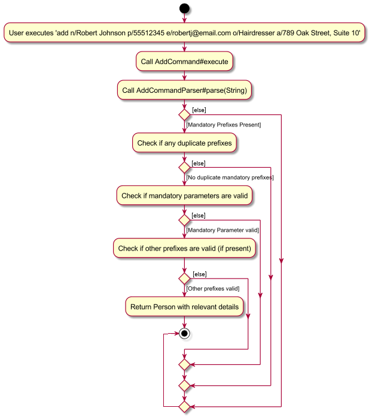
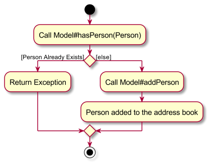
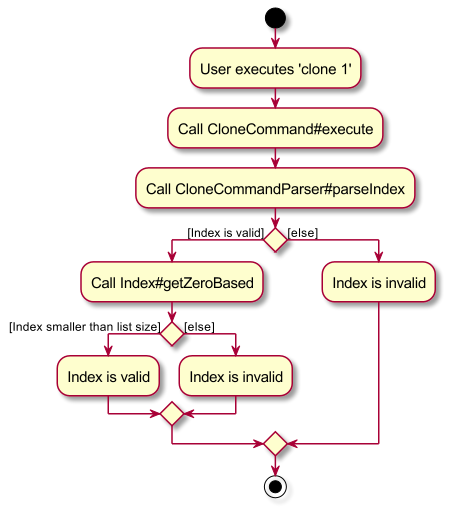
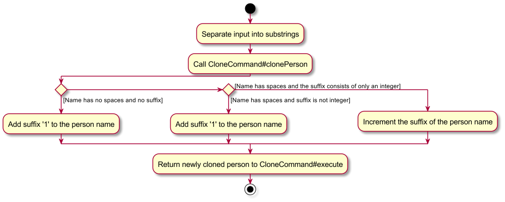
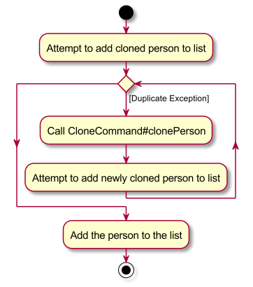
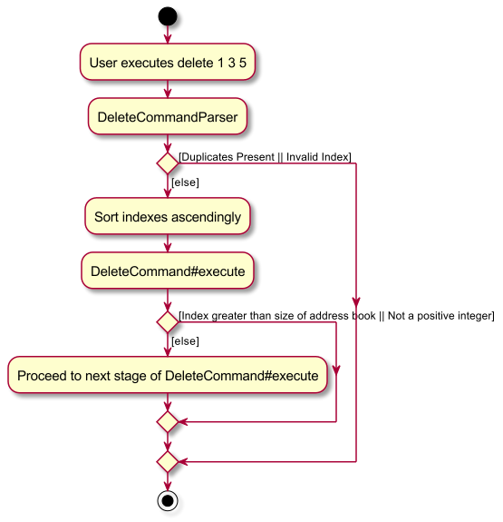
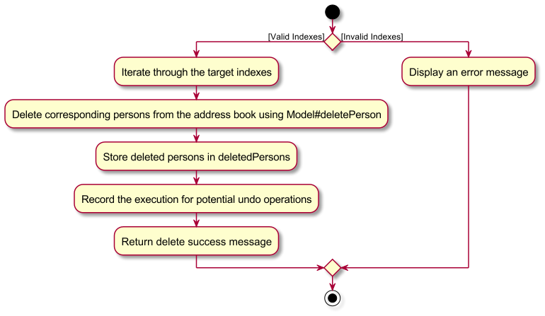

### Project: FAPro

FApro seeks to improve the quality of life of financial advisors (FAs). It allows FAs to keep track of large numbers of contacts. It allows FAs to have a one-stop platform to manage their contacts and conduct financial analytics while providing a big-picture view of their clientele as a whole.

Given below are my contributions to the project.

* **New Parameter**: Added occupation parameter
  * What it does: Allows the store the occupation of as person when adding the contact 
  * Justification: As Financial Advisors, users may wish to store the Occupation of their clients, so as to get a better
    gauge on their clients overall financial profile and what investment plans might be more suitable for them.
  * Highlights: As this was my first significant contribution to the groups code, it was initially rather daunting,
    considering that adding a parameter entails changing many classes (every class that has to do with Person), and
    additionally meant I had to update all the test cases. However, overall it was a smooth process of coding and
    deployment.

* **New Feature**: Added the ability to clone contacts
  * What it does: Allows the user to clone contacts if they want to add a similar contact 
  * Justification: Users may have to add multiple similar contacts at one time (i.e people from the same household.
    As such, the clone feature provides and alternative should the user not wish to type out all the details to add a
    contact.
  * Highlights: This enhancement was manageable in it's implementation. One difficulty faced was how to clone a command
    while ensuring that duplicate contacts still could not be held in the address book. This difficulty was overcome by
    adding an integer to the end of the name, so as to make the contacts dissimilar and hence, not duplicates of one
    another.

* **Major Enhancement**: Updated Delete Command to take in multiple indexes
  * What it does: Allows the user to delete multiple contacts, rather than just one at a time
  * Justification: Users may have to delete multiple contacts at a time, such as when an entire family decides to change
    over to another financial advisor or if you have multiple clients from the same company and the company happens to
    be doing poorly.
  * Highlights: This enhancement was deceptively difficult. While the implementation of delete with multiple indexes
    seems simple initially, when considering it has to work in conjunction with the undo and redo command, you have to
    take into consideration and record exactly how many contacts are deleted at a time, as opposed to just returning 
    the most recently deleted contact. The use of multiple indexes also introduces bugs, regarding the ordering of
    deletes.

* **Code contributed**: [RepoSense link](https://nus-cs2103-ay2324s1.github.io/tp-dashboard/?search=bhnuka&breakdown=true)

* **Project management**:
  * Set up milestones
  * Assigned milestones and labels to pull requests
  * Reviewed & merged pull requests
  * Updated issue tracker & fixed issues relating to PE-D
  * Weekly calls (1-4x a week, 2+ hours each)
  * Followed forking work flow

* **Enhancements to existing features**:
  * Updated Add Command to take in occupation as a parameter (Pull request [\#49](https://github.com/AY2324S1-CS2103T-W09-1/tp/pull/49))
  * Updated the GUI Colour Scheme and aesthetics (Pull request [\#65](https://github.com/AY2324S1-CS2103T-W09-1/tp/pull/65))
  * Updated Delete Command to take in multiple indexes to delete (Pull request [\#105](https://github.com/AY2324S1-CS2103T-W09-1/tp/pull/105)))

* **Documentation**:
  * User Guide:
    * Added implementation and manual testing and updated use case and user stories of the `add` feature.
    * Added implementation, use case, user stories and manual testing of the `clone` feature
    * Added implementation and manual testing and updated use case and user stories of the `delete` feature
      
  * Developer Guide:
    * Added implementation and manual testing and updated use case and user stories of the `add` feature.
    * Added implementation, use case, user stories and manual testing of the `clone` feature
    * Added implementation and manual testing and updated use case and user stories of the `delete` feature
      
  * Significant Diagrams:
    * 
    * 
    * 
    * 
    * 
    * 
    * 
    
* **Community**:
  * PRs reviewed (with non-trivial review comments):
    * Pull request [\#43](https://github.com/AY2324S1-CS2103T-W09-1/tp/pull/43)
    * Pull request [\#50](https://github.com/AY2324S1-CS2103T-W09-1/tp/pull/50)
    * Pull request [\#66](https://github.com/AY2324S1-CS2103T-W09-1/tp/pull/66)
    * Pull request [\#71](https://github.com/AY2324S1-CS2103T-W09-1/tp/pull/71)
    * Pull request [\#110](https://github.com/AY2324S1-CS2103T-W09-1/tp/pull/110)
    * Pull request [\#128](https://github.com/AY2324S1-CS2103T-W09-1/tp/pull/128)
    * Pull request [\#232](https://github.com/AY2324S1-CS2103T-W09-1/tp/pull/232)
