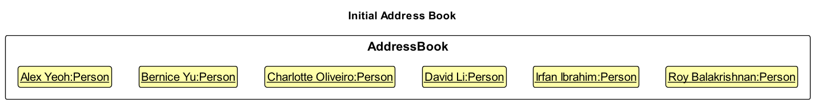
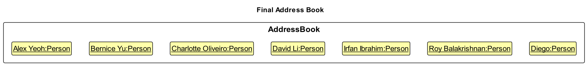
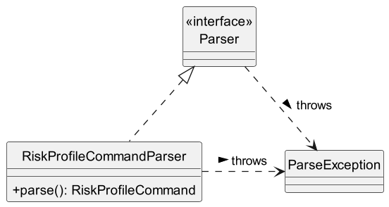
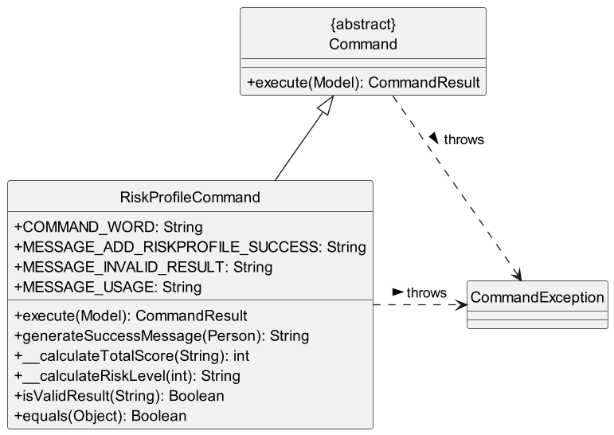
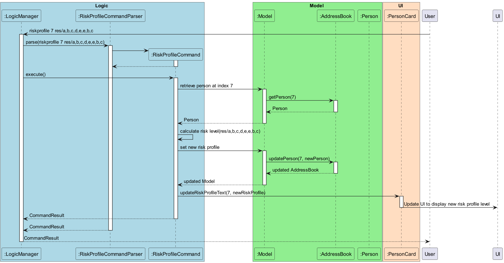
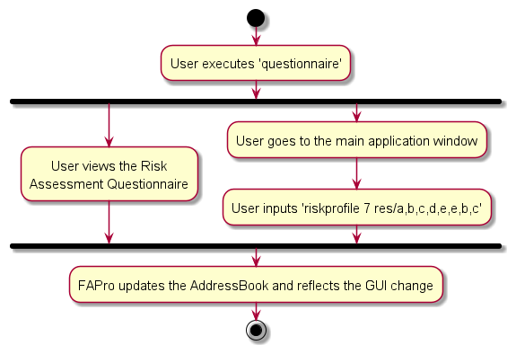
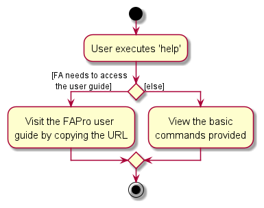

### Project: FAPro

FApro seeks to improve the quality of life of financial advisors (FAs). It allows FAs to keep track of large numbers of
contacts. It allows FAs to have a one-stop platform to manage their contacts and conduct financial analytics while providing a big-picture view of their clientele as a whole.

Given below are my contributions to the project.

* **New Feature**: Added a questionnaire window
    * What it does: Allows the user to view the risk assessment multiple choice questions, including the grading and risk profile categories criteria.
    * Justification: The questionnaire window was added to enhance user experience by providing a set of questions which they can refer in knowing their client risk profile level.
    * Highlights: This enhancement is manageable since the code is hard-coded. However, finding suitable risk assessment questions that are compatible with the `riskprofile` feature design is the most challenging part.

* **New Feature**: Implemented the ability to add client's risk profile level
    * What it does: Generates the client's risk profile level based on their responses to the risk assessment questionnaire provided in the questionnaire window and adds it to their contact.
    * Justification: This feature was implemented to streamline the process of assessing clients' risk profiles by automating the evaluation process. By automating this crucial aspect, it saves user time and effort.
    * Highlights: When I first started as a contributor to a brownfield project, I found it challenging to familiarize myself with the existing code base. Additionally, this app has several components, which means that when I was developing the feature, I have to trace through the code to find where to make changes or additions, which can be time-consuming. However, the tutorial and individual tasks I completed helped me implement this feature.

      There are several other challenges that I faced during the `riskprofile` development:

        1. The implementation process was difficult because I was sick. Despite facing unexpected challenges, I persevered to meet project timelines.

        2. The implementation journey involved intricate test case debugging that required substantial time and effort. However, persevering through this process honed my debugging skills and contributed to the overall robustness of the `riskprofile` feature.

        3. Handling user input intricacies for result processing was a challenging task. The requirement was to extract user information, perform calculations and derive a risk profile categorized as Low, Moderately Low, Moderate, Moderately High or High. Instead of directly displaying the user's input in the contact details, the complexity involved in transforming raw user input into a meaningful risk profile level for Financial Advisors and their clients was highlighted.

        4. The task was to extract user-inputted results, perform calculations, and categorize the risk profile as Low, Moderately Low, Moderate, Moderately High, or High. However, the main challenge was dealing with the intricacies involved in transforming raw user input into a meaningful risk profile level for Financial Advisors and their clients.

        5. The endeavor to enhance the risk profile display added yet another layer of complexity. Adapting the GUI to incorporate a color-coded representation proved challenging due to the intricacies of JavaFX styling.

      Overall, it was a nice journey to see at the end the `riskprofile` feature is working properly.

* **Code contributed**: [RepoSense link](https://nus-cs2103-ay2324s1.github.io/tp-dashboard/?search=daphne789&breakdown=true)

* **Project management**:
    * Managed milestones v1.1, v1.2, v1.2b, and v1.3
    * Managed labels for pull requests
    * Managed issue tracker and issues relating to PE-D
    * Managed pull requests by reviewing and merging
    * Branching:
      To ensure optimal management of specific changes and feature implementations, I adhere to a structured branching strategy. This involves creating distinct branches for each task. For instance, to implement the `riskprofile` feature, I created a branch named _questionnaire_ solely for that purpose. Likewise, when updating the Developer Guide, I made a separate branch called _modify-developer-guide_. This approach enables me to track changes and features separately, simplifying the efficient management of various tasks.
    * Working with remote branches:
      Our team created a remote repository called "tp" under the "AY2324S1-CS2103T-W09-1" organization. To keep my work in sync, I created a local repository by forking this remote repository. After implementing changes in a branch, I push them to my local repository and initiate a Pull Request to merge the changes with the remote repository. This collaborative approach ensures a seamless integration of individual contributions into the team's central codebase.

* **Enhancements to existing features**:
    * Updated the help window to show the basic commands and FAPro’s user guide link for other commands
      (Pull request [\#223](https://github.com/AY2324S1-CS2103T-W09-1/tp/pull/223))

* **Documentation**:
    * User Guide:
        * Added documentation on `help`, `questionnaire`, and `riskprofile`
        * Updated documentation on `list` and `exit`
    * Developer Guide:
        * Added implementation, design considerations, manual testing, and use case for `riskprofile`
        * Added implementation, design considerations, and use case for `help` and `questionnaire`
        * Added use case for `list` and `exit`
        * Added user story for `help` `riskprofile`
        * Added future implementation and planned enhancements for `riskprofile`
        * Modified the use case for `sort`, `riskprofile`, `edit`, `clone`, `delete`, `add` to use inclusion of UC10 - List out all contacts

* **Diagrams**:
    * 

    * 

    * 

    * 

    * 

    * 

    * 

* **Team-Based Task**:
    * Added technical question for troubleshooting in User Guide
    * Edited video for product demo

* **Community**:
    * PRs reviewed (with non-trivial review comments): [\#81](https://github.com/AY2324S1-CS2103T-W09-1/tp/pull/81), [\#84](https://github.com/AY2324S1-CS2103T-W09-1/tp/pull/84),
      [\#130](https://github.com/AY2324S1-CS2103T-W09-1/tp/pull/130), [\#132](https://github.com/AY2324S1-CS2103T-W09-1/tp/pull/132),
      [\#133](https://github.com/AY2324S1-CS2103T-W09-1/tp/pull/133), [\#213](https://github.com/AY2324S1-CS2103T-W09-1/tp/pull/213)
    * Bugs reported in other team: [\#216](https://github.com/AY2324S1-CS2103T-T08-4/tp/issues/216), [\#222](https://github.com/AY2324S1-CS2103T-T08-4/tp/issues/222),
      [\#227](https://github.com/AY2324S1-CS2103T-T08-4/tp/issues/227), [\#229](https://github.com/AY2324S1-CS2103T-T08-4/tp/issues/229),
      [\#230](https://github.com/AY2324S1-CS2103T-T08-4/tp/issues/230)
