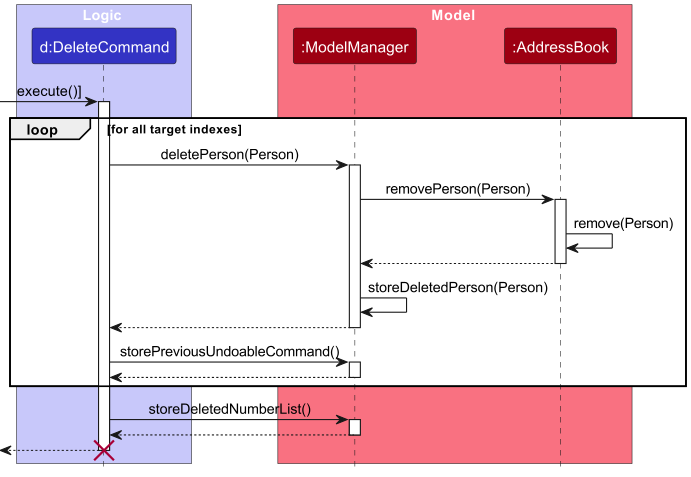
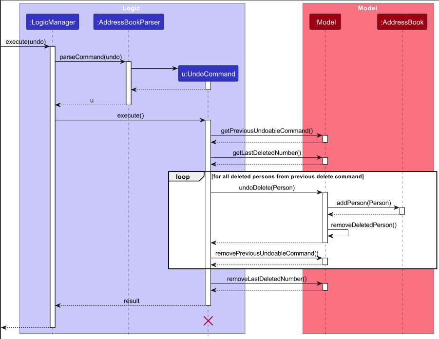
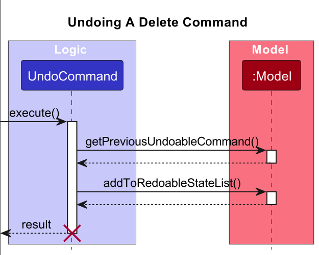
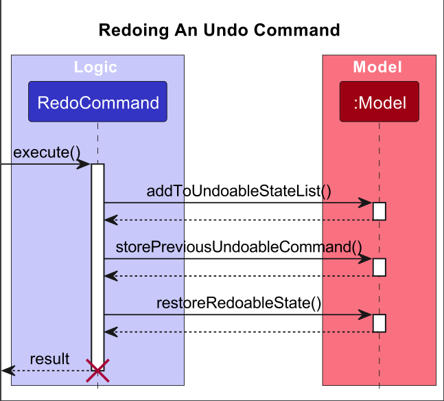
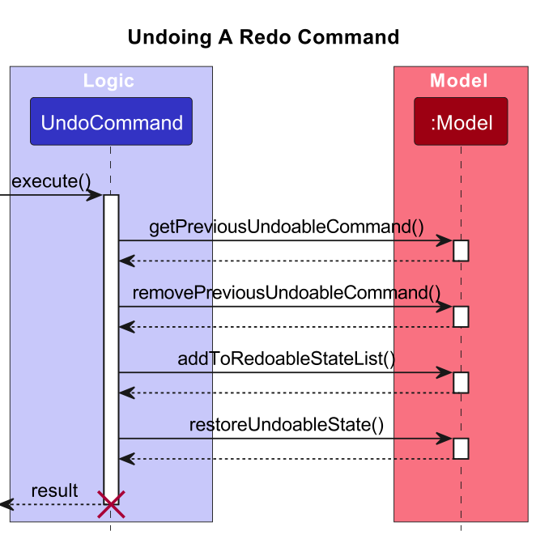

### Project: FApro

**Overview**:
FApro seeks to improve the quality of life of financial advisors (FAs). It allows FAs to keep track of large numbers of contacts. It allows FAs to have a one-stop platform to manage their contacts and conduct financial analytics while providing a big-picture view of their clientele as a whole.

Given below are my contributions to the project.

* **New Feature**: Added the ability to undo certain commands: `undo`
  * What it does: Allows the user to undo the most recent command. Only commands that modify the addressbook, such
    as `add`, `clone`, `edit`, `delete` & `clear` can be undone.
  * Justification: As financial advisors, or users in general, may make mistakes from time to time, undo provides
    a simple way to undo such mistakes without having to use more commands.
  * Highlights: This was my first major change/contribution. I struggled to implement it at the start, but I
    slowly learnt how to trace the existing code in AB3 to understand how the different components acted together.
    As this feature went through multiple (painful) iterations, I gained more experience on writing test cases as
    well as got more familiarised with the code structure.

* **New Feature**: Added the ability to redo commands : `redo`
  * What it does: Allows the user to redo the most recent undo command. With this new feature, `undo` is also 
    improved to be able to undo `redo` commands.
  * Justification: As financial advisors, or users in general, may make mistakes from time to time, redo provides a 
    simple way to redo an action that was accidentally undone. This provides a better alternative compared to having 
    to manually type in the command again.
  * Highlights: This enhancement was challenging. I had to ponder for quite a period on how to implement the feature.
    One difficulty was with the naming of the methods implemented in order to make them as easily understandable as 
    possible. Another challenge faced was on the saving of the states. As described earlier, my methods 
    implemented at the beginning were confusing even for me to wrap my head around, so I had to go through 
    extra trouble figuring out how the different components worked together. Furthermore, the most difficult part was 
    ensuring the feature would work properly as how redo features would in regular apps, like Microsoft Word. I had 
    to fiddle with the undo and redo features in Word for a bit before I finally understood how redo works and 
    could implement it. But, I must say I thoroughly enjoyed the process and I have a new-found sense of 
    fulfillment after figuring it out on my own!

* **Code contributed**: [RepoSense link](https://nus-cs2103-ay2324s1.github.io/tp-dashboard/?search=glenngnng&breakdown=false&sort=groupTitle%20dsc&sortWithin=title&since=2023-09-22&timeframe=commit&mergegroup=&groupSelect=groupByRepos)

* **Project management**:
  * Set up milestones
  * Assigned milestones and labels to pull requests 
  * Reviewed & merged pull requests
  * Updated issue tracker & fixed issues relating to PE-D
  * Weekly calls (1-4x a week, 2+ hours each)
  * Followed forking work flow

* **Enhancements to existing features**:
  * For undo to work, I needed to store certain information when commands such as `add`, `clone`, `edit`, `delete` &
    `clear` were executed.
    * For `add` & `clone`, I added a functionality that stored which contact was being added. 
    * For `edit`, I added a functionality that stored both the original `Person` and the edited `Person`. 
    * For `delete` & `clear`, I added a functionality that stored the deleted `Person`(s). Furthermore, the number 
      of deleted and cleared persons respectively would be stored.

* **Documentation**:
  * User Guide:
    * Added documentation for the `undo` feature.
    * Added documentation for the `redo` feature.
    * Updated documentation for `delete` and `clear` features.
  * Developer Guide:
    * Added implementation of the `undo` feature.
    * Added implementation of the `redo` feature.
    * Added instructions for manual testing of `undo` and `redo` feature.
    * Added planned enhancement for `undo` and `redo` feature.
  * Significant Diagrams:
    * 
    * 
    * 
    * 
    * 

* **Community**:
  * PRs reviewed (with non-trivial review comments):
    * Pull Request [\#145](https://github.com/AY2324S1-CS2103T-W09-1/tp/pull/145)
    * Pull Request [\#132](https://github.com/AY2324S1-CS2103T-W09-1/tp/pull/132)
    * Pull Request [\#111](https://github.com/AY2324S1-CS2103T-W09-1/tp/pull/111)
    * Pull Request [\#89](https://github.com/AY2324S1-CS2103T-W09-1/tp/pull/89)
    * Pull Request [\#73](https://github.com/AY2324S1-CS2103T-W09-1/tp/pull/73)
    * Pull Request [\#67](https://github.com/AY2324S1-CS2103T-W09-1/tp/pull/67)
    * Pull Request [\#51](https://github.com/AY2324S1-CS2103T-W09-1/tp/pull/54)
  * Contributed to forum discussion:
    * Pull Request [\#354](https://github.com/nus-cs2103-AY2324S1/forum/issues/354)
    * Pull Request [\#439](https://github.com/nus-cs2103-AY2324S1/forum/issues/439)
  * Bugs reported:
    * Issue [\#190](https://github.com/AY2324S1-CS2103T-F12-1/tp/issues/190)
    * Issue [\#186](https://github.com/AY2324S1-CS2103T-F12-1/tp/issues/186)
    * Issue [\#180](https://github.com/AY2324S1-CS2103T-F12-1/tp/issues/180)
    * Issue [\#177](https://github.com/AY2324S1-CS2103T-F12-1/tp/issues/177)
    * Issue [\#172](https://github.com/AY2324S1-CS2103T-F12-1/tp/issues/172)
    * Issue [\#171](https://github.com/AY2324S1-CS2103T-F12-1/tp/issues/171)
    * Issue [\#166](https://github.com/AY2324S1-CS2103T-F12-1/tp/issues/166)
    * Issue [\#161](https://github.com/AY2324S1-CS2103T-F12-1/tp/issues/161)
    * Issue [\#160](https://github.com/AY2324S1-CS2103T-F12-1/tp/issues/160)
    * Issue [\#158](https://github.com/AY2324S1-CS2103T-F12-1/tp/issues/158)

